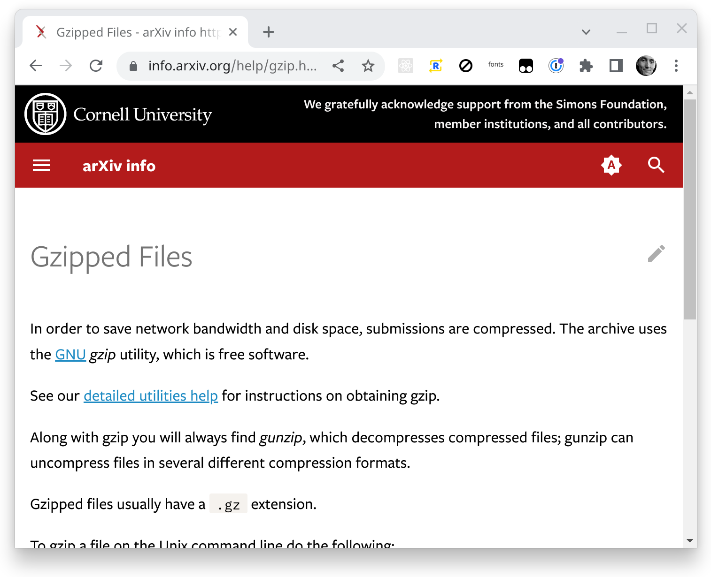
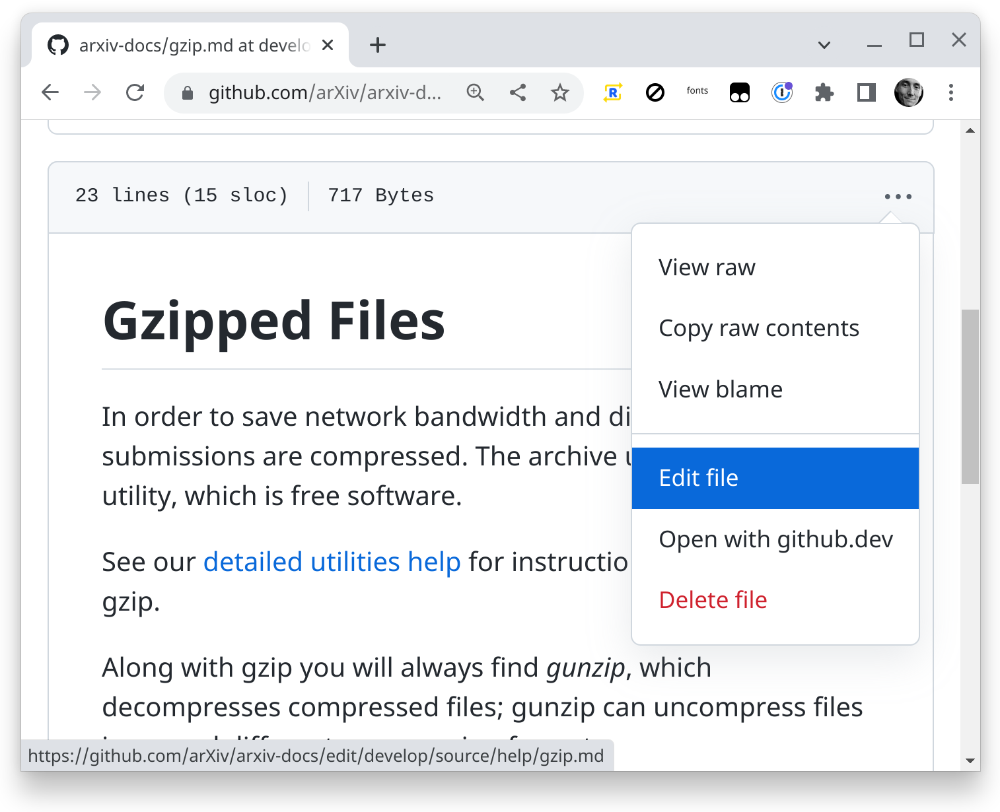
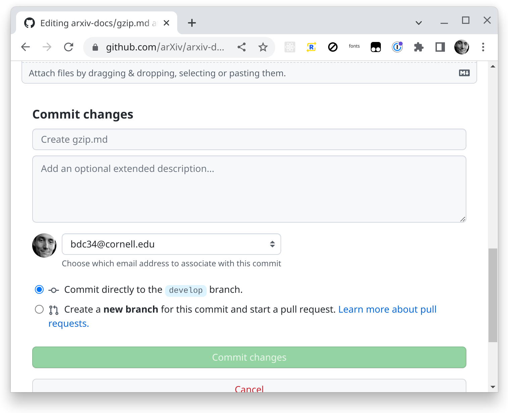
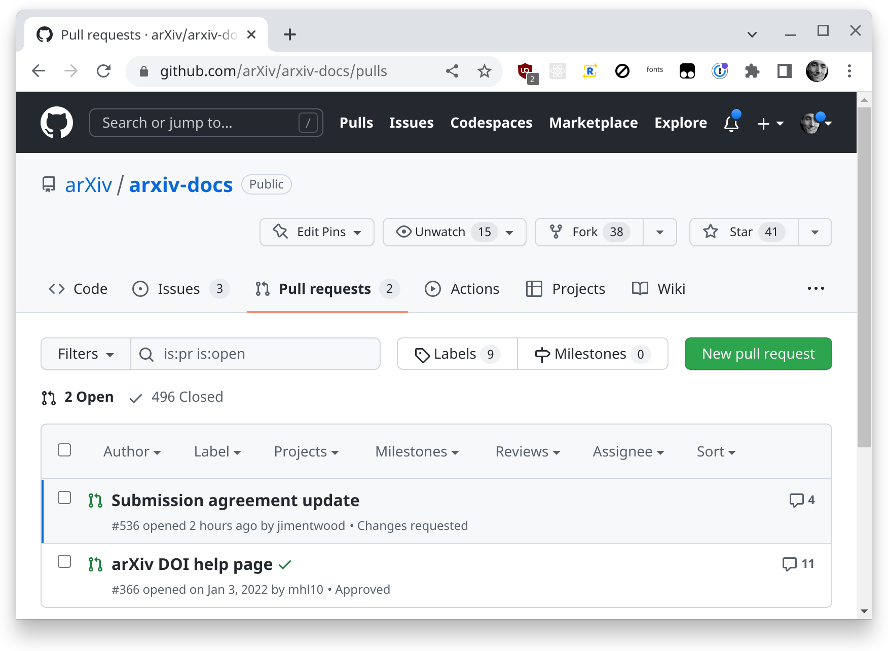

# info.arxiv.org pages

Help, about, policy and other pages for arXiv.

## Overview

This is where to make edits to the about, help, labs, new and other pages at
info.arxiv.org. These are written in
[markdown](https://daringfireball.net/projects/markdown/) and turned into HTML
pages with [mkdocs-material](https://squidfunk.github.io/mkdocs-material/).

## How to Edit a Page on github

To edit a page first go to the info.arxiv.org page you want to edit. Ex https://info.arxiv.org/help/gzip.html



There click on the pencil icon to edit the page. That will take you to the corresponding page in github.



There click "edit" and you can edit contents of the page in github. Once you
have made changes you can click preview to see how it will look when completed
There are slight differences between the markdown we use and what
github uses.



Once you are happy with your changes you can save the by going to the bottom of
the edit and "Commit changes". Commit is the term github and git use for
saving. You should put a brief note in the first text area. You may add longer
note in the larger text area if you have more to say about your changes. Then
you can commit your changes to a new branch. Click the radio button "create a
new branch" and give the new branch a name like `gzip-update` or
`ARXIVOPS-1234-gzip-update` if you have a Jira ticket.

The above step will not put your changes live on info.arxiv.org.  At that point
you have the change saved in github on a branch.

If you have more changes that are grouped with this change make them in github
and commit them on the new branch you created.

To get these change up on info.arixv.org follow the steps in "Reviewing Changes".

## Reviewing Changes
Once you have done all the changes you wanted you need to get your changes
reviewed. This is done by "creating a PR" PR stands for pull request.

To make a new PR click the "Pull Requests" tab on the top of a github page. Then
click the green "New Pull Request." You want changes from your branch to get put
into the branch called `master`.



From there you can give your PR a title and add a note about it. Also add
reviewers on the left. Then click the green "Create Pull Request"

Github will email all the reviewers.

## Getting changes deployed
Once a PR with changes is merged to develop, merging it to the branch called
`master` will cause automated scripts to deploy the changes to info.arxiv.org.

## Historical site content
See https://github.com/arXiv/arxiv-docs/releases for branches prior to 2023 when content was shifted to the source/ directory.

# Authoring Markdown
Markdown is a document syntax that allows writing documents in plain text that
can be converted to HTML or other format. The following section contains some
help about authoring the markdown format.

Basics about markdown [markdown basics](https://daringfireball.net/projects/markdown/basics)

Sometimes you might find a guide to markdown and some formating in it won't work
with info.arxiv.org. That is becasue the tool used for info.arixv.org supports 
[Gruber's markdown syntax](https://daringfireball.net/projects/markdown/syntax)
and not all the extensions that exist. 

## Links
Both absolute and relative links work. You can add a link in
``foo/index.md`` to ``foo/baz.md`` with either ``[click this absolute
link](/foo/baz.md)`` or ``[click this relative
link](baz.md)``. Relative links assist in movig directories of pages
around since a whole subdirectory can be moved and if all the pages in
it have relative links then those will not break. Absolute links
assist in moving pages around since the links on a single page do not
break if a single page is moved.

You can put static files in the same directory structure. If the page
``specifics/coolstory.md`` has an image tag like
````, this will get rendered as
``https://some.site/specifics/impressive.png``.

Only ``.md`` (markdown) files will be treated like pages. Everything
else is won't get rendered like a page (fancy headers, etc).

Inside of your ``.md`` files, you can add some front-matter. For example,
if you want the title in the browser tab and breadcrumbs to be different from
whatever is in the content of the page, you could do:

```markdown
---
title: This is the title that I like in the browser tab
---
# This is the title that gets displayed as an H1 on the page.

Bacon ipsum dolor sit amet...
```

The first H1 tag will be used as the name of the page in navigtion.


## Templates, CSS, JS

# Style options for markdown pages

Use the following css are already in the CSS used by the arxiv-docs pages.

To clear a float use a single ``#`` (an empty header) on its own line.


## Images

Note that more than one class can be applied to an image.

- make an image 100% width of content area :
```
{.mkd-img-full}
```
- make an image 60% width of content area (100% on mobile) and center it:
```
{.mkd-img-60}
```
- make a small thumbnail image:
```
{.mkd-img-thumb}
```
- add a grey border:
```
{.mkd-img-border}
```
- float an image left and make it 50% width:
```
{.mkd-img-left}
```
- float an image right and make it 50% width:
```
{.mkd-img-right}
```
- place two images side by side, each 50% width of content area (will stack at 100% width on mobile), with borders:
```
{.mkd-img-left .mkd-img-border}
{.mkd-img-left .mkd-img-border}
```

## Ordered Lists
The following styles will be automatically applied to any ordered lists, or
ordered lists within a blockquote, on your page. A normal ordered list will
produce a condensed list of items separated horizontally by some padding and a
red bullet. Enclosing the ordered list within a blockquote will produce a
2-column list of bordered items with box shadows. Stacks to a single column on
mobile.

### Syntax for Ordered List
#### plain ordered list:
```
1. item goes here
1. another item here
1. final list item
```
#### ordered list within a blockquote:
```
> 1. item goes here
> 1. another item here
> 1. final list item
```

## Unordered Lists within a Blockquote
The following styles will be automatically applied to any unordered lists within a blockquote on your page.

### Syntax for Unordered Lists within Blockquote
```
> - First item
> - This is a second item
> - Third item here
```

## Blockquotes
Use the following styles to add a subtle box-shadow around some content.


### Syntax for Blockquotes
```
> This content will appear in a blockquote.
> So will this line. Be sure to add a carrot to each line in a blockquote even...
>
> ... blank lines.
```

## CSS for a page
See [mkdocs-material additional CSS](https://squidfunk.github.io/mkdocs-material/customization/#additional-css)


## Left Nagivation Bar
Currently using custom nav bar config:
https://pypi.org/project/mkdocs-literate-nav/
Change the nav by editing /source/SUMMARY.md

# Advanced topics

`arxiv-docs` uses
[mkdocs-material](https://squidfunk.github.io/mkdocs-material) which
is theme for mkdocs. For information about customizing themes, CSS or
JS see:

https://squidfunk.github.io/mkdocs-material/customization/

## Redirects

Redirect from inside mkdocs can be done with HTML pages. Mkdocs will
pass through .html files unchanged.

Say you wanted to redirect from /xyz.html to /about/donate.html, then put this
at `source/xyz.html`:

```
    <!DOCTYPE HTML>
    <meta charset="UTF-8">
    <meta http-equiv="refresh" content="1; url=/about/donate.html">
    <script>
      window.location.href = "/about/donate.html"
    </script>
    <title>Redirect</title>
    If you are not redirected automatically, follow the <a href='/about/donate.html'>link</a>
```

Note that the URL to redirect to should be relative if it is in mkdocs
but if it is not in mkdocs, it should be absolute. That is, for
https://info.arxiv.org/cheese.html ->
https://info.arxiv.org/onions.html use a relative URL of
`/onions.html`. But for a URL outside of info.arxiv.org like
https://info.arxiv.org/corr/subjectclasses ->
https://arxiv.org/archive/cs you need to use the full URL with the
hostname.

Redirects from /about to
/about/index.html are handled by GCP buckets that are served as a
static web site. See
https://cloud.google.com/storage/docs/static-website

To get a directory to redirect, ex. /corr/subjectclasses ->
https://arxiv.org/archive/cs you need to create the directory and put
an index.html that will do the redirect.

Redirects from https://info.arxiv.org/about/contact to
https://info.arxiv.org/about/contact.html are handled by javascript in
`overrides/404.html`

## How to handle 'Missing end of comment tag'?
As of 2022-09 the macro plugin for mkdocs is disabled and this should
not be a problem. It was difficult to track down so I'm leaving this in.

When using mkdocs and the macros plug in you can get a stack grace
with a Jinja error like message "Missing end of comment tag".  This is
often due to LaTeX or code samples with text like ` "{{?}}"
`.

See the [mkdocs-macros docs](https://mkdocs-macros-plugin.readthedocs.io/en/latest/advanced/#code-blocks-containing-similar-languages) for several ways to work around this.


## Building a local site

Instead of using github to edit you can check all the files for arxiv-docs to
your laptop to edit and preview.

```bash
git clone git@github.com:arXiv/arxiv-docs.git
cd arxiv-docs
python --version
# 3.8.12
python -m venv docs-venv
source docs-venv/bin/activate
pip install -r requirements.txt
mkdocs serve
google-chrome https://localhost:8000/index.html
```

Then you will have the site served locally with hot reloading on edits. In your
browser, go to http://localhost:8000/index.html

## Where can I find more about mkdocs-material?
See [mkdocs-material/customization](https://squidfunk.github.io/mkdocs-material/customization/)


## Deployment to info.arxiv.org

Commits or merges to `arxiv-docs` `master` branch will deploy the site.

The cloud build YAML files combined with CloudBuild triggers in
`arxiv-production` comprise the deployment pipeline for `arxiv-docs`.

## Previews of PRs

PRs that will merge to the branch `develop` on the github repo
`arxiv-docs` will deploy previews at
https://storage.googleapis.com/arxiv-docs-prs/YOUR_PR_NAME/index.html
This preview can been seen by the public, everything in the github
arxiv-docs repo can also be seen by the public.
