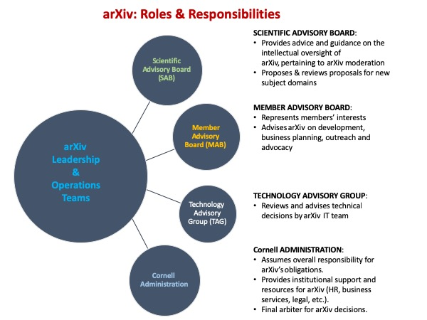
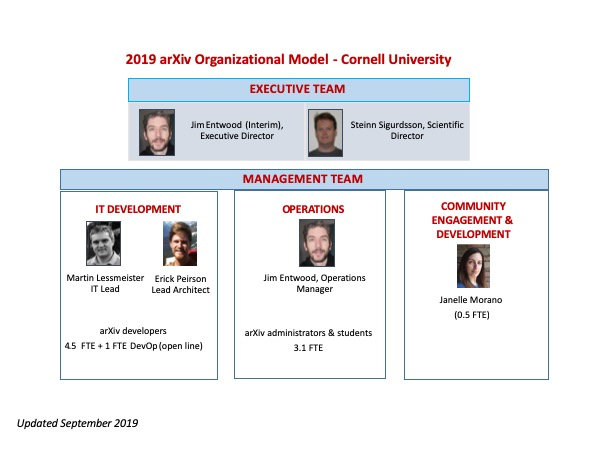
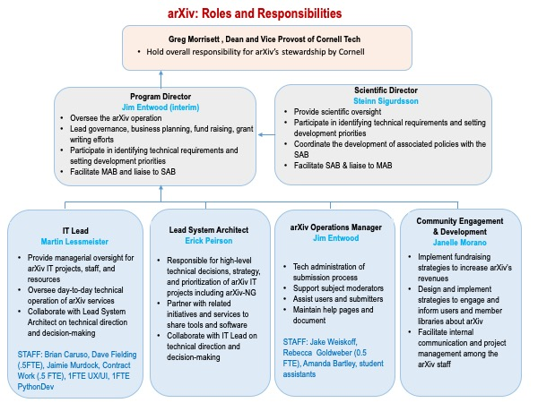

# arXiv Governance Model and Business Support

## Governance
arXiv is governed by its [operating principles](/about/principles). Operations are maintained by the arXiv Leadership Team and arXiv staff at Cornell, with the help of numerous volunteer subject moderators. Governance of arXiv is led by the Leadership Team with guidance from the [arXiv Scientific Advisory Board](/about/people/scientific_ad_board) and the [arXiv Member Advisory Board](/about/people/member_ad_board). The [Technical Advisory Group](/about/people/technical_ad_group) provides technical advice to the IT Team.

The arXiv team, consisting of the [arXiv Leadership Team](/people/leadership_team) and arXiv staff, is responsible for the operations and sustainability of arXiv.

## Business Support

arXiv’s sustainability planning creates a broad-based, community-supported resource, ensuring that the ultimate responsibility for sustaining arXiv remains with the research communities and institutions that benefit from the service most directly. arXiv’s sources of revenue are from 1) Cornell University, which provides a cash subsidy in support of arXiv’s operational costs and an in-kind contribution of all indirect costs, which currently represents 37% of total operating expenses, 2) The Simons Foundation, 3) [member institutions](about/membership), 4) [gifts](/about/give), and 5) grants from foundations and agencies.
