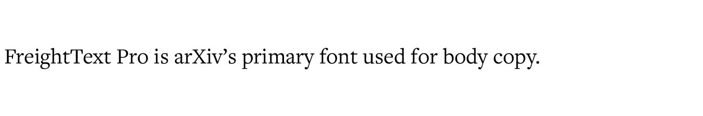
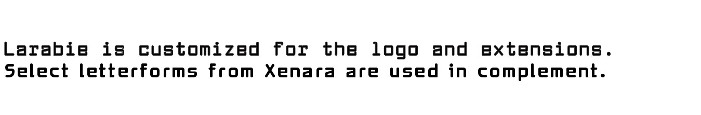
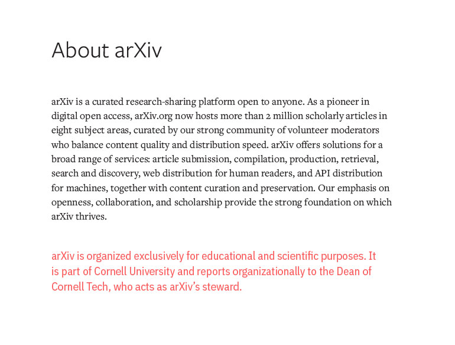
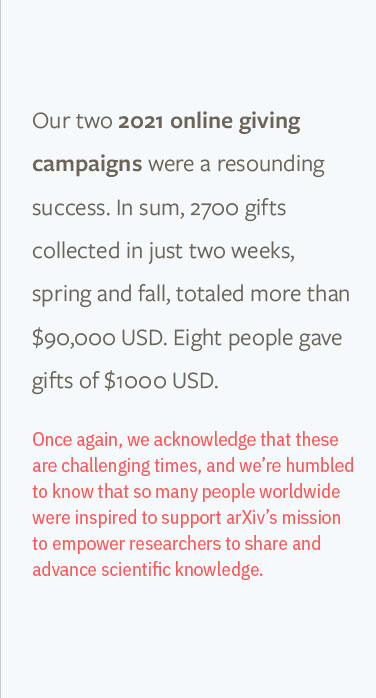
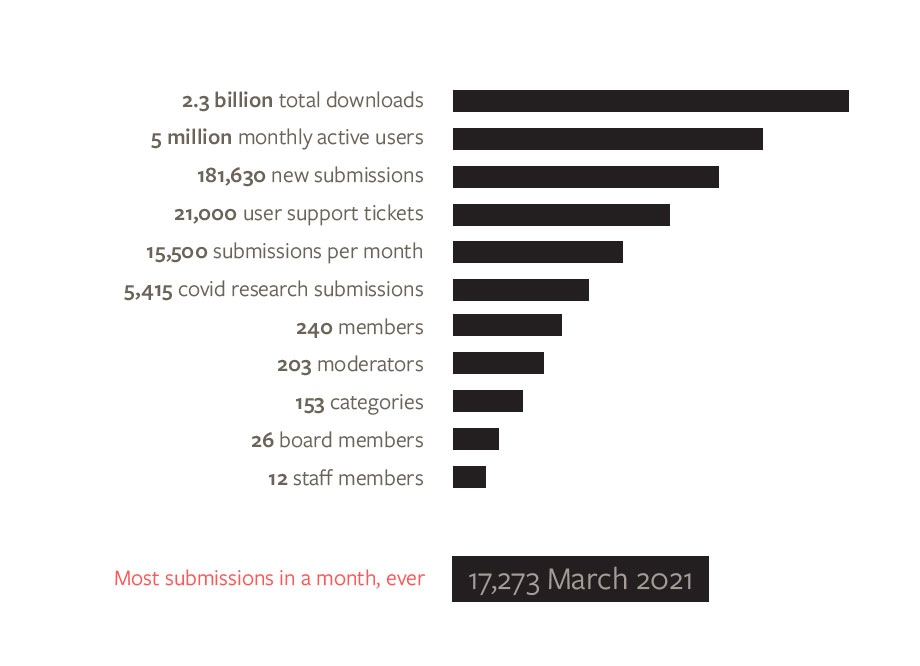

#Fonts

arXiv uses two main typefaces from the Freight family, and two accent typefaces. The Freight family draw from Cornell University’s branding and connect us stylistically with our parent organization. The accent typefaces add variation and interest, and bridge a modern look with our retro 90's roots.

##arXiv Fonts
FreightText pro is our primary typeface. With high legibility and a classic, sophisticated look it is the workhorse of the arXiv look and feel:
{.mkd-img-60}

FreightSans Pro elegantly complements it's serif sibling font. The clean lines of this sans serif face lend themselves well to larger uses like titles, and special use cases like callouts, sidebars, and other secondary content.
{.mkd-img-60}

IBM Plex Sans Condensed is used for special cases where a bold face is called for. Special headings, annotations, limited horizontal space, or labels are all good candidates for IBM Plex Sans Condensed:
{.mkd-img-60}

Larabiefont, in combination with Xenara, is customized for use in our logo, as well as logo lockups and logo extensions for special partnerships. Larabie is our base logo font, however certain letterforms from Xenara—like the 'e'—have greater legibility and elegance and are incorporated:
{.mkd-img-60}

##Examples

> 1. **Title:** FreightSans Pro, Medium, Black 
>  **Body Copy:** FreightText Pro, Book, Black 
>  **Secondary copy:** IBM Plex Sans Condensed, Salmon 
>  

> 1. **Callout:** FreightSans Pro, Book & Bold, in Warm Grey 
> **Highlight:** IBM Sans Plex Condensed in Salmon 
> Over a Light Blue background 
> 

> 1. **Quotation:** FreightSans Pro, Book, in Dark Warm Grey with Light Grey highlighting 
> **Attribution:** FreightSans Pro, Medium, in Warm Grey
> 

> 1. **30th Anniversary identity:** FreightText Pro, Bold in Cornell Red and Black
> 

> 1. **Infographic:** FreightSans Pro, Bold and Medium, in Warm Grey
> 
