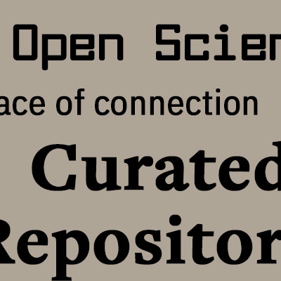
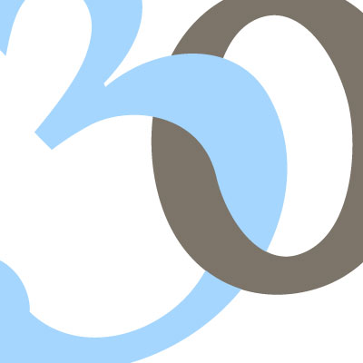
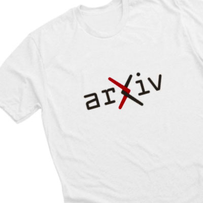

#Our Brand Philosophy

As we evolve to meet the diverse needs of researchers around the globe and protect arXiv for the future, how we present ourselves is evolving too. After three decades of transforming scientific publishing, here we introduce a fresh update to the arXiv we have loved and relied on for 30 years.

Strengthening arXiv’s brand is one way we can protect an open pre-print culture and keep arXiv free for everyone. From communicating with our global community, to how to use the logo, our guidelines for brand use allow us to maintain consistent quality and build a unified message without limiting creativity.

Researchers depend on arXiv. Many authors have their life’s work hosted on the platform. Our website is not just a tool, it’s personal. While we recognize the pressing need to modernize the arXiv website and brand, all changes will be done thoughtfully and with respect for our users. Consistently referencing our brand guidelines will help us achieve this balance.

#Table of Contents
> - {.mkd-img-full}[Brand Pillars](brand-pillars)
> - {.mkd-img-60}[Logos](logos)
> - {.mkd-img-60}[The arXiv Voice](voice)
> - {.mkd-img-60}[Tagline](tagline)
> - {.mkd-img-full}[Images](images)
> - {.mkd-img-full}[Fonts](fonts)
> - {.mkd-img-full}[Colors](colors)
> - {.mkd-img-60}[Typography](typography)
> - {.mkd-img-full}[Quotes](quotes)
> - {.mkd-img-full}[Merchandise](swag)
> - {.mkd-img-full}[Guidelines](brand-guidelines)
