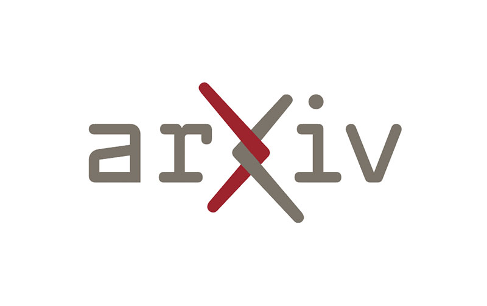
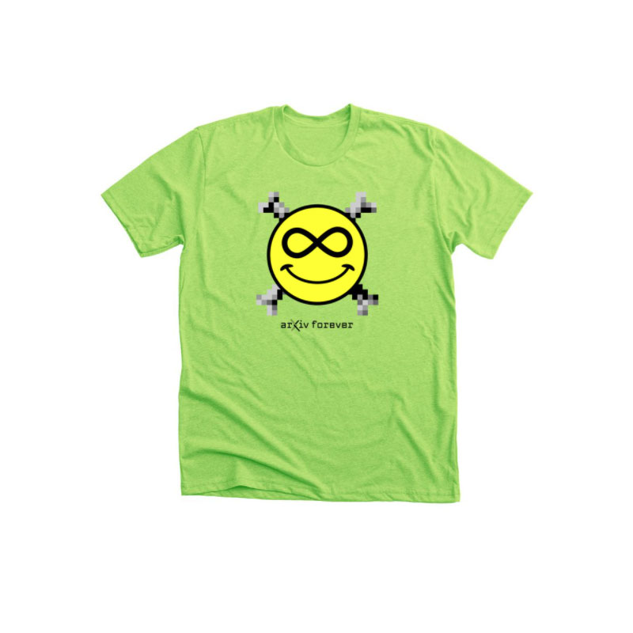

#Logos

Our identifying mark, vetted and approved by Cornell University, achieves the *legibility, memorability and legal defensibility* arXiv needs. Our logo is ready to help us share a consistent, intentional, and meaningful message about who we are with the world. That message is: arXiv is a place of connection, linking together people and ideas, and connecting them with the world of open science.

The arXiv logo nods to the past with a font that pays homage to arXiv’s birth in the 90’s, while also being boldly forward looking. The arms of the ‘X’ retain stylistic elements of the ‘chi’ in our name, with a lengthened top left and lower right branch. Symbolically, the intertwining of the arms at the heart of the logo captures the spirit of arXiv’s core value as a place of connection.

Using our logo consistently over time will build up rich layers of meaning with our community, and it’s value to arXiv will increase exponentially. The legal protection we have over the logo will help us also protect the arXiv service that we all love.

<a href="box-logos-here" class="button-fancy">Download Logo Assets  </a>
*The logo should not be altered in any way, redrawn, used in an unspecified color or reproduced on a background that will impair its visual recognition. Use of the name arXiv and associated logos, web addresses, and colors are only allowed with explicit written permission from the arXiv management team.*

Are you a third party looking to use our logos in your product or materials?
<a href="box-logos-here" class="button-fancy">Read our logo usage guidelines  </a>

##Primary Logo
The primary arXiv logo is our default mark seen in most applications. It showcases two primary brand colors: Dark Grey and Cornell Red.

{.mkd-img-left}

###Spacing
A clear area around the logo prevents any nearby graphic elements from interfering with the name’s impact. This distance is the minimum amount of space that must surround the logo. Create the clear area in proportion to the type size. The “X” represents the height the “a” in arXiv.

{.mkd-img-left}

##Alternate Logos
The arXiv logo is available in various alternate colors for special use cases.

On a dark background, the dark mode version can be used for greater contrast:
{.mkd-img-left}

The alternate salmon color can be used where Cornell Red is inappropriate, while staying in the same warm color family:
{.mkd-img-left}

Single color versions can be used when a simpler, higher contrast version is needed such as single color print applications:
{.mkd-img-left}
{.mkd-img-left}

##Lockups and Extensions
Lockups are used for internal arXiv projects with unique impact and a need for distinct branding, or for pre-approved partnership use.

The primary lockup configuration should maintain spacing around the logo equal to the height of the ‘a’,  as shown:
{.mkd-img-left}
{.mkd-img-left}

Logo extensions can be created on a custom basis for distinct projects, like arXiv Check:
{.mkd-img-left}

##Supergraphic
arXiv's supergraphic provides a new twist on an old favorite: the arXiv "smileybones". Quirky, scrappy, inscrutable, and whaaaat? are just some of the ways this icon has been described over the years. The updated icon celebrates the pixelation of the original 90's image, and it's rebellious nature, with a modernized and high quality homage. For fun, here is a [brief history](https://www.quora.com/Whats-the-story-behind-the-arXiv-org-favicon) of the original icon.

{.mkd-img-left}

The smileybones supergraphic should be used in applications where it can display on a large enough scale for impact, and where a bit of informality is appropriate, such as in the examples below.

{.mkd-img-left}
{.mkd-img-left}
