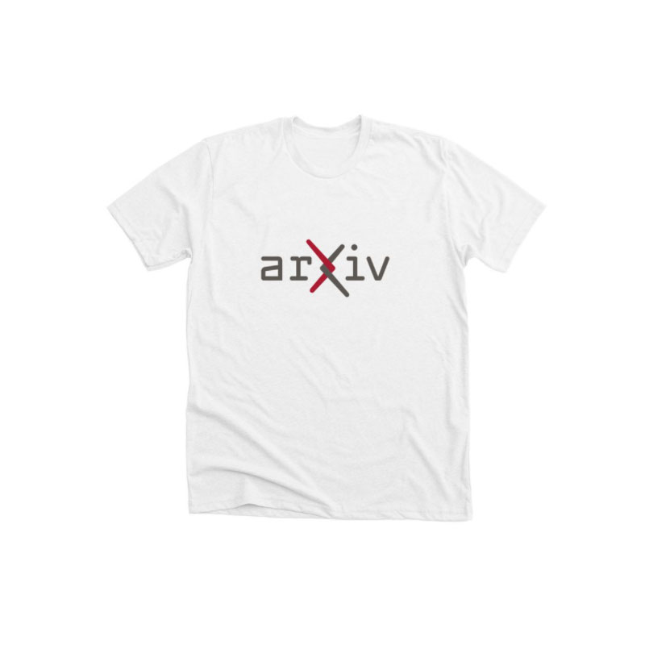
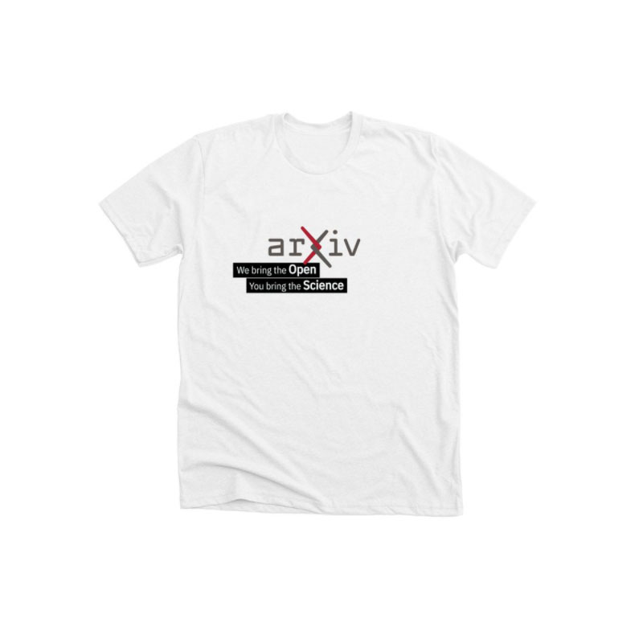

#Merchandise

arXiv's community is enthusiastic! They appreciate a thank you, or the ability to take home a little piece of the arXiv they love so much, and to support this service at the same time. Expressing our visual identity on products in the real world also helps establish our branding on a firm footing, protecting arXiv and our ability to continue to provide this service.

Swag is also a good place for experimenting with informal, playful, and edgier permutations of the arXiv brand.

##Store
arXiv maintains a [non-profit store](https://www.bonfire.com/store/arxiv-official/) with Bonfire.com, which prints orders on demand and ships directly to customers with no upfront costs.

Our most popular product is the arXiv logo on a cotton t-shirt, followed by the arXiv logo on a white mug.
{.mkd-img-left}
{.mkd-img-left}

We always like to offer a few other options that celebrate different aspects of the arXiv identity.
{.mkd-img-left}
{.mkd-img-left}

Merchandise is also a good way to celebrate special events, such as our 30th anniversary when we offered a number of limited time products.

##Appreciation, and other expressions of identity
arXiv has many opportunities to say thanks and strengthen connections, and a small tangible 'something' can make all the impact in the world. In addition to the swaggy items above, here is a sampling of other permutations:

{.mkd-img-left}
{.mkd-img-left}
{.mkd-img-left}
