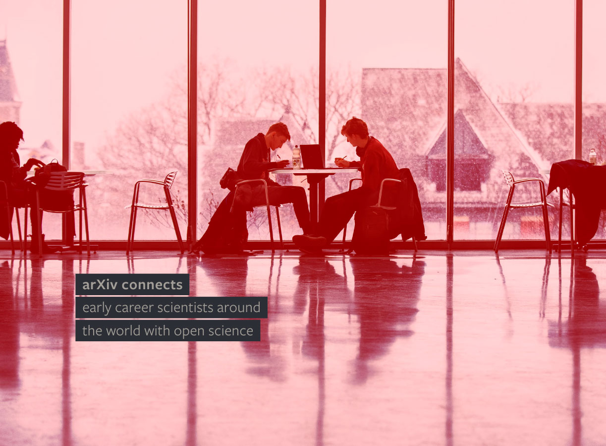

#Tagline

The tagline **"arXiv connects..."** reflects our role as a place of connection among researchers, institutions, repositories, other Xivs, and to the world of open science. It re-enforces the message of interconnectivity behind arXiv's logo, but adds specific context through word and image choices.

Our tagline is both consistent and flexible. It always begins with "arXiv connects" in a semi-bold weight, with the second line starting in lowercase and in a regular weight. The text is always highlighted in a bold black, with two pixels of spacing between the highlighted lines. No punctuation is ever used.

The font used is Freight Sans Pro (in Google applications, use Catamaran. When other fonts are not available default to Arial). The text color is Light Warm Grey over a black background.

##Tagline Example 1

In the example below, the tagline is layered over a large, colorized photo for impact. The black highlight allows the tagline to retain legibility over even very busy backgrounds.

Note the correct line break after 'arXiv connects'
{.mkd-img-full}

##Tagline Example 2

In this second example, the tagline breaks the grid established by other text on the page.
{.mkd-img-full}

##Tagline Example 3

In the following page layout, the tagline follows the established grid, while the photo breaks the grid. The tagline is most often, though not exclusively, overlayed on top of a photographic image that bleeds of one or more edges. Photos can add further context, build a sense of place, and reinforce the tagline message.
{.mkd-img-full}

##Tagline Example 4

The tagline is used in our Membership Newsletter header. By changing the context of the second line arXiv can draw attention to the specific idea being conveyed, or celebrate a particular audience.

The photo aligns with the grid, while the tagline breaks it to the left. Due to the limitations of email, the font in this case is Arial.
{.mkd-img-full}
