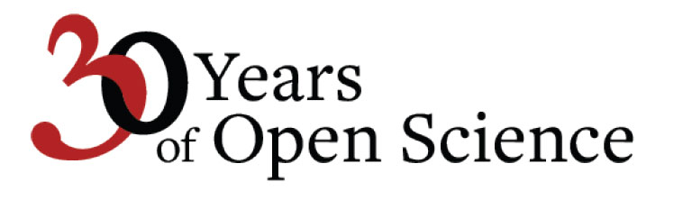

#Typography

Typographic treatments are at the heart of arXiv's identity. Maintaining consistency across all communications is, in large part, achieved through consistency of type. But within this framework there are options and a lot of room for creativity. Use the guidelines below to maintain consistency and spontaneity.

Base styles are built around the Freight font, both Text Pro and Sans Pro. The Freight family draw from Cornell University’s branding and connect us stylistically with our parent organization. From this baseline we have developed several treatments that range from elegant and sophisticated to edgy and bold.

##Architectural
This architectural treatments of the type allows for endless variations. The guiding principles are elegance, brevity, and high legibility. Contrasting font sizes and interesting interplay of letterforms provide visual interest without sacrificing legibility or elegance.

{.mkd-img-left .mkd-img-border}
{.mkd-img-right .mkd-img-border}

##Intertwined Letterforms
We also use intertwined letterforms to echo the arms of the chi in our logo.

{.mkd-img-left .mkd-img-border}
{.mkd-img-right .mkd-img-border}

##Highlighting
We use text highlighting in two contexts, taglines and quotes.

**Tagline:** The highlight color for the tagline is always black with Light Warm Grey type, as in this example:
{.mkd-img-60 .mkd-img-border}

**Quotes:** Quotes use a Dark Warm Grey type over a Light Warm Grey highlight color, as shows here:
{.mkd-img-60 .mkd-img-border}

Learn more about [tagline formatting](tagline) and [using quotations](quotes).
