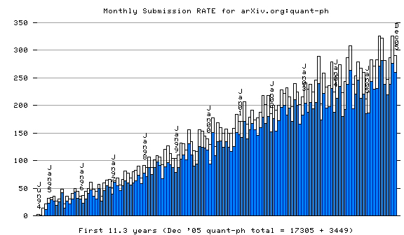
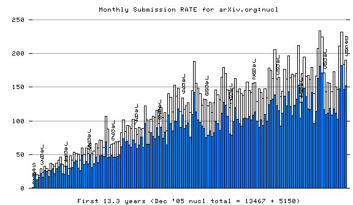
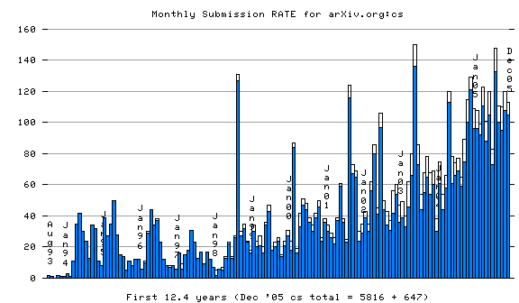
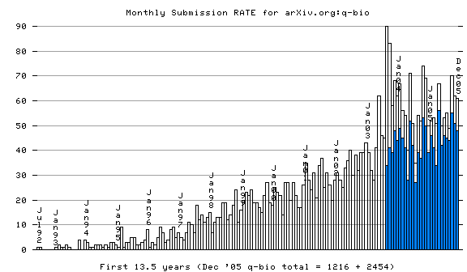

[arXiv](/) monthly submission **rate** statistics, 31 Dec '05
=============================================================

(for the remaining "subject areas": math(+math-ph), gr-qc, quant-ph,
nucl, physics(other), nlin, cs, q-bio)

------------------------------------------------------------------------

------------------------------------------------------------------------

------------------------------------------------------------------------

------------------------------------------------------------------------

------------------------------------------------------------------------

------------------------------------------------------------------------

------------------------------------------------------------------------

------------------------------------------------------------------------

------------------------------------------------------------------------
