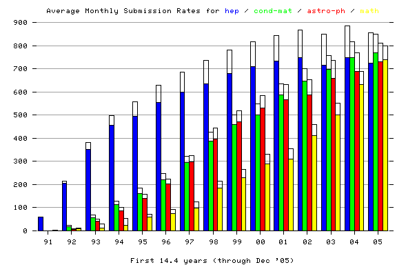
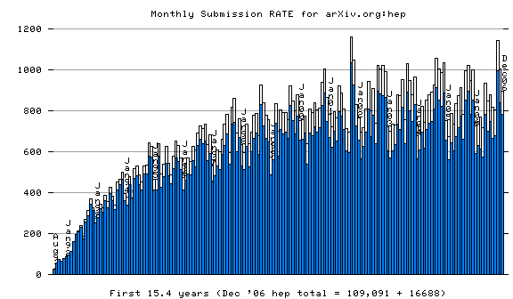

arXiv monthly submission **rate** statistics, 31 Dec '06
========================================================

(for the four largest "subject areas": "hep" = High Energy Physics,
"cond-mat" = Condensed Matter Physics, "astro-ph" = Astrophysics, "math"
= Mathematics)   
Blue/Green/Red/Purple - Average number of submissions/month as a
function of calendar year for hep/cond-mat/astro-ph/math(+math-ph).  
**Note:** These are not meant to be interpreted as measures of research
output, but rather only as measures of the extent to which communities
deposit their ouput at arXiv.org  
In calendar year '05, the astro-ph and cond-mat submission rates each
grew to exceed the hep rate (which appears to have flattened out in the
late '90s, suggesting 100% participation from that community).
math(+math-ph) has been growing even faster since 2002 (suggesting a
rapid adoption of this resource by an increasing percentage of the
mathematics community).

------------------------------------------------------------------------

  
Blue - Number of new hep (= hep-th/hep-ph/hep-lat/hep-ex) submissions
received during each month since Aug '91 (+ cross-listings to hep in
clear)

------------------------------------------------------------------------

  
Green - Number of new cond-mat submissions received during each month
since Aug '91 (+ cross-listings to cond-mat in clear)

------------------------------------------------------------------------

  
Red - Number of new astro-ph submissions received during each month
since Aug '91 (+ cross-listings to astro-ph in clear)

------------------------------------------------------------------------

The current submission rates (i.e. averaged over calendar year '06) as
percentages of the average '06
[overall](http://arxiv.org/stats/monthly_submissions) average rate of
4186/month are roughly:

-   math(+math-ph): 21.2%
-   astro-ph: 18.5%
-   cond-mat: 18.4%
-   hep: 17.1%

> (The '06 submission rates for the [remaining](remmonthly.html) subject
> areas are:  
> physics(other): 6.3%, quant-ph: 5.9%, gr-qc: 3.5%, cs: 3.3%, nucl:
> 3.0%, nlin: 1.7%, q-bio: 1.2% )

The total number of submissions to date as percentages of the total
400680 submissions (i.e. Aug '91 through Dec '06) are roughly:

-   hep: 27.2%
-   cond-mat: 19.2%
-   astro-ph: 18.5%

> (The overall percentages to date for the remaining subject areas
> are:  
> [math(+math-ph)](math_monthly.png): 13.8%,
> [quant-ph](quant-ph_monthly.png): 5.1%, [gr-qc](gr-qc_monthly.png):
> 4.1%, [physics(other)](physics_monthly.png): 3.8%,
> [nucl](nucl_monthly.png): 3.4%, [nlin](nlin_monthly.png): 2.2%,
> [cs](cs_monthly.png): 1.9% , [q-bio](q-bio_monthly.png): 0.5% )

------------------------------------------------------------------------

For the first half of calendar year '03: **84%**
of the new submissions came via web upload, **16%** via the original
e-mail interface, and **2%** via anonymous ftp upload. (The web upload
was enabled in June '96 after a multi-year wait for browsers to support
it. E-mail and ftp submissions were disabled in Jul '03.) For years
past:

<table>
<tbody>
<tr class="odd">
<td>uploads</td>
<td>late '96</td>
<td>'97</td>
<td>'98</td>
<td>'99</td>
<td>'00</td>
<td>'01</td>
<td>'02</td>
<td>'03 (6mo)</td>
</tr>
<tr class="even">
<td>web</td>
<td>13%</td>
<td>21%</td>
<td>49%</td>
<td>60%</td>
<td>68%</td>
<td>75%</td>
<td>80%</td>
<td>84%</td>
</tr>
<tr class="odd">
<td>e-mail</td>
<td>77%</td>
<td>67%</td>
<td>43%</td>
<td>34%</td>
<td>27%</td>
<td>21%</td>
<td>17%</td>
<td>14%</td>
</tr>
<tr class="even">
<td>ftp</td>
<td>10%</td>
<td>12%</td>
<td>8%</td>
<td>6%</td>
<td>5%</td>
<td>4%</td>
<td>3%</td>
<td>2%</td>
</tr>
</tbody>
</table>

------------------------------------------------------------------------

**Note also:** [distributions](au_all.html) according to e-mail domain
of submitting author
