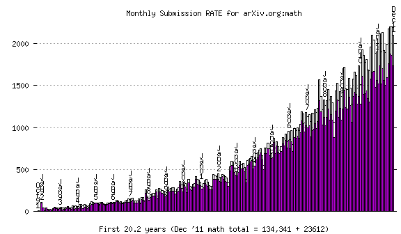
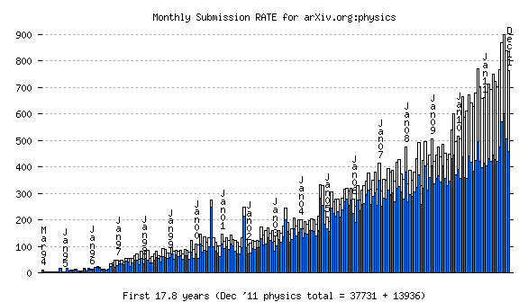
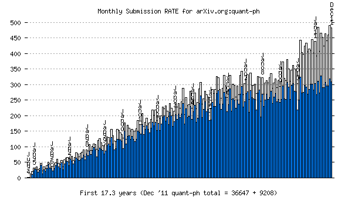
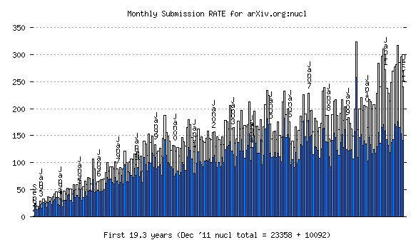
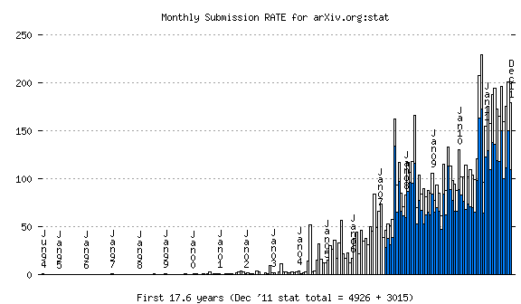
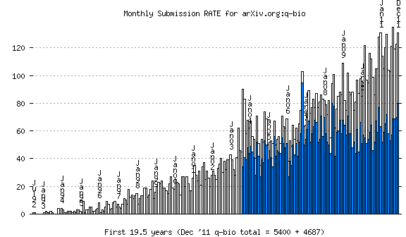
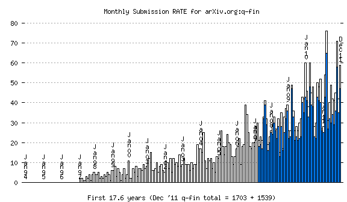

[arXiv](/) monthly submission **rate** statistics, 1 Jan '12
============================================================

(for the remaining "subject areas": math(+math-ph), cs, physics(other),
quant-ph, gr-qc, nucl, stat, nlin, q-bio, q-fin)

------------------------------------------------------------------------

------------------------------------------------------------------------

------------------------------------------------------------------------

------------------------------------------------------------------------

------------------------------------------------------------------------

------------------------------------------------------------------------

------------------------------------------------------------------------

------------------------------------------------------------------------

------------------------------------------------------------------------

------------------------------------------------------------------------

------------------------------------------------------------------------
