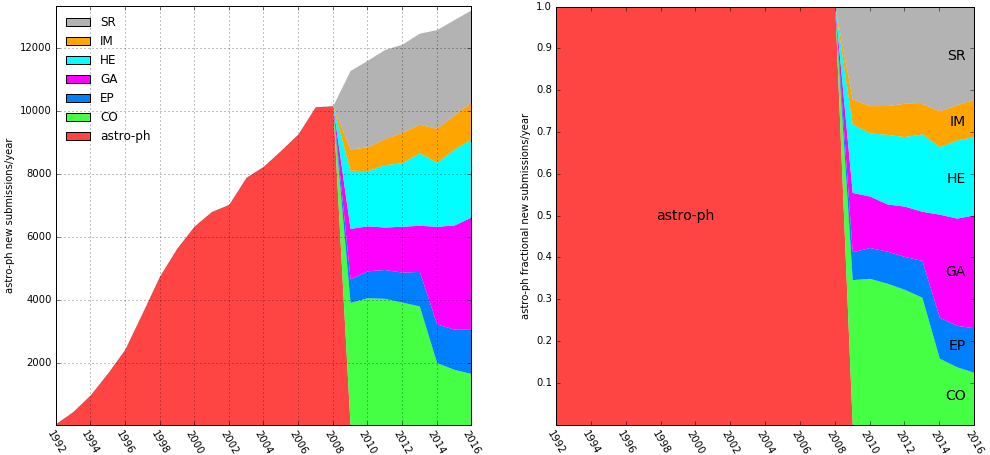
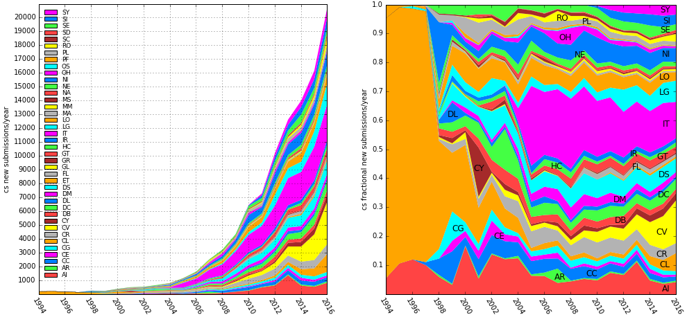
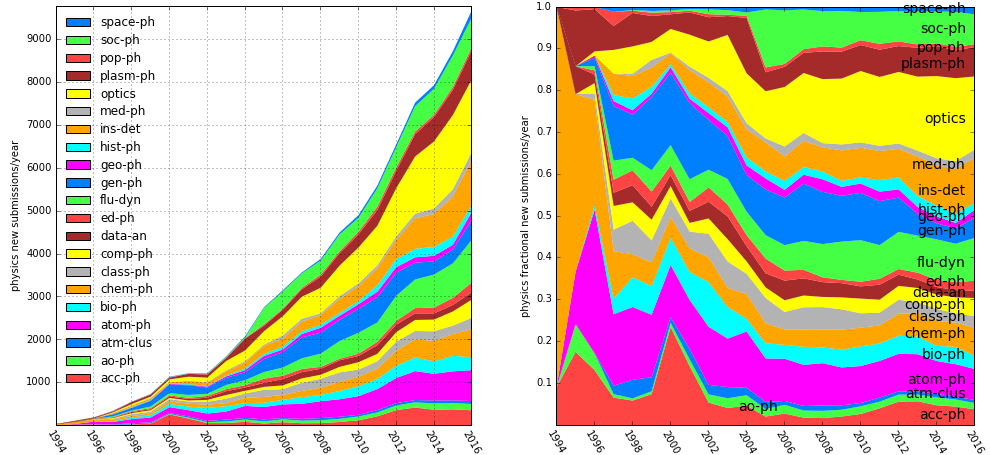
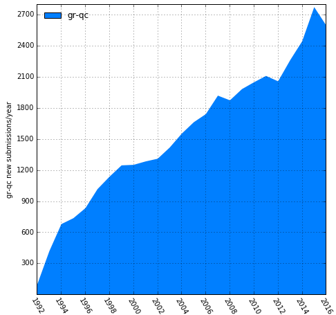
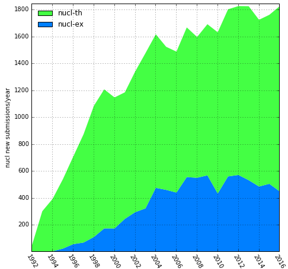
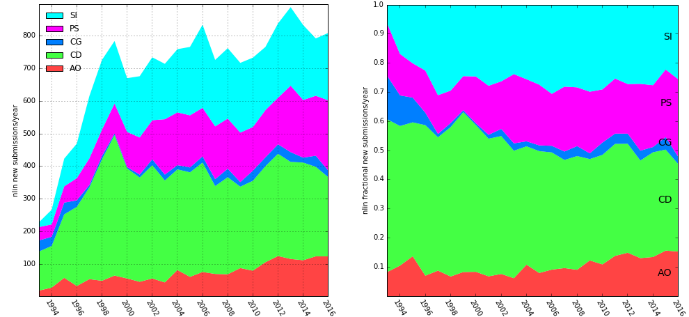

arXiv submission rate statistics
================================

Data for 1991 through 2016, updated 31 December 2016.

{: width="850"}

Left: number of new submissions/year as a function of calendar year for
"hep" = High Energy Physics (hep-th+hep-ph+hep-lat+hep-ex), "cond-mat" =
Condensed Matter Physics, "astro-ph" = Astrophysics, "math" =
Mathematics (math+math-ph), "other physics" =
physics+nucl+gr-qc+quant-ph+nlin, cs, stats, biology = q-bio, finance =
q-fin.

The graph on the right shows the same data as at left, but with the
submission rates divided by the total for each year, giving the
fractional submission rates for each of the domains, and highlighting
the growth in submission rates from new domains.

**Notes:** These are not meant to be interpreted as measures of research
output, but rather only as measures of the extent to which communities
deposit their ouput at arXiv.org. The graphic illustrates its adoption
by research communities that did not necessarily employ a formal prior
paper preprint distribution system, as did HEP.

In calendar year 2005, the astro-ph and cond-mat submission rates each
grew to exceed the hep rate (which appears to have flattened out in the
late 1990s, suggesting 100% participation from that community,
fluctuating about a mean of roughly 8800/year for 2000-2010, but then
with a bit of a superluminal+higgs bump in 2011, and another higgs bump
in 2012, to over 9600/year for each of those two years, and staying at
the new plateau through 2016). A diminished cond-mat growth rate in
2004-2007 was due in part to the shift of biologically related
submissions from cond-mat.soft to q-bio, and network/complex systems
submissions from cond-mat.stat-mech to physics.soc-ph.

math(+math-ph) has been growing even faster since 2002 (suggesting a
rapid adoption of this resource by an increasing percentage of the
mathematics community). The cs rate started as well to ramp up in 2007,
grew to exceed the hep rate in calendar year 2012, and has been at an
extremely fast growth rate since 2011. It is misleading, of course, to
compare subfields of physics to the entirety of mathematics or computer
science, since the current total numbers of publications per year in the
three overall domains are roughly comparable.

The current submission rates (i.e., averaged over calendar year 2016) as
percentages of the average 2016
[overall](http://arxiv.org/stats/monthly_submissions) average rate of
9448/month (113380 total for 2016, corresponding to the vertical slices
at 2016 in the above graphs) are roughly:

-   math+math-ph (29953): 26.4%
-   cs (20767): 18.3%
-   cond-mat (14622): 12.9%
-   astro-ph (13214): 11.7%
-   hep (9673): 8.5%
-   physics (9670): 8.5%
-   quant-ph (4737): 4.2%
-   stat (3072): 2.7%
-   gr-qc (2596): 2.3%
-   nucl (1828): 1.6%
-   q-bio (1689): 1.5%
-   nlin (810): 0.7%
-   q-fin (749): 0.7%

{: width="850"}

The graphs above show the cumulative data as a function of time, where
the current total number of submissions to date as percentages of the
total 1219219 submissions (corresponding to the vertical slices at 2016
in the above, i.e., all of Aug 1991 through Dec 2016) are roughly:

-   [math+math-ph](math_yearly.png) (267469): 21.9%
-   [hep](hep_yearly.png) (203315): 16.7%
-   [cond-mat](cond-mat_yearly.png) (196411): 16.1%
-   [astro-ph](astro-ph_yearly.png) (192160): 15.8%
-   [cs](cs_yearly.png) (105378): 8.6%
-   [physics](physics_yearly.png) (78068): 6.4%
-   [quant-ph](quant-ph_yearly.png) (58108): 4.8%
-   [gr-qc](gr-qc_yearly.png) (38485): 3.2%
-   [nucl](nucl_yearly.png) (32336): 2.7%
-   [nlin](nlin_yearly.png) (16552): 1.4%
-   [stat](stat_yearly.png) (13324): 1.1%
-   [q-bio](q-bio_yearly.png) (12713): 1.0%
-   [q-fin](q-fin_yearly.png) (4900): 0.4%

Graphs of yearly submission rates by archive
--------------------------------------------

{: width="850"}

{: width="850"}

{: width="850"}

{: width="850"}

{: width="850"}

{: width="850"}

{: width="415"}

{: width="415"}

{: width="415"}

{: width="850"}

{: width="850"}

{: width="850"}

{: width="850"}
