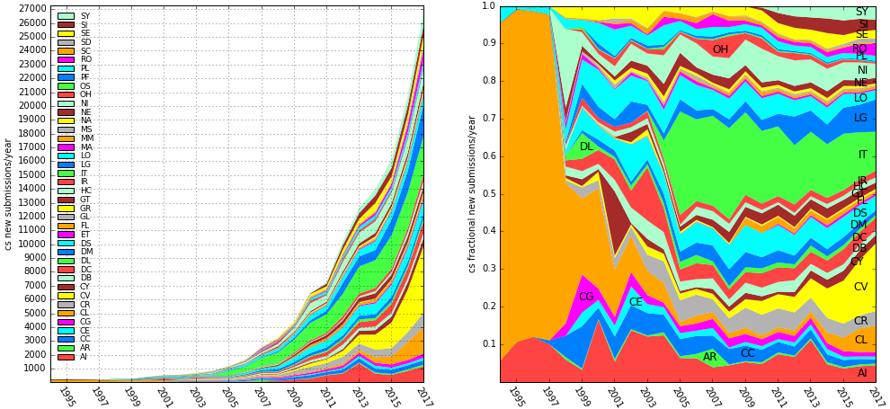
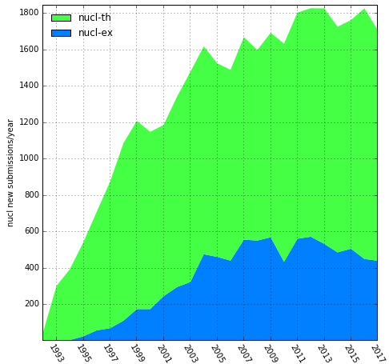
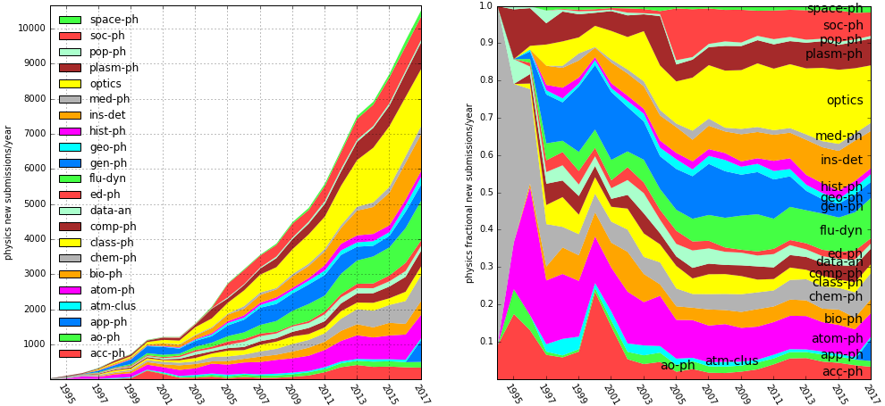
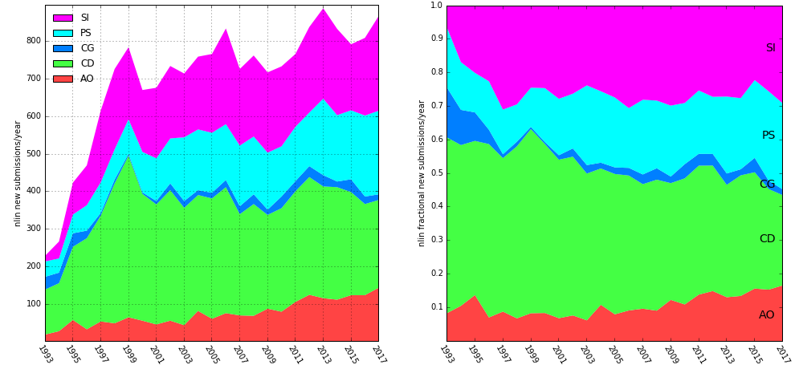

arXiv submission rate statistics
================================

Data for 1991 through 2017, updated 31 December 2017.

Left: number of new submissions/year as a function of calendar year for "hep" = High Energy Physics (hep-th+hep-ph+hep-lat+hep-ex), "cond-mat" = Condensed Matter Physics, "astro-ph" = Astrophysics, "other physics" = physics+nucl+gr-qc+quant-ph+nlin, "math" = Mathematics (math+math-ph), cs, eess, stats, biology = q-bio, finance = q-fin (+econ.EM). The graph on the right shows the same data as at left, but with the submission rates divided by the total for each year, giving the fractional submission rates for each of the domains, and highlighting the growth in submission rates from newer domains.

The numbers indicate the extent to which communities deposit their ouput at arXiv.org, rather than absolute measures of research output. The graphic also illustrates the growing adoption by research communities that did not necessarily employ a formal prior paper preprint distribution system, as did HEP. The incoming rate for 2017 was composed of roughly 47% physics, 26% math, and 22% cs. (2017 was the first year that the incoming percentage of physics dropped to below 50% of the incoming total.) The current total numbers of publications per year in those three domains are roughly comparable, so the latter two percentages may continue to increase.

Going further back, in calendar year 2005 the [astro-ph](#astro-ph_yearly) and [cond-mat](#cond-mat_yearly) submission rates each grew to exceed the [hep](#hep_yearly) rate (which appears to have flattened out in the late 1990s, suggesting 100% participation from that community, fluctuating about a mean of roughly 8800/year for 2000-2010, but then with a bit of a superluminal+higgs bump in 2011, plus another higgs bump in 2012, to over 9600/year for each of those two years, and staying at the 2011 level through 2017). A diminished cond-mat growth rate in 2004-2007 was due in part to the shift of biologically related submissions from cond-mat.soft to q-bio, and network/complex systems submissions from cond-mat.stat-mech to physics.soc-ph. The decreased rate for cond-mat.mes-hall in 2017 was due to the creation of physics.app-ph. [math(+math-ph](#math_yearly)) started growing very quickly in 2002 as arXiv was adopted an increasing percentage of the mathematics community. The [cs](#cs_yearly) rate started as well to ramp up in 2007, grew to exceed the hep rate in calendar year 2012, continued on a very fast growth rate 2011-2015, and on an even faster growth rate since 2015 (driven largely by the computer vision, machine learning, and computational linguistics communities).

The current submission rates (i.e., averaged over calendar year 2017) as percentages of the average 2017 [overall](http://arxiv.org/stats/monthly_submissions) average rate of 10293/month (123523 total for 2017) are roughly:

*   [math+math-ph](#math_yearly) (31577): 25.6%
*   [cs](#cs_yearly) (27031): 21.9%
*   [cond-mat](#cond-mat_yearly) (14391): 11.7%
*   [astro-ph](#astro-ph_yearly) (13264): 10.7%
*   [hep](#hep_yearly) (9590): 7.8%
*   [physics](#physics_yearly) (10564): 8.6%
*   [quant-ph](#quant-ph_gr-qc_yearly) (4995): 4.0%
*   [stat](#stat_yearly) (4003): 3.2%
*   [gr-qc](#quant-ph_gr-qc_yearly) (2659): 2.2%
*   [nucl](#nucl_yearly) (1708): 1.4%
*   [q-bio](#q-bio_yearly) (1678): 1.4%
*   [nlin](#nlin_yearly) (869): 0.7%
*   [q-fin](#q-fin_yearly) (718): 0.6%

The graphs above show the cumulative data as a function of time, where the current (2017) cumulative number of submissions to date as percentages of the total 1342742 submissions are roughly:

*   [math+math-ph](#math_yearly) (299046): 22.3%
*   [hep](#hep_yearly) (212905): 15.9%
*   [cond-mat](#cond-mat_yearly) (210802): 15.7%
*   [astro-ph](#astro-ph_yearly) (205424): 15.3%
*   [cs](#cs_yearly) (132409): 9.9%
*   [physics](#physics_yearly) (88632): 6.6%
*   [quant-ph](#quant-ph_gr-qc_yearly) (63103): 4.7%
*   [gr-qc](#quant-ph_gr-qc_yearly) (41144): 3.1%
*   [nucl](#nucl_yearly) (34044): 2.5%
*   [nlin](#nlin_yearly) (17421): 1.3%
*   [stat](#stat_yearly) (17327): 1.3%
*   [q-bio](#q-bio_yearly) (14391): 1.1%
*   [q-fin](#q-fin_yearly) (5618): 0.4%

Graphs of yearly submission rates by subject areas
--------------------------------------------------

    

