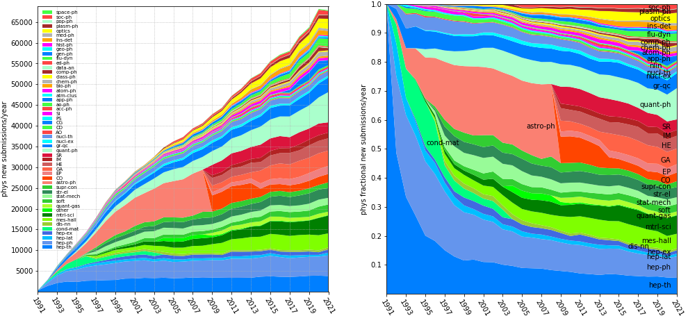
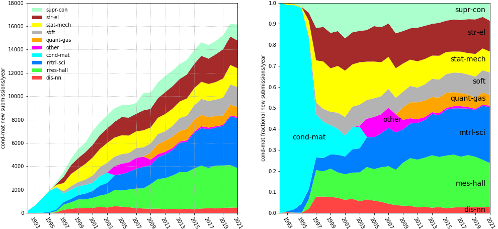
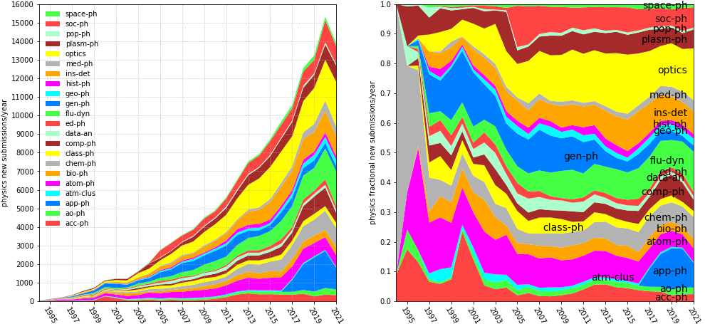
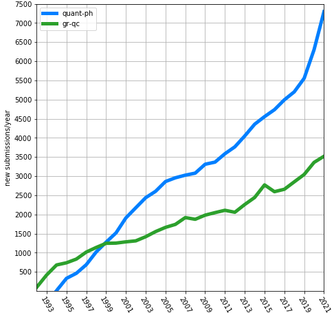
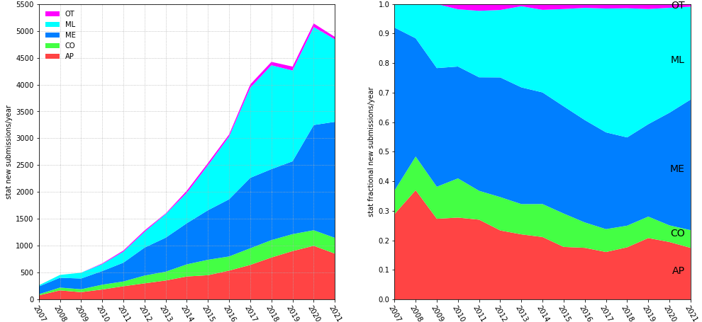

# arXiv submission rate statistics

Data for 1991 through 2021, updated 3 January 2022.

Left: number of new submissions/year as a function of calendar year for "hep" = High Energy Physics (hep-th+hep-ph+hep-lat+hep-ex), "cond-mat" = Condensed Matter Physics, "astro-ph" = Astrophysics, "other physics" = physics+nucl+gr-qc+quant-ph+nlin, "math" = Mathematics (math+math-ph), cs, eess, stats, biology = q-bio, finance = q-fin (+econ.EM). The graph on the right shows the same data as at left, but with the submission rates divided by the total for each year, giving the fractional submission rates for each of the domains, and highlighting the growth in submission rates from newer domains.

The numbers indicate the extent to which communities deposit their output at arXiv.org, rather than absolute measures of research output. The graphic also illustrates the growing adoption by research communities that did not necessarily
employ a formal prior paper preprint distribution system, as did HEP. The incoming rate for 2021 was composed of roughly 37.4% [physics](#phys_yearly), 33.6% [cs](#cs_yearly), and 19.6% [math](#math_yearly).
(2017 was the first year that the incoming percentage of physics dropped to below 50% of the incoming total.) cs has been growing faster than the other two domains since the early 2010s, so its percentage will likely continue to increase.

The current submission rates (i.e., averaged over calendar year 2021) as percentages of the average 2021 [overall](http://arxiv.org/stats/monthly_submissions) average rate of 15136/month (181,630 total for 2021) are roughly:

-   [cs](#cs_yearly) (60989): 33.6%
-   [math](#math_yearly) (35531): 19.6%
-   [cond-mat](#cond-mat_yearly) (16147): 8.9%
-   [astro-ph](#astro-ph_yearly) (14462): 8.0%
-   [physics](#physics_yearly) (13871): 7.6%
-   [hep](#hep_yearly) (10221): 5.6%
-   [eess](#eess_yearly) (8066): 4.4%
-   [quant-ph](#quant-ph_yearly) (7298): 4.0%
-   [stat](#stat_yearly) (4888): 2.7%
-   [gr-qc](#gr-qc_yearly) (3521): 1.9%
-   [q-bio](#q-bio_yearly) (2093): 1.2%
-   [nucl](#nucl_yearly) (1536): 0.8%
-   [econ](#econ_yearly) (1371): 0.8%
-   [q-fin](#q-fin_yearly) (847): 0.5%
-   [nlin](#nlin_yearly) (789): 0.4%

The overall annual growth rate in submissions for 2021 over 2020 was only about 2%, significantly lower than the past few years, likely for pandemic-related reasons. (Additional time to analyze, write, and publish perhaps led to a burst in 2020, and then diminished data collection and a flushed-out pipeline may led to a fall-off in 2021, below the expected pre-pandemic trendline.) In physics categories, [quant-ph](#quant-ph_yearly) and [gr-qc](#gr-qc_yearly) continued to grow, while the biggest fractional decline was mysteriously [physics.app-ph](#physics_yearly), and overall [physics](#phys_yearly) had a slight decline from 2020. [math](#math_yearly) had an even bigger fractional decline overall than physics. [cs](#cs_yearly) retained an overall large 2021 growth rate, though not as large as in recent years. The larger areas (cs.LG, cs.CV, cs.CL
-- machine learning, computer vision, computational linguistics) all grew, but many of the smaller areas declined.

Going further back, in calendar year 2005 the [astro-ph](#astro-ph_yearly) and [cond-mat](#cond-mat_yearly) submission rates each grew to exceed the [hep](#hep_yearly) rate (which appears to have flattened out in the late 1990s, suggesting 100% participation from that community, fluctuating about a mean of roughly 8800/year for 2000-2010, but then with a bit of a superluminal+higgs bump in 2011, plus another higgs bump in 2012, to over 9600/year for each of those two years, and staying at the 2011 level through 2021). A diminished cond-mat growth rate in 2004-2007 was due in part to the shift of biologically related submissions from cond-mat.soft to q-bio, and network/complex systems submissions from cond-mat.stat-mech to physics.soc-ph. The decreased rate for cond-mat.mes-hall in 2017 was due to the creation of physics.app-ph. [math(+math-ph)](#math_yearly) started growing very quickly in 2002 as arXiv was adopted an increasing percentage of the mathematics community. The [cs](#cs_yearly) rate started as well to ramp up in 2007, grew to exceed the hep rate in calendar year 2012, continued on a very fast growth rate 2011-2015, and on an even faster growth rate since 2015 (driven largely by the computer vision, machine learning, and computational linguistics communities).

Submission data is available in bulk [via OAI](../../oa).

The graphs above show the **cumulative** data as a function of time, where the current (2021) cumulative number of submissions to date as percentages of the total 1,999,183 submissions are roughly:

-   [math](#math_yearly) (439906): 22.0%
-   [cond-mat](#cond-mat_yearly) (273106): 13.7%
-   [hep](#hep_yearly) (251919): 12.6%
-   [astro-ph](#astro-ph_yearly) (263219): 13.2%
-   [cs](#cs_yearly) (326765): 16.3%
-   [physics](#physics_yearly) (143599): 7.2%
-   [quant-ph](#quant-ph_yearly) (87466): 4.4%
-   [gr-qc](#gr-qc_yearly) (53924): 2.7%
-   [nucl](#nucl_yearly) (40812): 2.0%
-   [stat](#stat_yearly) (36111): 1.8%
-   [nlin](#nlin_yearly) (20674): 1.0%
-   [q-bio](#q-bio_yearly) (22882): 1.1%
-   [eess](#eess_yearly) (26228): 1.3%
-   [q-fin](#q-fin_yearly) (8953): 0.4%
-   [econ](#econ_yearly) (3619): 0.2%

## Graphs of yearly submission rates by subject areas

   

