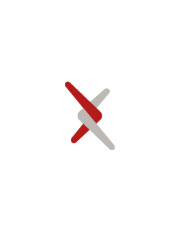


<link rel="stylesheet" type="text/css" href="{{'/css/brand_guide.css' | urlize}}""/>


#Brand Use Guidelines

##The purpose of these guidelines
Using our logo consistently is important to present a unified message to the world about who we are. That message is:

> *arXiv is a place of connection, linking together people and ideas, and connecting them with the world of open science.

Unauthorized use of our logo causes confusion about who we are. And when it’s use is authorized it’s just as important that we follow consistent guidelines to preserve the legibility, memorability, and legal defensibility that we need.

The arXiv logo is Federally trademarked and the legal property of arXiv and Cornell University, protected against unauthorized use. Our logo is ready to help us share a consistent, intentional, and meaningful message about who we are with the world.

##General guidelines that cover all logo use cases
1. Use of the name arXiv and associated logos, web addresses, and colors are only allowed with explicit written permission from the arXiv management team.
2. If use is allowed, display of the arXiv logo should always follow the visual layout rules as stated in the arXiv brand guide.
3. The logo should never be altered in any way, redrawn, used in an unspecified color, or reproduced on a background that will impair its visual recognition.
4. The use of the name “arXiv” or “arXiv.org,” in non-arXiv organization names or projects that imply or tend to imply some official connection with arXiv, is prohibited.
5. Except as specifically authorized in writing, use of arXiv’s name and marks in advertising and other promotional vehicles is prohibited when such use is likely to be perceived as an endorsement, even if such an endorsement is not the intention of the person or organization seeking to use arXiv’s name or marks.
6. In order to protect its name and reputation, arXiv regulates the use of arXiv’s name and marks on memorabilia, products, and goods. Third party use of arXiv’s logo for products and other goods is prohibited.

##Further guidelines based on project type

###For products that use the arXiv API
1. Acknowledge arXiv data usage with this statement on your product: ​“Thank you to arXiv for use of its open access interoperability. This [service/ product] was not reviewed or approved by, nor does it necessarily express or reflect the policies or opinions of, arXiv.”
2. Typically logo usage is not granted for API use. If you think your project is an exception you can always inquire at ​nextgen@arxiv.org​.
3. The use of the name “arXiv” or “arXiv.org,” in non-arXiv organization names implying or tending to imply some official connection with arXiv, is prohibited.

###For members & affiliates
1. We encourage members and affiliates to acknowledge arXiv with the statement: ​“Proud supporter of arXiv.”
2. arXiv’s logo may be used for the purposes of acknowledging the relationship while the membership or affiliation is active.
3. Use of arXiv’s logo must follow our visual brand guidelines.

###For LABS projects
1. All projects will be shared with the arXiv community on our website under the arXiv Labs sub-brand.
2. Additionally, we encourage Labs projects to acknowledge arXiv with the statement: ​“An arXiv Labs collaboration.”
3. The use of the name “arXiv” or “arXiv.org,” in non-arXiv organization names implying or tending to imply some official connection with arXiv, is prohibited.

###Lockups for internal arXiv projects
Lockups are special logo configurations used for internal arXiv projects that have unique impact and a need for distinct branding. See the {Logos page}(logos) for details.

##Request arXiv logo
If you are authorized to use arXiv’s logo you may download the format you need below:

<a href="https://cornell.box.com/v/arxiv-logo-svg" target="_blank">
{.mkd-img-thumb .mkd-img-border} 
Primary logo (SVG)
</a>
**Other formats:**
<a href="https://cornell.box.com/v/arxiv-logo-jpg" target="_blank">JPG</a>
<a href="https://cornell.box.com/v/arxiv-logo-png" target="_blank">PNG</a>

<a href="https://cornell.box.com/v/arxiv-logomark-svg" target="_blank">
{.mkd-img-thumb .mkd-img-border} 
Primary Logomark (SVG)
</a>

<a href="https://cornell.box.com/v/arxiv-logomark-small-svg" target="_blank">
{.mkd-img-thumb .mkd-img-border} 
Small Logomark (SVG)
</a>
**Other formats:**
<a href="https://cornell.box.com/v/arxiv-logomark-small-jpg" target="_blank">small JPG</a>
<a href="https://cornell.box.com/v/arxiv-logomark-small-png" target="_blank">small PNG</a>
