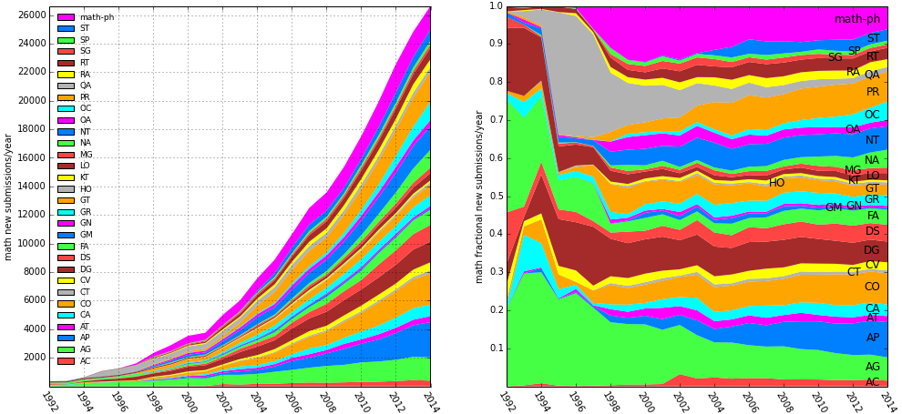
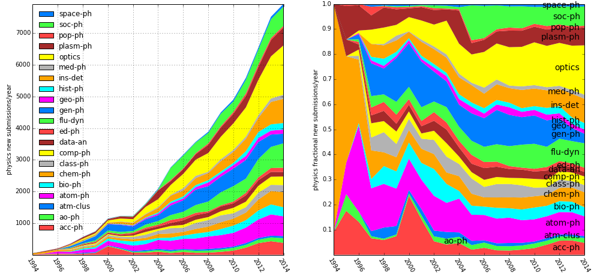
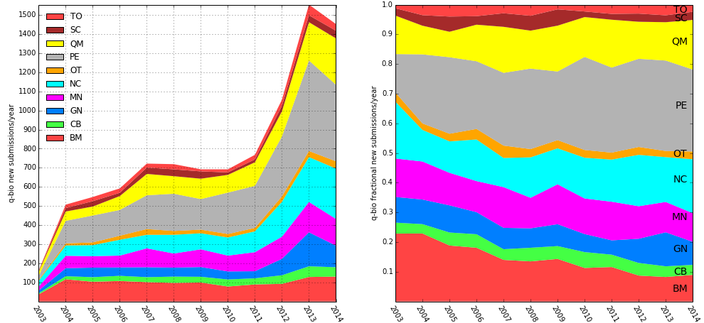

arXiv submission rate statistics
================================

Data for 1991 through 2014, updated 31 December 2014.

Left: number of new submissions/year as a function of calendar year for
"hep" = High Energy Physics (hep-th+hep-ph+hep-lat+hep-ex), "cond-mat" =
Condensed Matter Physics, "astro-ph" = Astrophysics, "math" =
Mathematics (math+math-ph), "other physics" =
physics+nucl+gr-qc+quant-ph+nlin, cs, stats, biology = q-bio, finance =
q-fin.

The graph on the right shows the same data as at left, but with the
submission rates divided by the total for each year, giving the
fractional submission rates for each of the domains, and highlighting
the growth in submission rates from new domains.

**Notes:** These are not meant to be interpreted as measures of research
output, but rather only as measures of the extent to which communities
deposit their ouput at arXiv.org. The graphic illustrates its adoption
by research communities that did not necessarily employ a formal prior
paper preprint distribution system, as did HEP.

In calendar year 2005, the astro-ph and cond-mat submission rates each
grew to exceed the hep rate (which appears to have flattened out in the
late 1990s, suggesting 100% participation from that community,
fluctuating about a mean of roughly 8800/year for 2000-2010, but then
with a bit of a superluminal+higgs bump in 2011, and another higgs bump
in 2012, to over 9600/year for each of those two years). A diminished
cond-mat growth rate in 2004-2007 was due in part to the shift of
biologically related submissions from cond-mat.soft to q-bio, and
network/complex systems submissions from cond-mat.stat-mech to
physics.soc-ph.

math(+math-ph) has been growing even faster since 2002 (suggesting a
rapid adoption of this resource by an increasing percentage of the
mathematics community). The cs rate started as well to ramp up in 2007
and grew to exceed the hep rate in calendar year 2012. It is misleading,
of course, to compare subfields of physics to the entirety of
mathematics or computer science, since the current total numbers of
publications per year in the three overall domains are roughly
comparable.

The current submission rates (i.e., averaged over calendar year 2014) as
percentages of the average 2014
[overall](http://arxiv.org/stats/monthly_submissions) average rate of
8126/month (97517 total for 2014, corresponding to the vertical slices
at 2014 in the above graphs) are roughly:

-   math+math-ph (26638): 28.8%
-   cs (14020): 15.1%
-   cond-mat (13108): 14.1%
-   astro-ph (12584): 13.6%
-   hep (9754): 10.5%
-   physics (7927): 8.6%
-   quant-ph (4357): 4.7%
-   gr-qc (2444): 2.6%
-   stat (2025): 2.2%
-   nucl (1727): 1.9%
-   q-bio (1453): 1.6%
-   nlin (834): 0.9%
-   q-fin (646): 0.7%

The graphs above show the cumulative data as a function of time, where
the current total number of submissions to date as percentages of the
total 1,000,863 submissions (corresponding to the vertical slices at
2014 in the above, i.e., all of Aug 1991 through Dec 2014) are roughly:

-   [math+math-ph](math_yearly.png) (208763): 23.1%
-   [hep](hep_yearly.png) (183518): 20.3%
-   [cond-mat](cond-mat_yearly.png) (167858): 18.6%
-   [astro-ph](astro-ph_yearly.png) (166046): 18.4%
-   [cs](cs_yearly.png) (68432): 7.6%
-   [physics](physics_yearly.png) (59679): 6.6%
-   [quant-ph](quant-ph_yearly.png) (48815): 5.4%
-   [gr-qc](gr-qc_yearly.png) (33116): 3.7%
-   [nucl](nucl_yearly.png) (28744): 3.2%
-   [nlin](nlin_yearly.png) (14949): 1.7%
-   [q-bio](q-bio_yearly.png) (9466): 1.0%
-   [stat](stat_yearly.png) (7711): 0.9%
-   [q-fin](q-fin_yearly.png) (3462): 0.4%

Graphs of yearly submission rates by archive
--------------------------------------------

