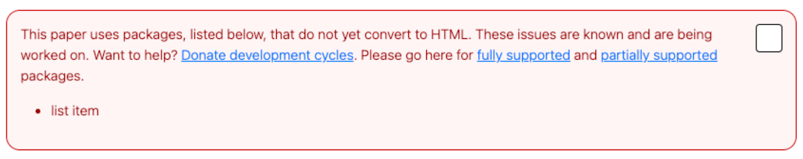

# Error messages in HTML papers

Developing a rapid and automated process to accurately convert TeX/LaTeX formats to HTML is a unique and complex challenge. arXiv is devoted to maintaining free and fast dissemination of submissions; with your help we can quickly iterate, improve, and provide an accessible arXiv corpus to the scientific community and public at large.
{ .intro }

## For readers

If you have noticed red LaTeX code and other formatting irregularities in some of the HTML papers you have viewed like the ones listed below, don't panic, this is a known issue. 

|   |   |   |
|---|---|---|
|\usetikzlibrary|\draw|\LetLtxMacro\oldsqrt
|\jyear|\fnm?|\PHnumber
|\AuthorMark|\orgdiv|\online\ensubject

These errors are notifying us that the author of the paper did not use a TeX/LaX package that we fully support. 

## For authors

After you have submitted your paper and it has been processed, you will receive a link to preview the HTML version of your paper. You may see an error message alerting you that the TeX/LaTeX packages used to format your paper are not fully supported by our conversion process. Therefore your paper may display red TeX/LaTeX code and other formatting irregularities. 

Please see an example of a HTML processing error below:
{.mkd-img-full alt='Error message in a red box stating, This paper uses packages, listed below, that do not yet convert to HTML. These issues are known and are being worked on. View the list of unsupported packages.'}

