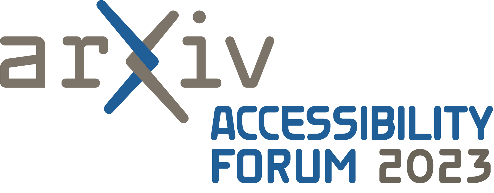

# Forum: How do we make accessible research papers a reality?

> **Please note: Registration has been paused due to very high interest levels**. As we are able to expand our online hosting capacity we will open up registration again. Please keep an eye out for that link.
>
> The high level of interest affirms that the research community wants open science to be truly open to all. Please watch for more opportunities to forward this critical work together.

##A practical forum, free and open to all
Hosted by arXiv, this half-day online forum will center the experiences of academic researchers with disabilities who face barriers to accessing and reading papers. The forum will be useful for people across the academic authoring and publishing ecosystem who are committed to making accessible research papers a reality. Together, we can chart a path towards fully accessible research papers, and leave with practical next steps for our own organizations.

---
{.mkd-img-right .mkd-border alt='logo for the arXiv forum' role="presentation"}

##Event Details
**Date:** April 17th, 2023

**Time:** 1:00pm - 5:00pm Eastern Time

**Cost:** Free

**Public registration is temporarily on pause. Please check back again soon.**

Forum presentations and the panel discussion will be recorded and shared online after the event. Please keep an eye on this space for those links, and more opportunities to get involved and share your expertise**

---

We will walk away from this forum having learned three things:

1. That accessibility is a known problem with known solutions.
1. That we are far behind.
1. And that we can do it! Accessible research papers is within our reach. There are a lot of resources and smart people working on solutions. And those solutions can be relatively easy.

---
## Schedule
| Time | Session | Description |
| --- | --- | --- |
| 1:00 | **Welcome** | A brief introduction to the event, and why it is so important that research papers and other outputs are fully accessible to everyone in your field |
| 1:15 | **Presentations** | Learn from the expertise and lived experience of Avneesh Singh, Cynthia Bennett, Jonathan Godfrey, Lucas Nadolskis, Patrick Smyth, Stacey Scott, and more. How can personal solutions become global and part of the culture? |
| 2:30 | **Panel Discussion** | Where in the pipeline do we need to change? Whose responsibility is it to make content accessible? |
| 3:20 | **Q&A Session 1**  |  Breakout room 1: What can authors and publishers do right now? And what do we need to do in the future?    Breakout room 2: Myth-busting the needs of deaf academics when it comes to accessing research |
| 4:00 | **Q&A Session 2**  |  Breakout room 1: How can AI and crowd-sourcing help with accessibility?    Breakout room 2: Digging deeper into image and graph descriptions for scientific papers |
| 4:40 | **Closing Roundtable** | Converging on a shared path towards accessible research papers |

## Presentations
We, the community, know the issues of accessibility. And we know the solutions, too. In this segment researchers who directly face barriers to accessing papers will share the obstacles they face and the solutions that work for them. We will ask: How can these personal solutions become global and part of the culture?

*Presenters to be announced soon.*

## Panel Discussion
Topic: Where in the pipeline do we need to change? Whose responsibility is it to make content accessible?

*Panel participants to be announced soon.*

## Q&A Sessions
Dig deeper into topical discussions on specific technical subjects and more.

*List of discussions topics to be announced soon.*

---
## Inclusive Event
We want to make this forum as inclusive as we can. *Please note that STEM-literate ASL interpreters will be present throughout all segments.* When registering, please let us know if additional accommodations will help you participate fully.
