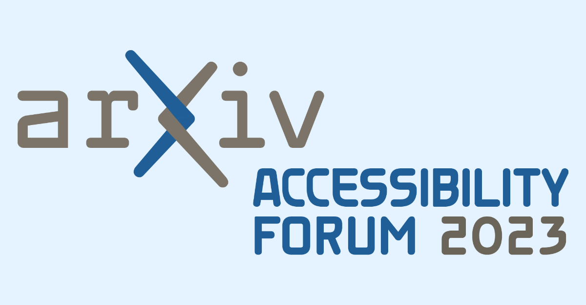

# Participant Bios (Draft)

{.mkd-img-right alt='logo for the arXiv forum' role="presentation"}
[Return to main Forum page](../accessibility_forum.md)

We are excited to be joined by the following presenters, panelists, and Q&A participants in the forum:

## Presenters
### Dr. Jonathan Godfrey
Senior Lecturer in Statistics, School of Mathematical and Computational Sciences, Massey University.

Jonathan's research is focused on the needs of the thousands of blind people around the world who need additional tools to make the visual elements of statistical thinking and practice less of a barrier. [Jonathan's Faculty Profile](https://www.massey.ac.nz/massey/expertise/profile.cfm?stref=416430)

### Avneesh Singh
Avneesh Singh, chair, accessibility task force - W3C EPUB 3 Working Group and Publishing Community Group.

Avneesh aspires to make knowledge and information accessible to all, at affordable cost, using technical innovations and leveraged by inclusive strategies & global partnerships. [Avneesh's LinkedIn](https://www.linkedin.com/in/avneesh-singh-01b32316/)

### Dr. Cynthia Bennett
Senior Research Scientist, Responsible AI and Human Centered Technology, Google.

Cynthia's research involves disabled people as the experts of their own lived experiences, and accessible futures for everyone. [Cynthia's LinkedIn](https://www.linkedin.com/in/clb5590/)

### Anne Logan
PhD Candidate, Vanden Heuvel Lab, School of Integrative Plant Science Horticulture Section, Cornell University.

Anne has always been very passionate about fruit crop production and hopes to develop teaching videos on all things fruit crop and wine related in ASL, and one day to own a farm winery. [Anne's LinkedIn](https://www.linkedin.com/in/anne-kearney-logan-9a75b989/)

### Lucas Nadolskis
2023 Masters in Biomedical Engineering from Carnegie Mellon University; Incoming Neurosciences PhD Candidate, University of California Santa Barbara.

Lucas is passionate about what it will take to address inaccessible research publication at scale and how to make analytical data more accessible.[Lucas's Twitter](https://twitter.com/lnadolskis?lang=en)

### Breanne Kisselstein
PhD Candidate, School of Integrative Plant Science, Plant Pathology and Plant-Microbe Biology Section, Cornell University.

Breanne is passionate about the power of community for underrepresented students, and the need for better support systems for blind and deaf researchers. [Breanne's LinkedIn](https://www.linkedin.com/in/breannekisselstein/)

### Dr. Patrick Smyth
Postdoctoral Fellow in Humanities Entrepreneurship at the Publics Lab, and Chief Learner at Iota School.

Patrick is a blind hacker and programmer whose work focuses on citizen technology, critical infrastructure, accessibility, and technical pedagogy. [Patrick's Homepage](https://smythp.com/index.html)

### Stacy Scott
Accessibility Office, Taylor & Francis; Chair, Accessibility Action Group of The Publishers Association; Member, Learned Publishing board for the Association of Learned, Professional and Society Publishers (ALPSP).

In her work as a researcher and in publishing, Stacy is committed to breaking down barriers and improving the availability of accessible education. She seeks to promote and realize her ‘raison d’être’ – "a world that is born-accessible and truly inclusive for all." [Stacy's LinkedIn](https://www.linkedin.com/in/stacy-scott-b7552737/)

## Panelists
### Bill Kasdorf
Principal, Kasdorf & Associates; Founding partner, Publishing Technology Partners; W3C Global Publishing Evangelist, W3C Publishing Working Group member, EPUB 3 Community Group member.

Bill offers consultancy to publishers on accessibility, XML/HTML/EPUB modeling and specification, standards alignment, and more. He believes accessibility in publishing has reached an inflection point and we are at a critical time for renewed action. [Bill's LinkedIn](https://www.linkedin.com/in/billkasdorf/)

### Dr. Neil Soiffer
Chief Listening Officer at Talking Cat Software.

Neil Soiffer is a principal architect of MathML, the standard for putting math on the web. He is the main developer of MathPlayer and its replacement, MathCAT. They are used in NVDA and elsewhere to make math accessible in Web, Word, and PowerPoint documents.  He currently co-chairs the W3C Math Working Group. [Neil's LinkedIn](https://www.linkedin.com/in/neil-soiffer-1807b76/)

### Dr. Raja Kushalnagar
Director of the Information Technology program in the Department of Science, Technology and Mathematics at Gallaudet University.

Raja primarily teaches human-centered computing with a focus on accessible computing, and application development courses. His research interests encompass the fields of accessible computing and accessibility/intellectual property law, with the goal of improving information access for deaf and hard of hearing individuals. [Raja's Faculty Profile](https://gallaudet.edu/personnel/raja-kushalnagar/)

### Dr. Julie R. Williamson
Lecturer in Human Computer Interaction, School of Computing Science, University of Glasgow, United Kingdom, and Vice President for publications for ACM SIGCHI.

Julie's research focuses on interaction in immersive environments and she is an expert in interaction design, and evaluation, and deployment of immersive experiences. Julie is an outspoken champion of open access and accessibility in academic publishing.
[Julie's LinkedIn](https://www.linkedin.com/in/julierico/)

### Frank Mittelbach
Technical Lead of the LaTeX Project.

Frank is focused on the future development of the LaTeX typesetting system. A critical authoring tool in the fields of Math, Physics, Computer Science and more, LaTeX's five year plan will have profound accessibility impacts. [Details on Frank's work](https://www.latex-project.org/publications/indexbytopic/pdf/)

### Sarah Kane
Undergraduate Student at University of Pennsylvania with a focus on Astrophysics Research; PURM Research Assistant, Department of Physics and Astronomy; NSF REU Scholar, Department of Astronomy, University of Texas at Austin; 2023 Marshall Scholar.

For Sarah, her career as a researcher is intertwined with her work as a disability advocate. She was born legally blind and has a strong interest in the accessibility of science to people with disabilities. Her work includes usability testing for Astronify, a project of the Space Telescope Institute turning datasets into audio.  [Sarah's University Profile](https://curf.upenn.edu/profile/kane-sarah)

### Kevin-John Black
Preprints Product Lead, Cold Spring Harbor Laboratory.

Kevin-John brings his experience leading bioRxiv and medRxiv towards offering full-text HTML version of papers, and the broad implications of HTML on researchers and publishers. [Kevin-John's LinkedIn](https://www.linkedin.com/in/kevinjohnblack/)

## Breakouts
### Deyan Ginev
Creator of ar5iv.org and LaTeXML developer; W3C Math Working Group member; PhD candidate in hiding (do not disturb).

Deyan's main focus is to enhance the representation of mathematical expressions in rendered research papers, improving their accessibility, computational semantics, and enabling further reuse in a broader class of applications. [Deyan's University Profile](https://kwarc.info/people/dginev/)

### Dr. Kaveh Bazargan
Director, River Valley Technologies

Kaveh is a physicist, and one of the first to use TeX (1983). In 1988 he founded River Valley Technologies, with the aim of improving the publishing process. Kaveh has a special interest in the accessibility of STM content, and in particular of mathematics. He is a proponent of open standards, and in particular an advocate of XML as the "format of record". [Kaveh's LinkedIn](https://www.linkedin.com/in/bazargankaveh/)

### Arwa Alnajashi
Data Scientist, Saudi Aramco.

Arwa is a legally blind data scientist and self described "data transformation enthusiast." She holds a Bachelor's degree in Computer Science from the University of York, where she was recognized with the Simon Poulding award for being the top graduating woman. Her personal experiences have motivated her to actively participate in research projects that aim to combine her academic knowledge with her lived experience to find innovative solutions that benefit everyone, with a special focus on improving the lives of disabled individuals. [Arwa’s LinkedIn](https://www.linkedin.com/in/arwa-alnajashi-84b1541a2/)

### Tony Malykh
Software Developer, Facebook; NVDA community developer.

Tony is a software developer in Machine Learning and an active contributor to improving screen reader technology. [Tony's LinkedIn](https://www.linkedin.com/in/tony-malykh-2971591/)

### Ulrike Fischer
Member of the LaTeX project.

Ulrike's main focus is currently on LaTeX packages related to accessibility. LaTeX's five year plan will have profound accessibility impacts. [Ulrike's Author Bio](https://www.informit.com/authors/bio/BA672B25-A399-4C25-9AC6-472F5BF29CA2)

### Mark Applin
Co-founder, Signly.

Signly provides synchronous, in-vision, sign language translations on any webpage, with the goal of improving equal access to digital information, advice and services. [Mark's LinkedIn](https://www.linkedin.com/in/mark-applin-20b9384/)

### Frank Elavsky
PhD Student, Human-Computer Interaction Institute, Carnegie Mellon University; Data interaction research at Apple; W3C invited expert in Data Visualization in the ARIA Working Group.

Frank's research focuses on methods that improve greater adoption of accessibility practices, engineer tools and systems that improve inclusive practitioner work and outcomes, and critically examine ways that sociotechnical systems exclude people with disabilities. [Frank's Homepage](https://www.frank.computer/)

### Dr. John Hammersley
Founder of Overleaf; VP Researcher and Community Engagement at Digital Science.

Overleaf is the world's leading LaTeX-based online authoring platform, used by researchers around the world. John's current work focuses on how to best serve the broad research community, with a particular focus on the end user. [John's LinkedIn](https://www.linkedin.com/in/john-hammersley-6419a266/)

### Charles LaPierre
Principal Accessibility and Content Quality Architect, Benetech; member of the following W3C Working Groups: Publishing Working Group, MathML Refresh, ARIA, APA / Personalization Task Force, EPUB3 W3C Community Group, and co-chair of the Accessibility Metadata W3C Community Group.

Charles has been a pioneer in accessible product development since 1993 and is the technical architect of the Global Certified Accessible initiative at Benetech. This certification identifies publisher content as conforming to the EPUB 1.0 Accessibility Specification, for which Charles was a co-editor. [Charles' LinkedIn](https://www.linkedin.com/in/charles-lapierre-8a16a13/)
