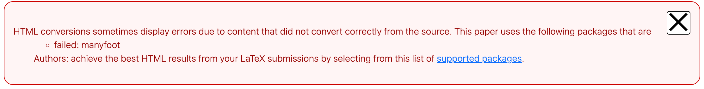
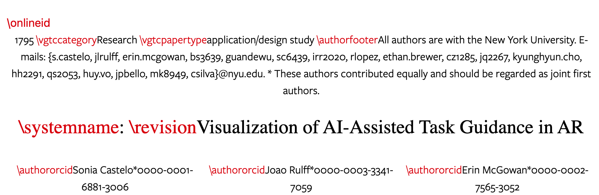
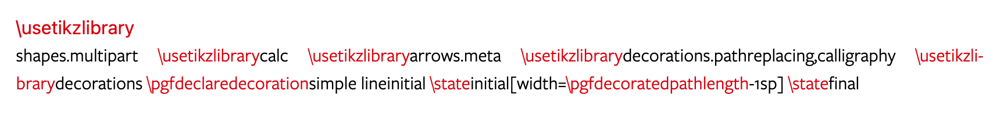
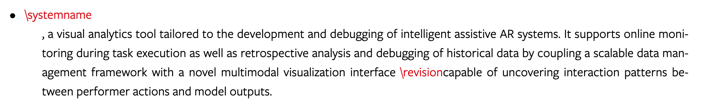

# Error messages in HTML papers

HTML papers on arXiv.org are a work in progress and will sometimes display errors. As we work to improve accessibility we share with you the causes of these errors and what authors can do to help minimize them.
{ .intro }

To produce accessible HTML papers we use a converter created and maintained by the LaTeXML team at the National Library of Standards and Technology (NIST). 

The errors that you have seen when viewing papers in HTML after submission or on arXiv.org are caused when the LaTeXML converter is unable to translate certain TeX and LaTeX software constructs. TeX and LaTeX, pronounced ‘tech’ and ‘LAH-tech’, are open source software packages used to typeset science and math papers. TeX and LaTeX made it possible accurately display complex mathematical formulae, symbols and tables in research papers. TeX is a fully programmable layout system, and there are many ways to extend the capabilities of TeX by creating packages of TeX code and macros. In fact, LaTeX itself is simply a large package of TeX extensions. The LaTeX community uses a large number of freely-available packages that are used by the scientific community for tasks like adding figures to articles, or following the publication template for a journal. All of the packages have to be individually supported in LaTeXML. While LaTeXML supports nearly all of the most commonly used LaTeX packages, there is a long tail of less commonly used packages that are not presently supported. The LaTeXML team will continue adding packages, but it will take a very long time to support every package used by every paper on arXiv.

## HTML errors you may see:

When browsing and reading HTML papers on arXiv.org, you may see formatting errors in red like below: 

{.mkd-border alt='Error message in a red box stating, This paper uses packages, listed below, that do not yet convert to HTML. These issues are known and are being worked on. View the list of unsupported packages.'}

{.mkd-border alt='Errors are displayed in red markup interpersed with the text. Errors are: forward slash online ID, foward slash v.g.t.c. category, forward slash author footer, foward slash system name, foward slash system name, foward slasch author orcid.'}

{.mkd-border alt='Tik Z errors are displayed in red markup. Errors are: foward slash use tik z library, foward slash p.g.f. declare decorations simple line initial'}

{.mkd-border alt='System name errors are displayed in red markup. Errors are: forward slash system name, foward slash revision'}

## Steps authors can take to minimize HTML errors
Authors who submit papers to arXiv can help minimize HTML errors by using LateX packages that are fully supported by LaTeXML. [Please view the list of fully supported LaTeX packages](https://corpora.mathweb.org/corpus/arxmliv/tex_to_html/info/loaded_file).

## Frequently Asked Questions

### What is TeX?
TeX is a fully programmable layout system, and there are many ways to extend the capabilities of TeX by creating packages of TeX code and macros. In fact, LaTeX itself is simply a large package of TeX extensions. The LaTeX community provides a large number of packages that can be used in scientific papers for tasks like adding figures to articles, or following the publication template for a journal. Each such package has to be individually supported in LaTeXML for an article to convert perfectly. While LaTeXML supports nearly all of the most commonly used LaTeX packages, there is a long tail of less commonly used packages that are not presently supported. The LaTeXML team will continue adding packages, but it will take a very long time to support every package used by every paper on arXiv. 

### What is LaTeX?
LaTeX is a software system for document layout and preparation developed in the early 1980s by Leslie Lamport. LaTeX is designed to provide a descriptive markup language that harnesses the power of TeX in a more user-friendly way. It consists of a collection of TeX macros and a program to process LaTeX documents providing authors with convenient commands to format different layout requirements such as section headers, footnotes, graphics and bibliographies.

### What is LaTeXML?

LaTeXML was developed at the [Digital Library of Mathematical Functions at NIST](https://math.nist.gov/) (National Institute of Standards and Technology) and is authored by Bruce Miller and Deyan Ginev. It's primary output is XML and a postprocessor can convert these XML documents into HTML with mathematical formulas as MathML. 

### What is MathML?
MathML is mathematical markup language and is an XML based application. MathML is used to describe and encode mathematical notation and scientific content for distribution on the web and other applications such as scientific software, print typesetting and voice synthesis. 

### Why are TeX and LaTeX so popular? 
They are beloved by academic communities for their ability to easily display complex mathematical formulae, symbols, charts and graphs that common word processing programs have difficulty rendering.

TeX and LaTeX are open source software programs  that  are platform independent which allows for the ability to view documents regardless of the operating system or software set-up making collaboration simple. These programs are maintained and iterated upon by the communities that use them, and as a result, there are many packages available offering a myriad of features to format research papers. 

### Which TeX/LaTeX packages are supported?
- Please see this list of [supported packages](https://corpora.mathweb.org/corpus/arxmliv/tex_to_html/info/loaded_file)
- Please see our list of [unsupported packages](https://github.com/brucemiller/LaTeXML/wiki/Porting-LaTeX-packages-for-LaTeXML)

### What are ‘partially’ supported packages? 

A partially supported package has select features NIST has chosen to support in LaTeXML. 

