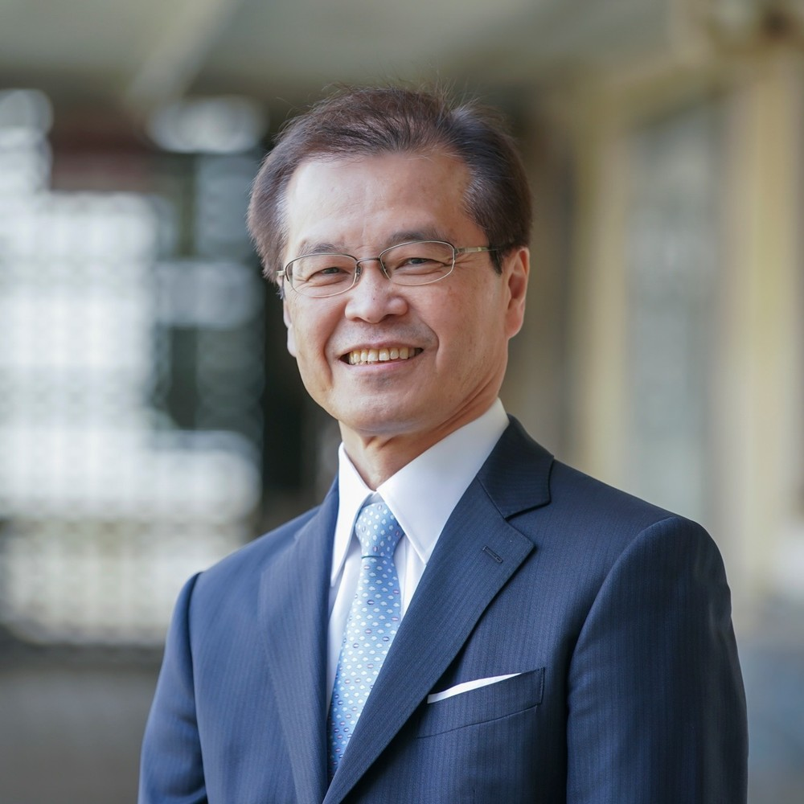
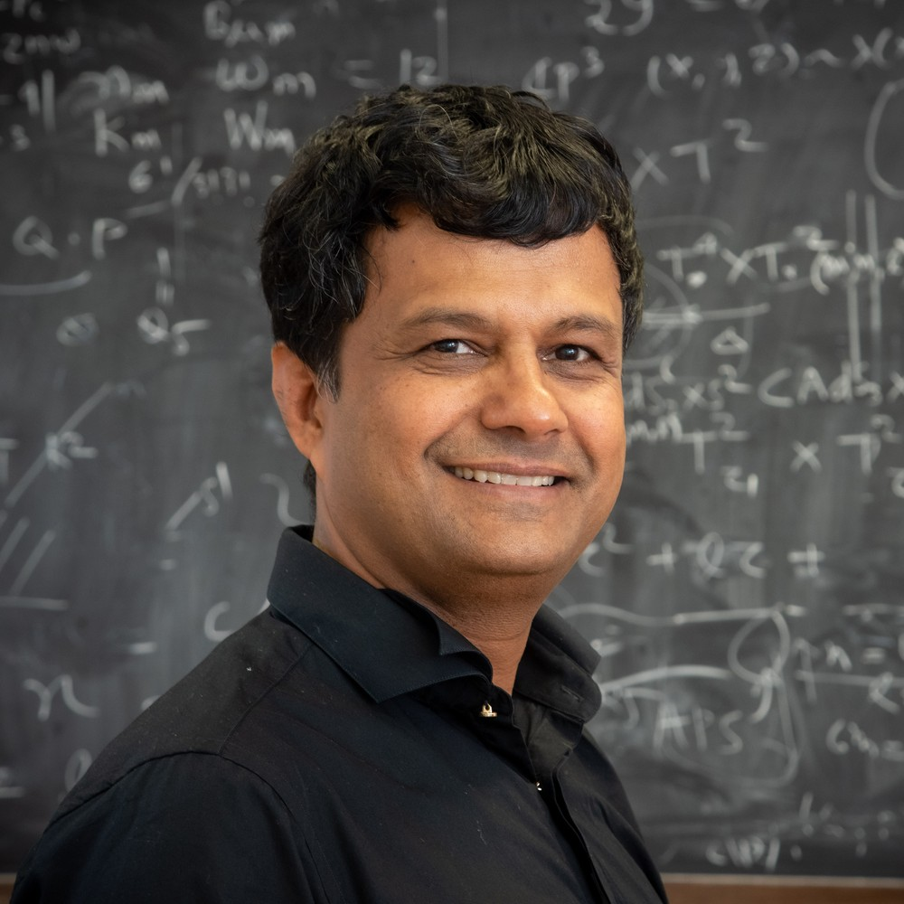
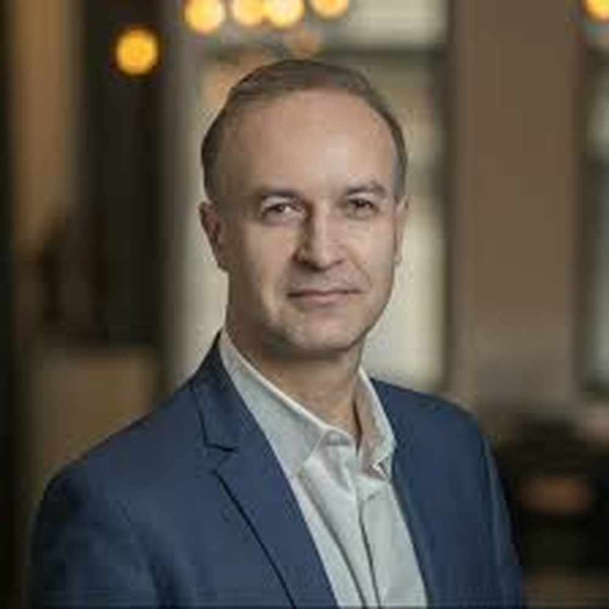
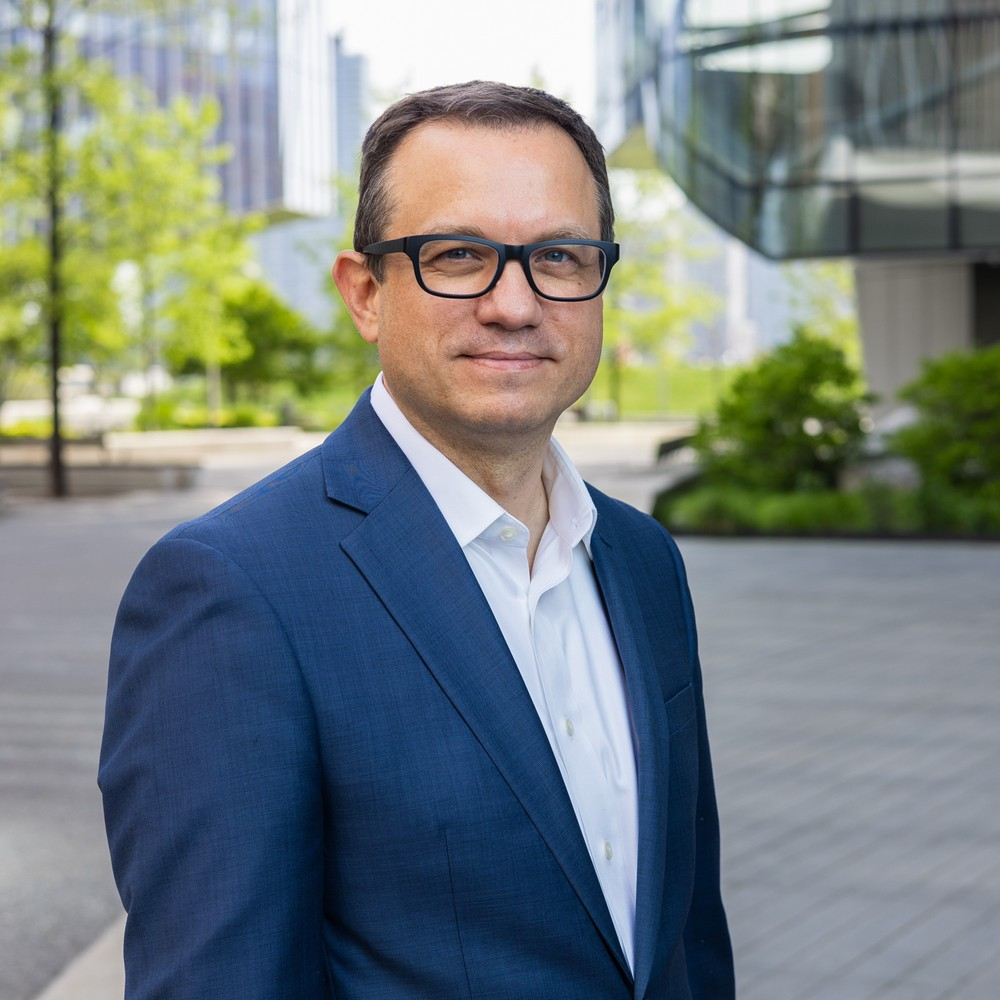
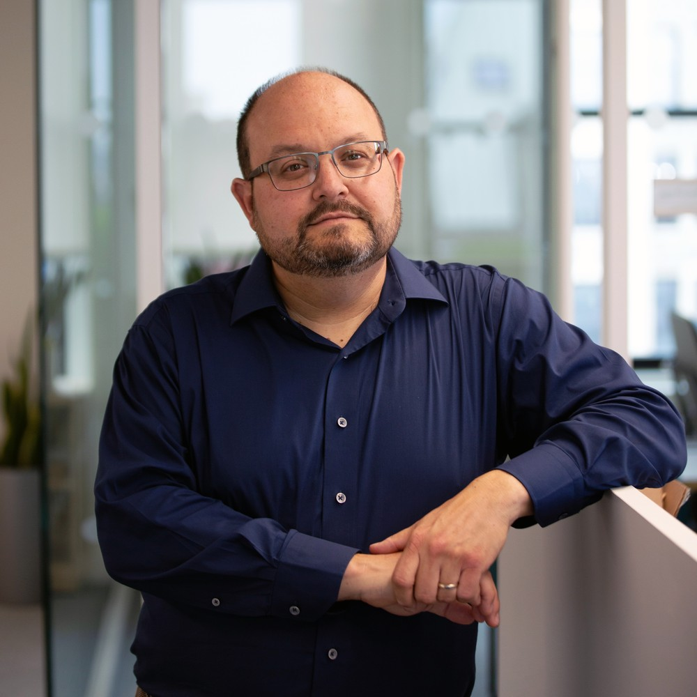
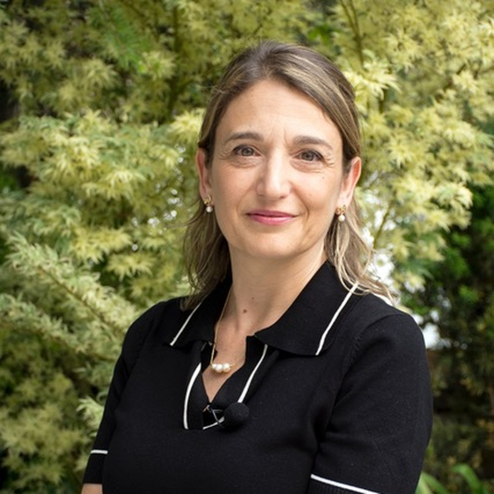
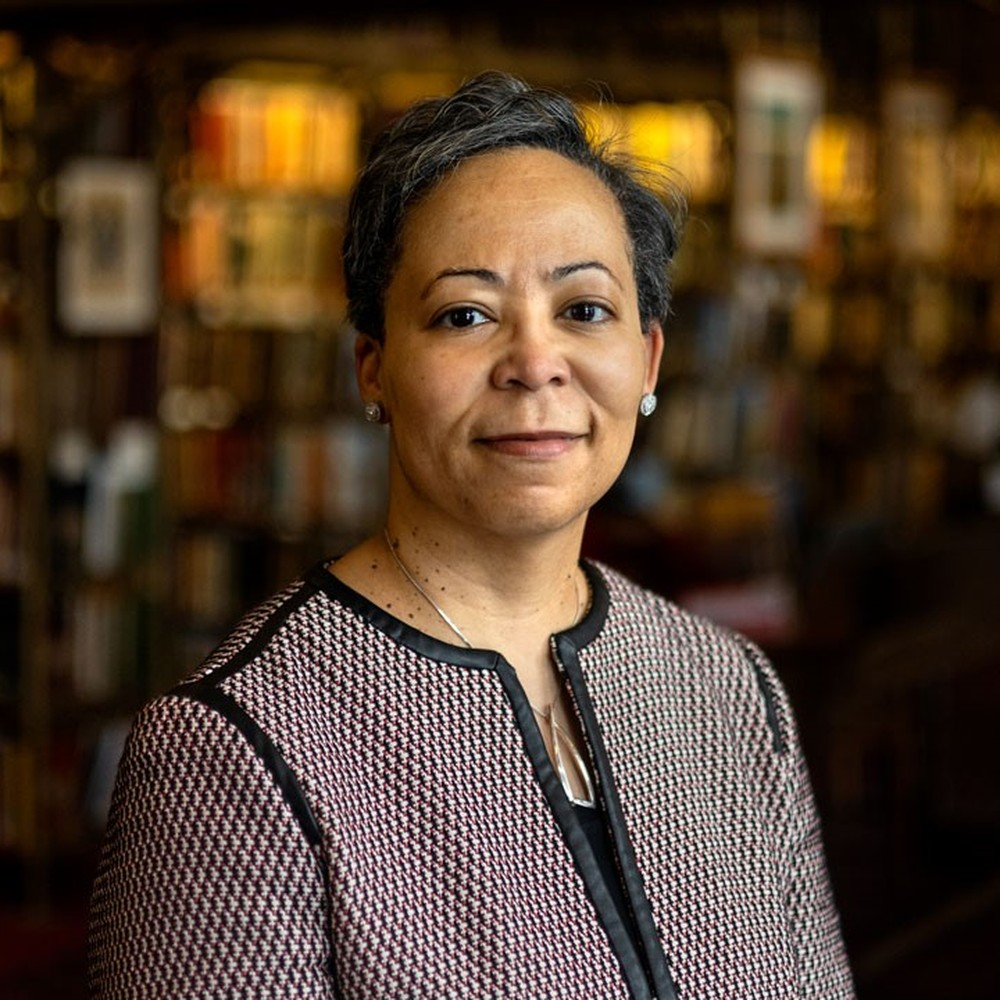

# Board of Directors

The Board of Directors (the Board) provides overall governance and stewardship of arXiv. The Board is responsible for overseeing the organization's activities, setting strategic direction, and ensuring strong fiduciary and operational oversight.
{.intro}

## Founding Partnership

Through July 31, 2031, the Simons Foundation and Cornell University serve as arXiv's founding members, providing continuity and helping ensure the organization remains aligned with its mission and long-term goals.

This partnership reflects a shared commitment to advancing arXiv's work and supporting its continued growth and success.

## Board Membership

The two founding members each appoint four directors, for a total of eight Board members. The full Board may also appoint up to four additional directors. This structure is designed to balance institutional leadership with broader expertise and perspectives. [Meet the Board](#meet-the-board)

## Leadership and Continuity

Directors serve limited terms (three years), helping to bring fresh ideas and diverse experience while maintaining continuity in governance. Directors may not serve more than four consecutive terms. The Board may implement staggered terms to ensure smooth leadership transitions over time.

## Meetings

The Board of Directors meets regularly throughout the year. Directors may participate in meetings either in person or remotely, ensuring broad engagement and collaboration. The Board also holds an annual meeting to conduct key governance activities and plan for the year ahead.

## Looking Ahead

arXiv's governance structure includes a planned transition designed to support long-term sustainability. On or before July 31, 2031, governance responsibilities currently held by the founding members will transition to the Board of Directors, creating a governance model that is fully Board-led while continuing to build on the strong foundation established by the Simons Foundation and Cornell University.

## Commitment to Responsible Governance

arXiv is committed to transparency, accountability, and thoughtful decision-making. Significant organizational actions—including major structural changes and strategic transactions—are subject to appropriate review and approval processes to ensure they serve the best interests of arXiv and its mission.

## Meet the Board

### Hiroaki Aihara
**Provost, The University of Tokyo**

{.mkd-img-bio align="left" alt='Portrait of Hiroaki Aihara' role="presentation"} 
Professor Hiroaki Aihara is Provost and Executive Vice President of the University of Tokyo (UTokyo), and professor at Kavli Institute for Physics and Mathematics of the Universe (IPMU). Immediately after he obtained PhD in experimental particle physics from UTokyo he joined School of Science at UTokyo as an assistant professor in 1984 and became full professor in 2003. He had also been a staff scientist from 1988 to 1995 at Lawrence Berkeley National Laboratory in U.S.A. He has a long career in the university administration. He served as Dean of School of Science from 2012 to 2014, Executive Vice President from 2014 to 2015, and Executive Director and Vice President from 2015 to 2021. He had been a council member of Science Council of Japan 2011 to 2017. He has been a member of the Association for the Promotion of Research Integrity since 2016. He serves as an associated editor of Reviews of Modern Physics (APS).

His fields of research are high energy particle physics and observational cosmology. Past research activities include experiments at Tevatron proton-antiproton collider at Fermilab, B factory at KEK and J-PARC accelerator. Major research achievements are significant contributions to the discovery of the top quark at the DØ experiment, the observation of CP violation in the B meson system at the Belle experiment, and the observation of electron neutrino appearance in a muon neutrino beam at the T2K experiment. He has been working on a dark energy survey with the Subaru Hyper Suprime Cam and the BelleII experiment at Super KEKB accelerator. Most recently, he is overseeing Quantum Initiative Innovation, a university-wide initiative of quantum science and technology.

He received awards including the 20th Inoue Science Awards (2004) for discovery of charge-parity symmetry violation in the B meson system, the Breakthrough Prize in Fundamental Physics (2016) for contribution to observation in neutrino oscillation and High Energy and Particle Physics Prize of the European Physical Society (2019) for discovery of the top quark.

### Atish Dabholkar
**Director, International Center for Theoretical Physics**

{.mkd-img-bio align="left" alt='Portrait of Atish Dabholkar' role="presentation"} 
Professor Atish Dabholkar was born in 1963 in India, he is a graduate of the Indian Institute of Technology at Kanpur, one of India's premier educational institutes. He earned a PhD in theoretical physics from Princeton University, followed by postdoctoral and research positions at Rutgers University, Harvard University and the California Institute of Technology. Until 2010, he was a professor of theoretical physics at the Tata Institute of Fundamental Research in Mumbai, and has been a visiting professor at Stanford University and a Visiting Scientist at CERN. He joined ICTP in 2014 on secondment from Sorbonne Université and the National Center for Scientific Research (CNRS), where he has been a research director until 2019. At ICTP, he was head of the High Energy, Cosmology and Astroparticle Physics section. He became ICTP's 5th director in November 2019.
Dabholkar is well-known for his research on string theory and quantum black holes, including investigations that build on ICTP founder Abdus Salam's Nobel-winning work on electroweak unification. In his work in collaboration with Jeffrey A. Harvey, Dabholkar identified a spectrum of supersymmetric states (now known as "Dabholkar-Harvey states'') and initiated the study of supersymmetric solitons in string theory which played an important role in the discovery of duality symmetries in string theory and later in the study of quantum entropy of black holes.

Dabholkar collaborated with Sameer Murthy and Don Zagier to discover a connection between the quantum entropy of black holes and the mathematics of mock modular forms introduced by Ramanujan a century ago . In his subsequent work with Pavel Putrov and Edward Witten he showed that mock modularity is generic and essential for exhibiting the duality symmetries of quantum gauge theories and M-theory and is a consequence of non-compactness in field space.

He has received many honours, including the Shanti Swarup Bhatnagar Award (2006), the most prestigious national science prize awarded by the Indian Prime Minister, for his "outstanding contributions for establishing how quantum theory modifies the entropy of black holes and his pioneering studies of supersymmetric solitons in string theory". He is an elected member of the Indian Academy of Sciences, an elected fellow of The World Academy of Sciences (TWAS) for the advancement of science in developing countries, and a Distinguished Alumnus of the Indian Institute of Technology Kanpur. In 2007 he received the Chair of Excellence award from the National Research Agency (ANR) in France. He is also a recipient of the National Leadership award from the President of India.

### Greg Gabadadze
**Executive Vice President, Simons Foundation**

{.mkd-img-bio align="left" alt='Portrait of Greg Gabadadze' role="presentation"} 
Greg Gabadadze is the EVP and CSO at the Simons Foundation, where he previously 
served as the Senior Vice President for Physics, and Associate Director for Physics,  
in the Mathematics and Physical Sciences Division. Gabadadze is on leave from NYU where he is a Professor of Physics. In his prior roles Gabadadze served as the Dean for Science, 
Vice Dean for Research, Chair of Physics, and Director of the Center for Cosmology 
and Particle Physics, all in the School of Arts and Science at NYU. Gabadadze holds 
PhD from Rutgers University and MS from Moscow State University. He conducts 
research in quantum field theory, theoretical particle physics, gravity and cosmology. 

### Greg Morrisett
**Jack and Rilla Neafsey Dean and Vice Provost of Cornell Tech**

{.mkd-img-bio align="left" alt='Portrait of Greg Morrisett' role="presentation"} 
Greg Morrisett is the Jack and Rilla Neafsey Dean and Vice Provost of Cornell Tech, Cornell University’s state-of-the-art campus in New York City that develops leaders and technologies for the AI era through foundational and applied research, graduate education, and new ventures. As the second dean of Cornell Tech, he has led the campus since 2019 and is responsible for the academic quality and direction of its degree programs as well as for efforts to recruit faculty, researchers, and students from around the world. His efforts have built pathways to expand access to the field as well as to engage industry partners and early-stage investors, further accelerating Cornell Tech’s contribution to New York City’s innovation economy.

Under Morrisett’s leadership, the campus has undergone significant expansion. The number of Cornell Tech students and its full-time faculty has more than doubled, while the addition of a new hotel and conference center in 2021 brought the total number of campus buildings to five. In 2024, the campus celebrated the 100th company launched through its startup programs as well as the milestone of surpassing $1 billion in philanthropic support. External research funding during his tenure has exceeded $100 million. Spearheading Cornell Tech’s industry leadership as well as its responsiveness to workforce needs, Morrisett launched the Urban Tech Hub and the Empire AI Postdoc Fellows Program both within the Jacobs Technion-Cornell Institute; PiTech – a public interest tech initiative; new degree programs in design tech and data science; two part-time advanced degree programs, as well as a collaborative workspace for companies called The Bridge at Cornell Tech. All of these efforts have solidified Cornell Tech’s position as a major contributor to the New York City economy, with a reported annual impact of more than $768 million in 2024.

Before joining Cornell Tech, Morrisett was Dean of Computing and Information Science at Cornell University from 2015 to 2019. Previously, he held the Allen B. Cutting Chair in Computer Science at Harvard University, where he also served as Associate Dean for Computer Science and Electrical Engineering as well as Director of its Center for Research on Computation and Society. Before Harvard, Morrisett was a visiting researcher at Microsoft and spent eight years on the faculty in Cornell’s computer science department, where he is currently a member of the faculty. He received his bachelor’s degree from the University of Richmond and both his master’s and doctoral degrees from Carnegie Mellon University.

Morrisett’s research focuses on the application of programming language technology for building secure, reliable, and high-performance software systems. He is a fellow of the Association for Computing Machinery and has received several prestigious awards, including a Presidential Early Career Award for Scientists and Engineers, an IBM Faculty Fellowship, a National Science Foundation Career Award, and an Alfred P. Sloan Fellowship. He is currently a member of the Association for Computing Machinery’s A.M. Turing Award Committee, which determines recipients for the annual prize widely considered the highest distinction in the field of computer science. Morrisett received an honorary doctorate in 2023 from the University of Richmond, where he also serves as a member of the university’s Board of Trustees.

### Ivan Oransky
**Special Advisor for Scientific Publishing, Simons Foundation**

{.mkd-img-bio align="left" alt='Portrait of Ivan Oransky' role="presentation"} 
Ivan Oransky is special advisor for scientific publishing at the Simons Foundation, where he also serves as editor in chief of The Transmitter. He is co-founder of Retraction Watch and executive director of its parent nonprofit, The Center For Scientific Integrity, as well as a distinguished journalist in residence at New York University's Arthur Carter Journalism Institute. Ivan previously was president of the Association of Health Care Journalists and vice president of editorial at Medscape. He has also held editorial leadership positions at MedPage Today, Reuters Health, Scientific American and The Scientist. He has received numerous awards for his work, including the 2015 John P. McGovern Medal for excellence in biomedical communication from the American Medical Writers Association, and in 2020 the Council of Science Editors gave Retraction Watch the Award for Meritorious Achievement, their highest honor.

### Licia Verde
**ICREA Professor at the Institute of Cosmos Sciences, University of Barcelona**

{.mkd-img-bio align="left" alt='Portrait of Licia Verde' role="presentation"} 
Licia Verde is an ICREA Professor at the Institute of Cosmos Sciences of the University of Barcelona (ICCUB), where she also serves as Scientific Director. She is a cosmologist whose research focuses on using observations of the Universe to address fundamental questions in physics, particularly through the cosmic microwave background and the large-scale distribution of galaxies. She received her PhD from the University of Edinburgh in 2000 and subsequently held research positions at Rutgers and Princeton Universities, including Chandra and Spitzer Fellowships. She later joined the faculty of the University of Pennsylvania before moving to Barcelona.

Verde was a member of the science team of NASA’s Wilkinson Microwave Anisotropy Probe (WMAP), whose measurements played a central role in establishing the current standard cosmological model. She has since contributed to major international cosmological surveys, including the Sloan Digital Sky Survey and the Dark Energy Spectroscopic Instrument (DESI). Her work spans precision cosmology, large-scale structure, dark energy, neutrino physics, primordial non-Gaussianity, and statistical methods for cosmological inference. A recurring theme of her research is the development of robust ways to combine different observations and to identify possible systematic effects or inconsistencies that may point toward new physics.

Alongside her research, Verde has taken on extensive scientific leadership and community-service roles. She has been an active user of arXiv since the mid-1990s, as both a reader and contributor, and has  served arXiv  through its scientific advisory structures, giving her long-standing familiarity with the organization, its mission, and the communities it serves.  She is the Scientific Director of the Journal of Cosmology and Astroparticle Physics (JCAP) and a Principal Investigator of the international  ERC Synergy project RedH0T which  addresses the current disagreement among measurements of the expansion rate of the Universe.  Through her research, editorial work, and participation in international collaborations and advisory bodies, she has contributed to the cosmology community and to the scientific structures that support research and scholarly communication.

### Michael Weissman
**Executive Director of Finance and Business Operations, Cornell Tech**

{.mkd-img-bio align="left" alt='Portrait of Michael Weissman' role="presentation"} 
As executive director of finance and business operations, Michael Weissman oversees the capital, operational, and sponsored financial portfolios for Cornell Tech. He is responsible for the full scope of financial operations, including budget development and campus financial reporting. He also supervises research administration, housing operations, and corporate and foundation relations.

Weissman has more than 15 years of experience in higher education finance and administration. Before joining Cornell Tech, he held several financial positions at Stony Brook University, including in the Office of Student Accounts and the University Budget Office.

He earned a bachelor’s degree in financial economics from Binghamton University, an MBA from Stony Brook University, and a master of science in legal studies from Cornell University.

### Elaine Westbrooks
**Carl A. Kroch University Librarian, Cornell University**

{.mkd-img-bio align="left" alt='Portrait of Elaine Westbrooks' role="presentation"} 
Elaine L. Westbrooks is the Carl A. Kroch University Librarian and Vice Provost at Cornell University Library. She is responsible for the leadership, administration, and innovation of the Library and Cornell University Press. Cornell University Library holds over 8 million volumes; and includes a diverse population of 17 libraries, and approximately 400 librarians, archivists, and staff. In 2023, Westbrooks led the Library in the planning of its “One Library for One Cornell Strategic Plan Framework.”
She has held leadership roles at the University of North Carolina at Chapel Hill, University of Michigan, and the University of Nebraska at Lincoln. 
 
Westbrooks is an expert who has been interviewed by the Chronicle of Higher Education, Inside Higher Ed, and Vox. Additionally, she has spoken on topics related to scholarly communications, academic publishing, and leadership; including this recent video “Why Democracies Need Libraries.”In recognition of her acumen and her efforts to build strategic partnerships across borders, she was honored with the Foreign Expert Award by Fudan University in Shanghai, China, in 2015 and 2016. 
 
She believes in libraries as a founding principle of democracy and focuses on their role to collect and provide access to a wide range of materials, encompassing diverse areas and perspectives, helping to empower scholarship at Cornell and beyond. 

Westbrooks serves on the board of numerous organizations, including the Cornell University Prison Education Program, the Sage Publishing Board of Directors, EBSCO Academic Library Leaders Advisory Board, and the MIT Visiting Committee for Libraries. She earned her bachelor’s degree from the University of Pittsburgh, and her master’s degree in library and information science from the University of Pittsburgh.

