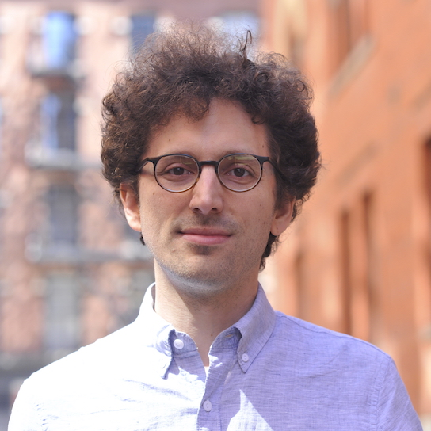
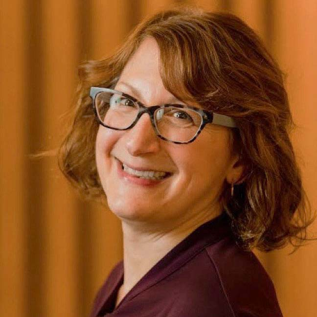
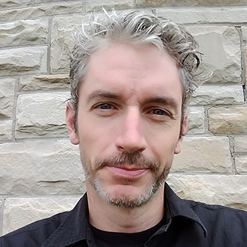
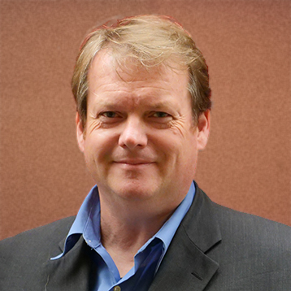

#Leadership Team

{.mkd-img-icon .mkd-img-center alt='Portrait of Ramin Zabih' role="presentation"}

## Ramin Zabih ## {align="center"}

**Faculty Director**
{align="center"}

Ramin is a computer science professor at Cornell Tech and president and founder of the Computer Vision Foundation. His research focuses on computer vision and its applications, especially in medical imaging. As arXiv faculty director, Ramin guides arXiv’s strategic vision and technological modernization with input from the global research and scholarly communications communities. He holds a Ph.D. in Computer Science and Mathematics from Stanford University.

{.mkd-img-icon .mkd-img-center alt='Portrait of Yoav Artzi' role="presentation"}

## Yoav Artzi ## {align="center"}

**Associate Faculty Director**
{align="center"}

Yoav is an associate professor in computer science at Cornell Tech and Cornell University and a researcher at ASAPP. His research focuses on developing learning methods for natural language understanding and generation in automated interactive systems. In his role as associate faculty director at arXiv, Yoav assists the faculty director in guiding arXiv’s strategic vision and ensuring that arXiv continues to meet the changing needs of researchers from around the world. He holds a B.Sc. from Tel Aviv University and a Ph.D. from the University of Washington.

{.mkd-img-icon .mkd-img-center alt='Portrait of Stephanie Orphan' role="presentation"}

## Stephanie Orphan ## {align="center"}

**Program Director**
{align="center"}

Stephanie’s role at arXiv spans administrative management, operational oversight, and implementation of arXiv’s short- and long-term strategic goals. She also serves as a liaison between arXiv, its advisors, and the international open access community. In her previous role at Portico, she served as director of content preservation and publisher relations, ensuring ongoing growth and sustainability. She holds an M.S. in library and information science from the University of Illinois at Urbana-Champaign.

{.mkd-img-icon .mkd-img-center alt='Portrait of Jim Entwood' role="presentation"}

## Jim Entwood ## {align="center"}

**Head of Content**
{align="center"}

Jim coordinates the efforts of the volunteer moderators and arXiv administrators on the daily flow of papers and user support and works with the Scientific Director to develop and improve arXiv's operations policies. His background is in volunteer management and website development for research groups, and he holds an M.A. in Leadership Studies.

{.mkd-img-icon .mkd-img-center alt='Portrait of Steinn Sigurdsson' role="presentation"}

## Steinn Sigurdsson ## {align="center"}

**Scientific Director**
{align="center"}

[ORCID](https://orcid.org/0000-0002-8187-1144)
[Twitter](https://twitter.com/steinly0)
Steinn is Professor of Astrophysics at Penn State University. His research interests include astrophysics and related areas, ranging from cosmology, large scale dynamics and black holes, to formation and evolution of planets and the prospects for discovering non-terrestrial life. Steinn holds a Ph.D. in Theoretical Physics from the California Institute of Technology.

{.mkd-img-icon .mkd-img-center alt='Portrait of Charles Frankston' role="presentation"}

## Charles Frankston ## {align="center"}

**Technical Director**
{align="center"}

Charles is focused on helping ready arXiv for it's next 30 years of stable support of open science and will shepherd arXiv's move to the cloud. He brings his wealth of expertise in a wide range of platforms and languages, systems architecture, and deep commitment to data privacy. Charles holds a B.S. in Computer Science and Engineering from the Massachusetts Institute of Technology.

{.mkd-img-icon .mkd-img-center alt='Portrait of Shamsi Brinn' role="presentation"}

## Shamsi Brinn ## {align="center"}

**UX Manager**
{align="center"}

Shamsi brings the experiences of arXiv’s diverse users to the forefront of organizational planning. Her role includes gathering feedback and testing product experiences with users, disseminating research findings, and using feedback to inform design and development across the arXiv platform. Shamsi holds a B.F.A. in Graphic Design and Photography from Moore College of Art & Design.

