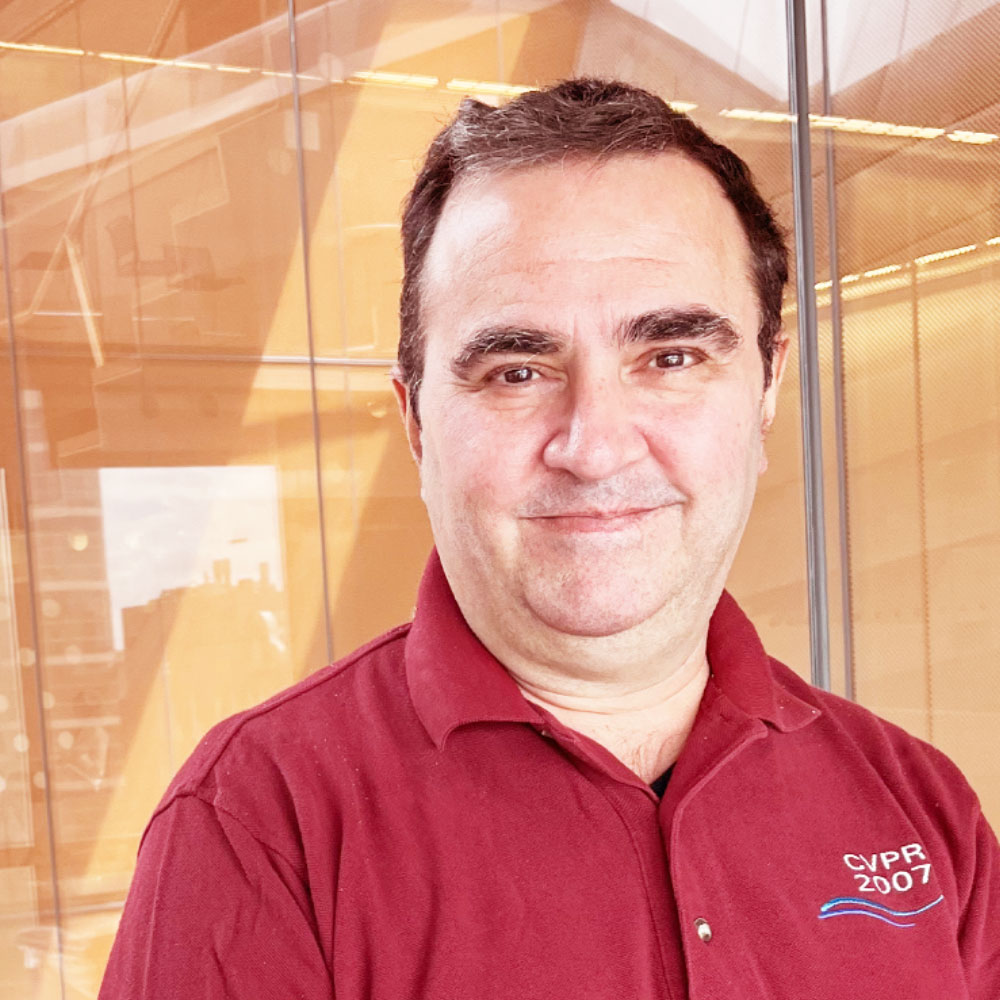
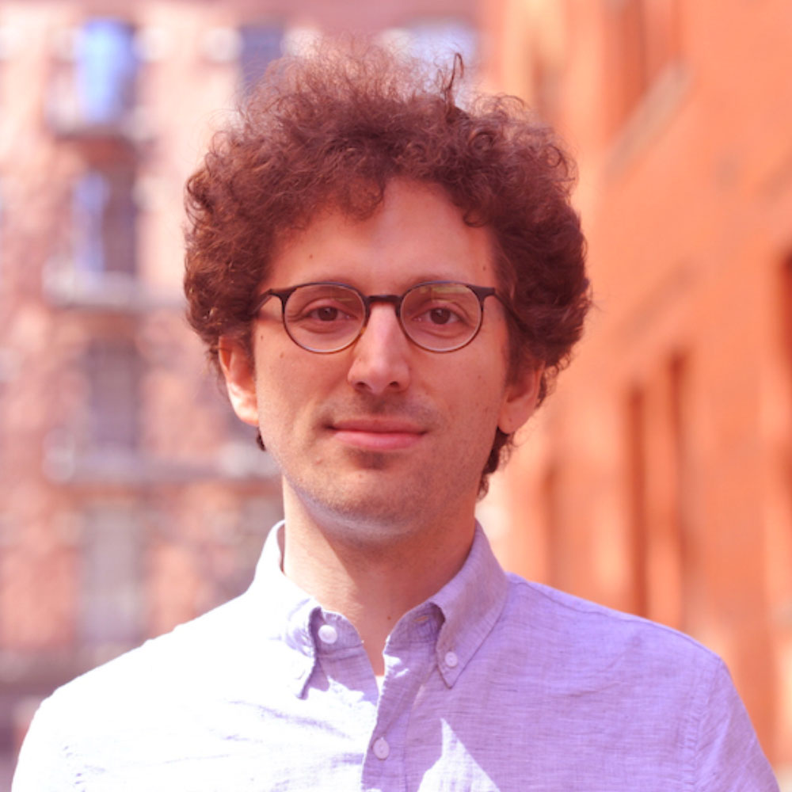
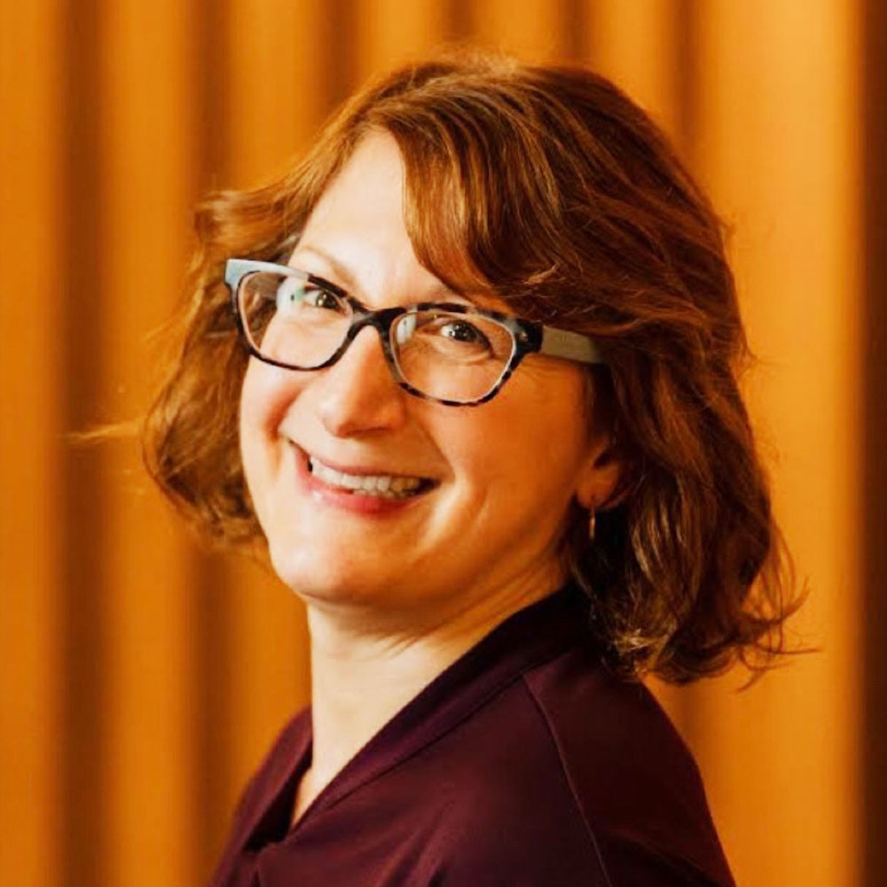
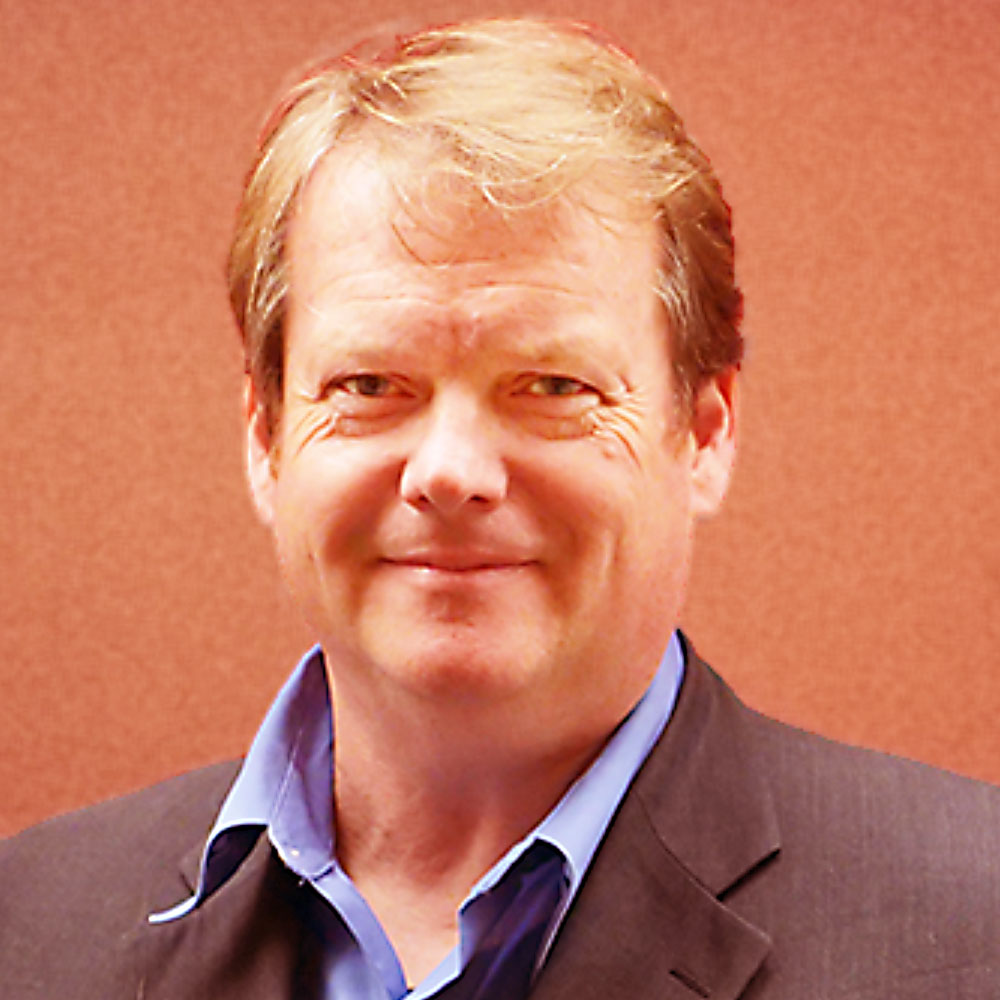
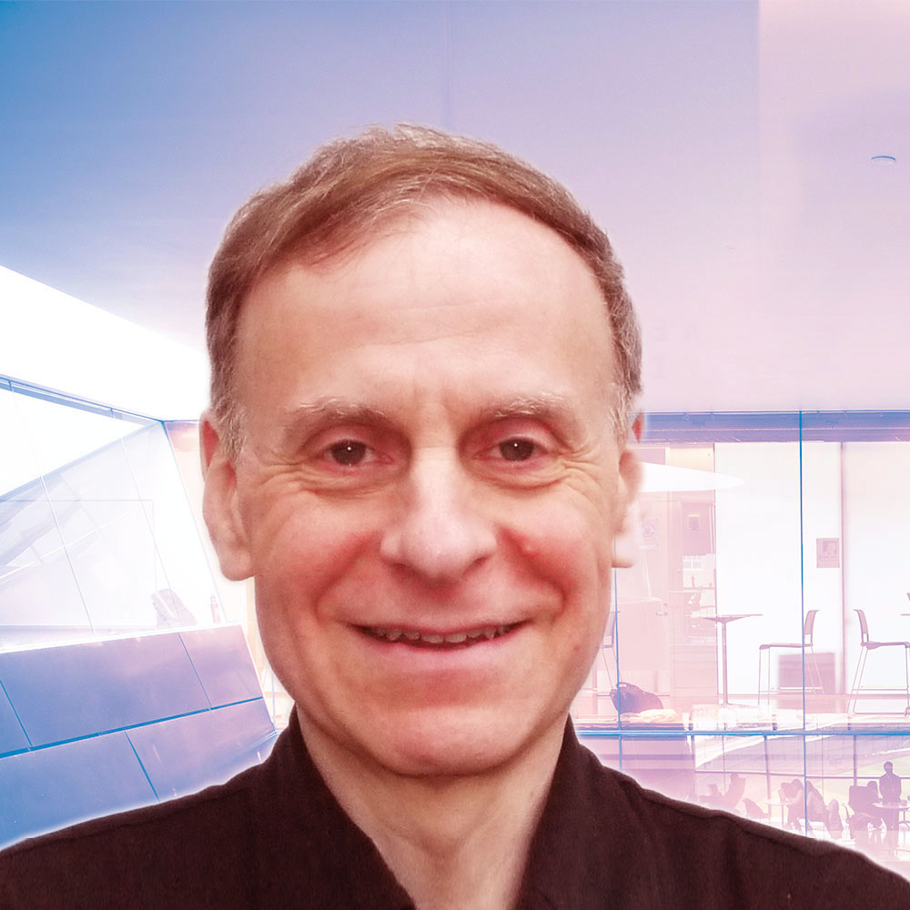

#Leadership Team

{.mkd-img-icon .mkd-img-center alt='Portrait of Ramin Zabih' role="presentation"}

## Ramin Zabih
**Executive Director**

- {class="sm-icon" role="presentation"}[0000-0001-8769-5666](https://orcid.org/0000-0001-8769-5666){target="_blank"}

As arXiv executive director, Ramin guides arXiv’s strategic vision and technological modernization with input from the global research and scholarly communications communities. He is a computer science professor at Cornell Tech and president and founder of the Computer Vision Foundation. Ramin holds a Ph.D. in Computer Science from Stanford University.

{.mkd-img-icon .mkd-img-center alt='Portrait of Yoav Artzi' role="presentation"}

## Yoav Artzi
**Associate Faculty Director**

- [@yoavartzi](https://twitter.com/@yoavartzi){target="_blank"}
- {class="sm-icon" role="presentation"}[0000-0002-4605-6144](https://orcid.org/0000-0002-4605-6144){target="_blank"}

In his role as associate faculty director at arXiv, Yoav assists the faculty director in guiding arXiv's strategic vision and ensuring that arXiv continues to meet the needs of researchers. He is an associate professor in computer science at Cornell Tech. Yoav holds a Ph.D. in Computer Science from the University of Washington.

{.mkd-img-icon .mkd-img-center alt='Portrait of Stephanie Orphan' role="presentation"}

## Stephanie Orphan {align="center"}

**Program Director**
{align="center"}

- {class="sm-icon" role="presentation"}[0009-0001-1240-9992](https://orcid.org/0009-0001-1240-9992){target="_blank"}

Stephanie’s role at arXiv spans administrative management, operational oversight, and implementation of arXiv’s short- and long-term strategic goals. She also serves as a liaison between arXiv, its advisors, and the international open access community. She holds an M.S. in Library and Information Science from the University of Illinois at Urbana-Champaign.

{.mkd-img-icon .mkd-img-center alt='Portrait of Steinn Sigurdsson' role="presentation"}

## Steinn Sigurdsson {align="center"}

**Scientific Director**
{align="center"}

- [@steinly0](https://twitter.com/steinly0){target="_blank"}
- {class="sm-icon" role="presentation"}[0000-0002-8187-1144](https://orcid.org/0000-0002-8187-1144){target="_blank"}

Steinn is Professor of Astrophysics at Penn State University. His research interests include astrophysics and related areas, ranging from cosmology, large scale dynamics and black holes, to the prospects for discovering non-terrestrial life. Steinn holds a Ph.D. in Theoretical Physics from the California Institute of Technology.

{.mkd-img-icon .mkd-img-center alt='Portrait of Charles Frankston' role="presentation"}

## Charles Frankston {align="center"}

**Technical Director**
{align="center"}

- [@arxivcto](https://twitter.com/@arxivcto){target="_blank"}
- {class="sm-icon" role="presentation"}[0000-0003-3878-5387](https://orcid.org/0000-0003-3878-5387){target="_blank"}

Charles is focused on helping ready arXiv for it's next 30 years of stable support of open science and will shepherd arXiv's move to the cloud. He brings his wealth of expertise in a wide range of platforms and languages, systems architecture, and data privacy. Charles holds a B.S. in Computer Science and Engineering from the Massachusetts Institute of Technology.

