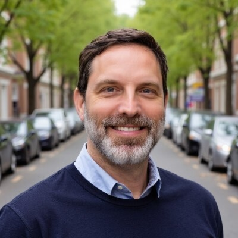

#Leadership Team

{.mkd-img-icon .mkd-img-center alt='Portrait of Penelope Lewis' role="presentation"}

## Penelope Lewis
**Chief Executive Officer**

- {class="sm-icon" role="presentation"}[0000-0001-8821-5169](https://orcid.org/0000-0001-8821-5169){target="_blank"}

Penelope is responsible for guiding arXiv's strategic vision and  ensuring arXiv's long-term growth, sustainability, and platform integrity as essential infrastructure for the scientific community. Penelope brings nearly two decades of strategic and transformational leadership in scholarly publishing and mission-driven scientific organizations, including Chief Publishing Officer at AIP Publishing and editorial and strategy leadership positions at the American Chemical Society Publications Division. A scientist by training, Penelope holds a Ph.D. in Chemistry from The Pennsylvania State University and a B.S. in Chemistry from Indiana University.

{.mkd-img-icon .mkd-img-center alt='Portrait of Jeff Sank' role="presentation"}

## Jeff Sank {align="center"}

**Engineering Director**
{align="center"}

As Engineering Director, Jeff leads the arXiv engineering teams building technology that supports arXiv's valuable Open Science mission. With over 20 years of experience in software development, digital strategy, and team building, Jeff has spent much of his career in the nonprofit sector, including a decade in digital publishing at NPR. Jeff is a graduate of The George Washington University.

{.mkd-img-icon .mkd-img-center alt='Portrait of Stephanie Orphan' role="presentation"}

## Stephanie Orphan {align="center"}

**Program Director**
{align="center"}

- {class="sm-icon" role="presentation"}[0009-0001-1240-9992](https://orcid.org/0009-0001-1240-9992){target="_blank"}

Stephanie’s role at arXiv spans administrative management, operational oversight, and implementation of arXiv’s short- and long-term strategic goals. She also serves as a liaison between arXiv, its advisors, and the international open access community. She holds an M.S. in Library and Information Science from the University of Illinois at Urbana-Champaign.

{.mkd-img-icon .mkd-img-center alt='Portrait of Steinn Sigurdsson' role="presentation"}

## Steinn Sigurdsson {align="center"}

**Scientific Director**
{align="center"}

- [@steinly0](https://twitter.com/steinly0){target="_blank"}
- {class="sm-icon" role="presentation"}[0000-0002-8187-1144](https://orcid.org/0000-0002-8187-1144){target="_blank"}

Steinn is Professor of Astrophysics at Penn State University. His research interests include astrophysics and related areas, ranging from cosmology, large scale dynamics and black holes, to the prospects for discovering non-terrestrial life. Steinn holds a Ph.D. in Theoretical Physics from the California Institute of Technology.

