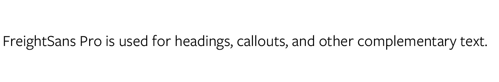
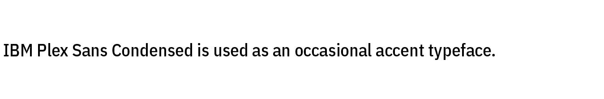
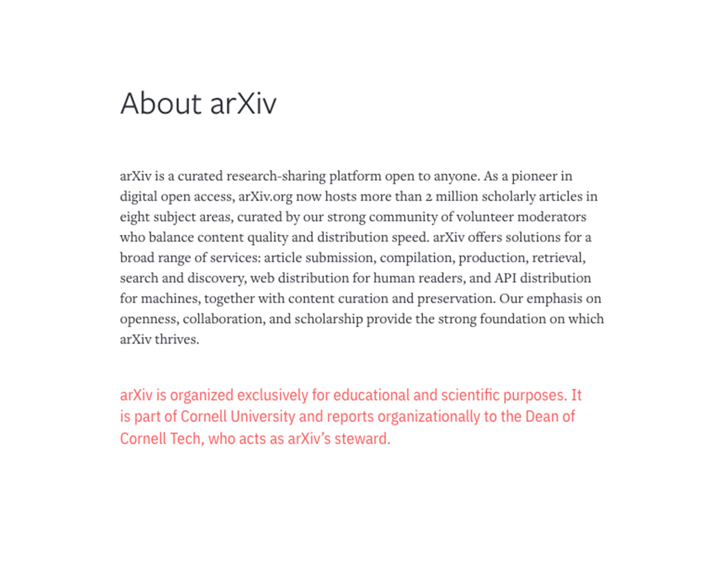
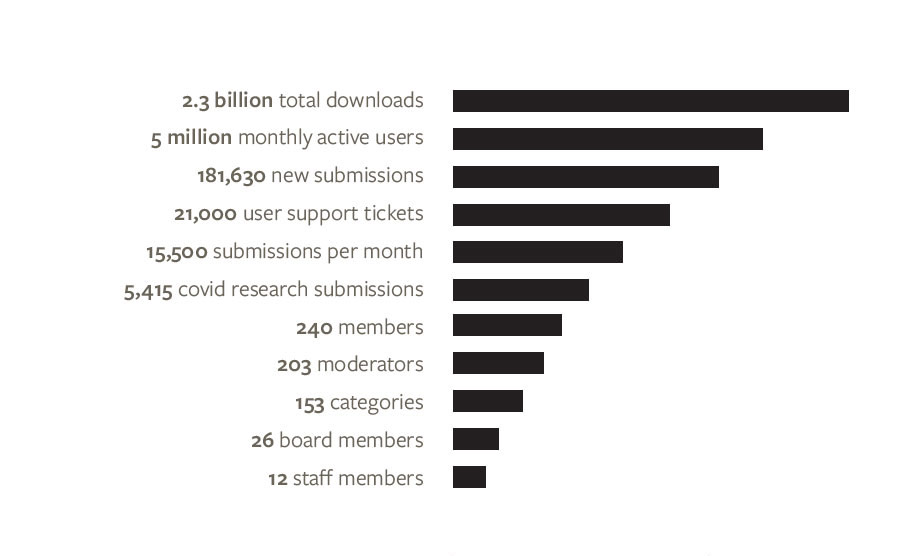

#Fonts

arXiv uses two main typefaces from the Freight family, and two accent typefaces. The Freight family draw from Cornell University’s branding and connect us stylistically with our parent organization. The accent typefaces add variation and interest, and are a bridge to our retro 90's roots.
{.intro}

##Primary Typefaces
FreightText pro is our primary typeface. With high legibility and a classic, sophisticated look it is the workhorse of the arXiv look and feel:
{.mkd-full alt='An example of Freight Sans Pro font, it is arXiv's primary font used for body copy'}

FreightSans Pro elegantly complements it's serif sibling font. The clean lines of this sans serif face lend themselves well to larger uses like titles, and special use cases like callouts, sidebars, and other secondary content.
{.mkd-full alt='An example of Freight Text Pro, it is used for headings, callouts, and other special uses'}

IBM Plex Sans Condensed is used for special cases where a bold face is called for. Special headings, annotations, limited horizontal space, or labels are all good candidates for IBM Plex Sans Condensed:
{.mkd-full alt='An example of IBM Ples Sans font, it is used as an accent typeface'}

Larabiefont, in combination with Xenara, is customized as the basis of our logo. These fonts are used in logo lockups, logo extensions, and in the identies for special partnerships.
{.mkd-full alt='An example of Larabie and Xenara's distinctive letterforms'}

##Alternative Google Fonts
When creating documents or slide decks in Google Docs, use the closest alternate font available, per the table below.

| Primary Font          | Google Font Substitute               |
| --------------------- | ------------------------------------ |
| Freight Text Pro      | Frank Ruhle Libre                    |
| Freight Sans Pro      | Catamaran                            |
| IBM Plex Sans         | IBM Plex Sans                        |

##Examples
1. **Title:** Freight Sans Pro, Medium, Black 
**Body Copy:** Freight Text Pro, Book, Black 
**Secondary copy:** IBM Plex Sans Condensed in Publishing Pink 
{.mkd-full .mkd-border alt='an example of Freight Text Pro and Freight Sans Pro fonts'}

1. **Callout:** Freight Sans Pro, Book & Bold, in Library Grey 
**Highlight:** IBM Sans Plex Condensed in Publishing Pink 
Over a Light Blue background 
{.mkd-full .mkd-border alt='an example of IBM Sans Plex Condensed and Freight Sans Pro fonts'}

1. **Quotation:** Freight Sans Pro, Book, in Library Grey with Light Grey highlighting 
**Attribution:** Freight Sans Pro, Medium, in Library Grey
{.mkd-full .mkd-border alt='an example of Freight Sans Pro font in several weights'}

1. **30th Anniversary identity:** FreightText Pro, Bold in Cornell Red and Black
{.mkd-full .mkd-border alt='an example of Freight Text Pro in Cornell Red'}

1. **Infographic:** FreightSans Pro, Bold and Medium, in Library Grey
{.mkd-full .mkd-border alt='an example of Freight Sans Pro font'}
