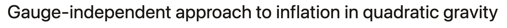
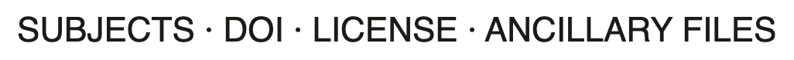
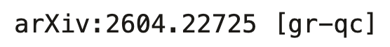
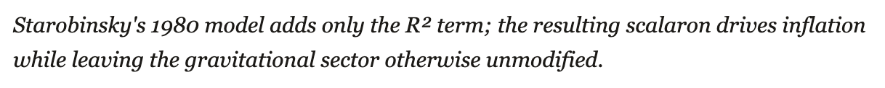
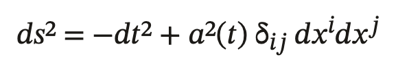
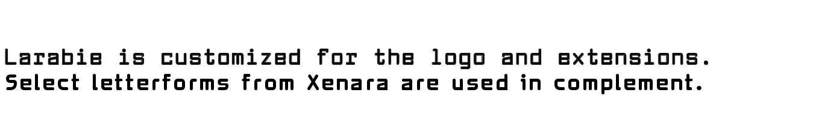

#Fonts

*Note: arXiv is transitioning to a new design and will be implementing the typographic changes below. Our legacy fonts will still be visible in many places until the transition is complete.*

arXiv uses two main typefaces several accent typefaces from the IBM Plex family. All our typefaces are open source and self-hosted to reduce tracking and maintain greater privacy for our visitors.
{.intro}

##Primary Typefaces

###IBM Plex Sans
Our primary typeface. With high legibility, versatility, and a classic, sophisticated look it is the workhorse of the arXiv platform:

{.mkd-border .mkd-img-space alt='An example of IBM Pleas Sans font'}

###IBM Plex Sans Condensed
For space-limited applications such as labels, captions, and metadata:

{.mkd-border .mkd-img-space alt='An example of IBM Plex Sans Condensed'}

###IBM Plex Mono
Used for code, tables, and arXiv identifiers:

{.mkd-border .mkd-img-space .mkd-img-small alt='An example of IBM Plex Mono'}

###IBM Plex Serif Italic
Captions and marginalia use this font:

{.mkd-border .mkd-img-space alt='An example of IBM Plex Serif Italic'}

###STIX Two Math
Applied to all formula throughout our HTML papers and other locations:

{.mkd-border .mkd-img-space .mkd-img-small alt='An example of STIX Two Math'}

###Larabie + Xenara
Larabiefont, in combination with Xenara and highly customized, form the foundational typography in our logo. These fonts are used in logo lockups, logo extensions, or in the identities for special partnerships:

{.mkd-border style="padding-left: 1em;" alt='An example of Larabie and Xenara'}
