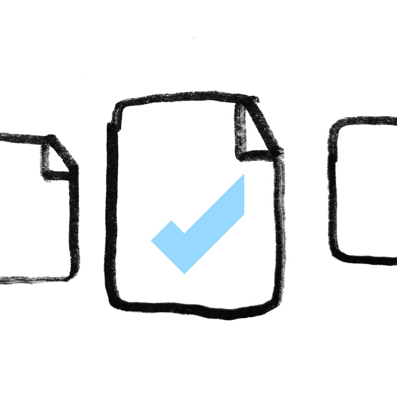

#Images
arXiv's branding uses both photographs and illustrations. Photos are used alone or paired with our [tagline](tagline.html). Illustrations capture abstract concepts well and are used in presentations and documentation.
{.intro}

**Important: Images may only be used for arXiv-owned materials.** All assets within arXiv image libraries have been cleared only for use in arXiv-owned platforms, messaging and communication.

##Photos
Photographs are an important part of the arXiv visual brand. Our curated photo collection represent academic spaces, researchers, labs, and other research-related subject matter. Images of the Cornell and Cornell Tech campuses help create a sense of place, and portraiture humanizes the vast community of people who rely on arXiv.

We apply color washes to photos in our [brand colors](colors.html):
{.mkd-img-full alt='Cornell's campus in the springtime. A student walks near the famous clocktower below flowering trees.'}

Photographs can be overlayed with a [tagline](tagline.html):
{.mkd-full alt='An image of arXiv's home at Cornell Tech overlayed with the tagline arXiv Connects old and new ways of publishing.'}  

##Illustrations
Illustrations are used to represent abstract concepts or stakeholder groups. The illustrative style we use is informal and friendly. It is not slick or polished, but emphasizes mission focus with a touch of gentle humor.

  
  
  
  
  
  

##Additional photo resources
Additional photographic image resources that are cleared for use on arXiv communication materials, both web and print, are listed here:

[CORNELL PHOTOGRAPHY LIBRARY](https://photo.cornell.edu/)
This resource holds a wide variety of cleared images of people and campus locations.

[CORNELL TECH IMAGE LIBRARY TOP 100](https://cornell.app.box.com/s/rpl81q6go7s9qq0nm7ndw2tw7hfh8079)
A curated collection from Cornell Tech, including images of campus, conferences and social gatherings, research discoveries, and more.

[LIBRARY OF CONGRESS ONLINE CATALOG](https://www.loc.gov/pictures/collections/)
Within this vast image collection can be found free and unlicensed historical images related to scientific discovery.
