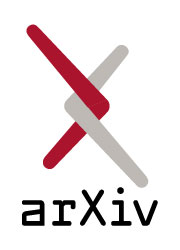
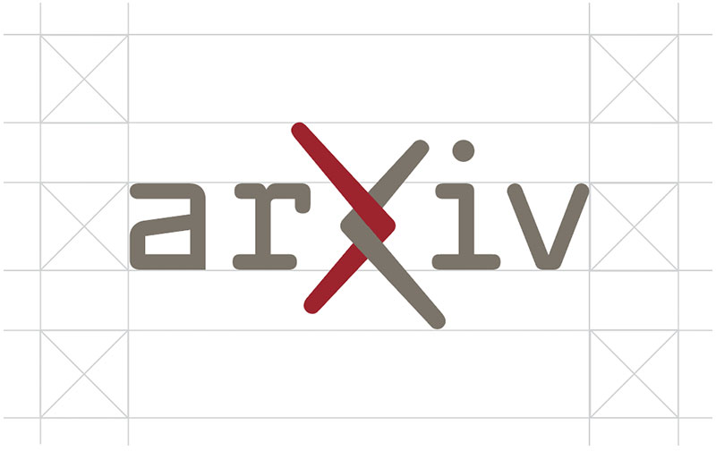

#Logos
Our identifying mark, vetted and approved by Cornell University, achieves the *legibility, memorability and legal defensibility* arXiv needs. Our logo is ready to help us share a consistent, intentional, and meaningful message about who we are with the world.
{.intro}

**That message is: arXiv is a place of connection, linking together people and ideas, and connecting them with the world of open science.**

The arXiv logo nods to the past with a font that pays homage to arXiv’s birth in the 90’s, while also being boldly forward looking. The arms of the ‘X’ retain stylistic elements of the ‘chi’ in our name, with a lengthened top left and lower right branch. Symbolically, the intertwining of the arms at the heart of the logo captures the spirit of arXiv’s core value as a place of connection.

Using our logo consistently over time will build up rich layers of meaning with our community, and it’s value to arXiv will increase exponentially. The legal protection we have over the logo will help us also protect the arXiv service that we all love.

> **The logo should not be altered in any way, redrawn, used in an unspecified color or reproduced on a background that will impair its visual recognition.** Use of the name arXiv and associated logos, web addresses, and colors are only allowed with explicit written permission from the arXiv management team.

##Download arXiv logo assets
*Are you a third party looking to use our logos in your product or materials?* Read our [logo and brand use guidelines](brand-guidelines.md) first. If your project and usage needs meet the criteria outlined in our use guidelines, you may download the style and format you need below:

| Logo style  | Image      | Download links                          |
| ----------- | --------------- | ------------------------------------ |
| Primary Logo | {.mkd-img-thumb} |  [SVG](https://cornell.box.com/v/arxiv-logo-svg){ target='_blank'}, [JPG](https://cornell.box.com/v/arxiv-logo-jpg){target='_blank'}, [PNG](https://cornell.box.com/v/arxiv-logo-png){target='_blank'} |
| Large Logomark | {.mkd-img-thumb}  | [SVG](https://cornell.box.com/v/arxiv-logomark-svg){target='_blank'}, [JPG](https://cornell.box.com/v/arxiv-logomark-jpg){target='_blank'}, [PNG](https://cornell.box.com/v/arxiv-logomark-png){target='_blank'} |
| Small Logomark   |  {.mkd-img-thumb} | [SVG](https://cornell.box.com/v/arxiv-logomark-small-svg){target='_blank'}, [JPG](https://cornell.box.com/v/arxiv-logomark-small-jpg){target='_blank'}, [PNG](https://cornell.box.com/v/arxiv-logomark-small-png){target='_blank'} |
| Alternate Logos   |   | [Full Logo Library](https://cornell.box.com/v/arxiv-logo-assets) |

##Primary Logo
The primary arXiv logo is our default mark seen in most applications. It showcases two primary brand colors: Dark Grey and Cornell Red.

{.mkd-img-60 alt='The main arXiv logo in our standard brand colors of Library Grey and Cornell Red'}

###Spacing
A clear area around the logo prevents any nearby graphic elements from interfering with the name’s impact. The primary logo configuration should maintain spacing around the logo equal to the height of the ‘a’, as shown.

{.mkd-img-60 alt='The arXiv logomark with a grid showing proper clearance around the graphic'}

###Alternate Colors
The arXiv logo is available in various alternate colors for special use cases, such as dark background or single color applications.

{.mkd-img-50 alt='The arXiv logo in lighter colors for use on a dark background'}
{.mkd-img-50 alt='The arXiv logo in black'}

##Lockups and Extensions
Lockups are used for internal arXiv projects with unique impact and a need for distinct branding, or for pre-approved partnership use.

{.mkd-img-50 alt='The arXiv Labs logo extension'}
{.mkd-img-50 alt='The arXiv Check logo extension'}

###Spacing
The lockup configuration should maintain spacing around the logo equal to the height of the ‘a’,  as shown:

{.mkd-img-60 alt='The arXiv logomark with a grid showing proper clearance around the graphic'}

##Logomark
arXiv's logomark is for use where space is at a premium, for example mobile applications and when an icon is needed. The logomark is available in large and small, and in the same color variations as the primary logo:

{.mkd-img-thumb alt='The arXiv logomark with the arXiv name below'}
{.mkd-img-thumb alt='The arXiv logomark'}
{.mkd-img-thumb alt='The arXiv logomark in light colors for use on dark backgrounds'}
{.mkd-img-thumb alt='The arXiv logomark in black'}

##Supergraphic
arXiv's supergraphic provides a new twist on an old favorite: the arXiv "smileybones". Quirky, scrappy, inscrutable, and whaaaat? are just some of the ways this icon has been described over the years. The updated icon celebrates the pixelation of the original 90's image, and it's rebellious nature, with a modern homage. For fun, here is a [brief history](https://www.quora.com/Whats-the-story-behind-the-arXiv-org-favicon) of the original icon. The smileybones supergraphic should be used in applications where it can display on a large enough scale for impact, and where a bit of informality is appropriate

{.mkd-img-60 alt='A large yellow smiley face over highly pixelated crossed bones'}
