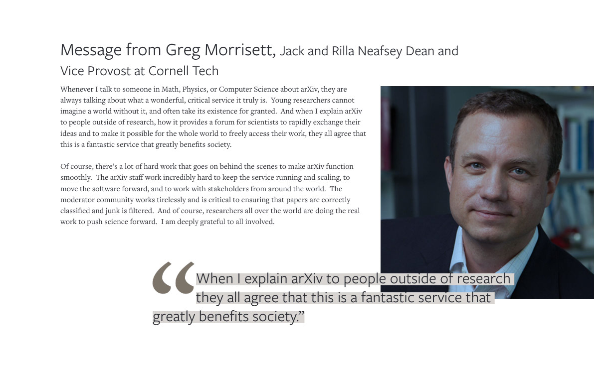

#Quotes
Quotes from community members and stakeholders are a powerful way to strengthen the arXiv message, and to bring a human voice to our digital product.
{.intro}

> Quotes must have permission from the quotee to be cleared for use. We maintain a collection of cleared quotes in our [User Experience Hub](https://arxiv-org.atlassian.net/issues/?jql=project%20%3D%20%22AUXDH%22%20and%20%22UX%20Quote%5BCheckboxes%5D%22%20is%20NOT%20EMPTY%20ORDER%20BY%20created%20DESC) *(Authorized access only)*

All arXiv staff should be proactive in listening for and asking permission to use great quotes. They  enrich presentations and communication materials, and strengthen our ties with a variety of communities as we amplify the voices of their members. If you hear of a good quote let the Communications Director know so we can request permission and get it on record!

##Examples
Quotes can be displayed with a background highlight:
{.mkd-img-60 .mkd-border}

The background highlight allows them to be easily overlayed over a photo:
{.mkd-full .mkd-border}
