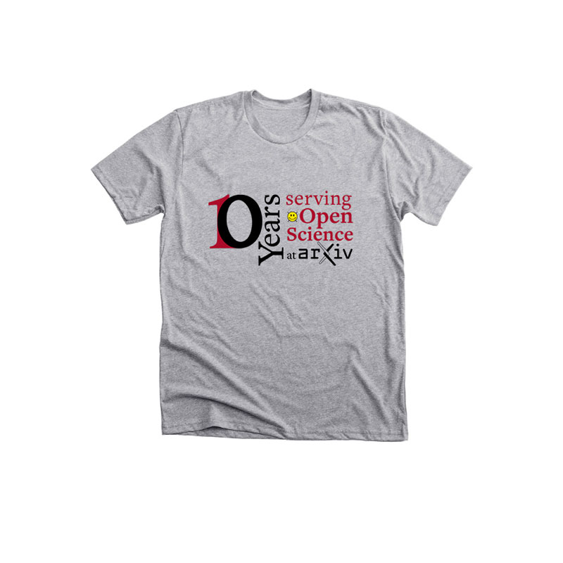

#Branded Merchandise

arXiv's community is enthusiastic! They appreciate a thank you, or the ability to take home a little piece of the arXiv they love so much, and to support this service at the same time.
{.intro}

Expressing our visual identity on products in the real world also helps establish our branding on a firm footing, protecting arXiv and our ability to continue to provide this service. Swag is also a good place for experimenting with informal, playful, and edgier permutations of the arXiv brand.

##Store

arXiv maintains a [non-profit store](https://www.bonfire.com/store/arxiv-official/) with Bonfire.com, which prints orders on demand and ships internationally. Our most popular product is the arXiv logo on a cotton t-shirt, followed by the arXiv logo on a white mug.

{.mkd-img-left .mkd-border alt='the arXiv logo on a white tshirt'}
{.mkd-img-left .mkd-border alt='The arXiv logo on a white mug'}

We can celebrate secondary elements of the arXiv identity, like the smileybones supergraphic, and our tagline.

{.mkd-img-left .mkd-border alt='The arXiv smileybones icon with the eyes replaced by an infinity symbol, and the words arXiv forever'}
{.mkd-img-left .mkd-border alt='the arXiv logo on a white tshirt with the phrase You bring the Open, We bring the Science'}

##Appreciation

arXiv has many opportunities to thank our collaborators and strengthen connections. A small, tangible gift can make all the impact in the world. From top left to bottom right: Thank you card, stickers, a custom arXiv cycling jersey, and a 10 year staff commemoration.

{.mkd-img-left .mkd-border alt='Cheerful arXiv thank you card in a red script typeface'}
{.mkd-img-left .mkd-border alt='An assortment of arXiv themed stickers in different colors and sizes'}
{.mkd-img-left .mkd-border alt='A cycling jersey in Access Lime color, with our logo on the front and our smileybones icon on the back'}
{.mkd-img-left .mkd-border}
