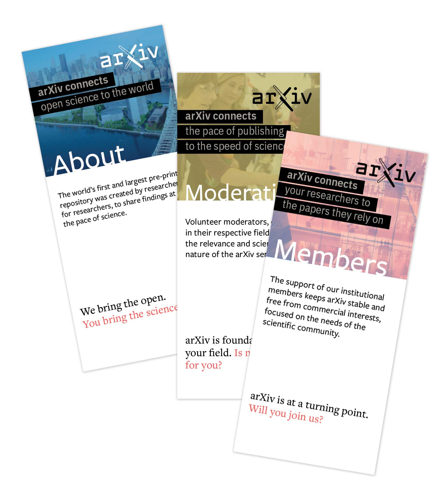
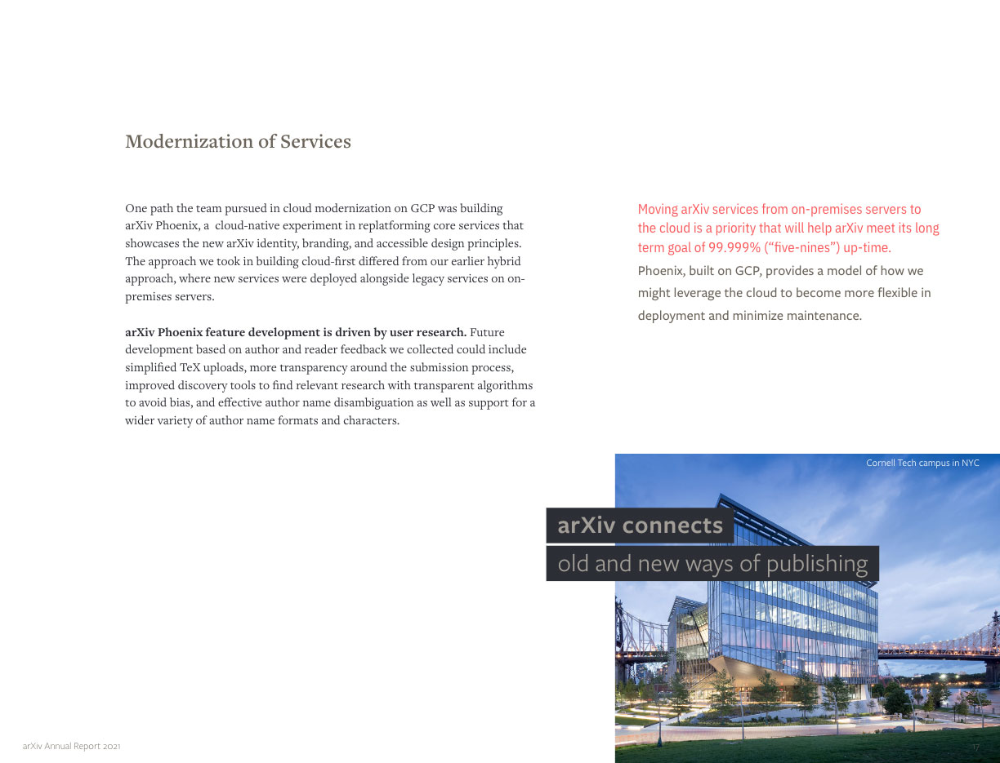
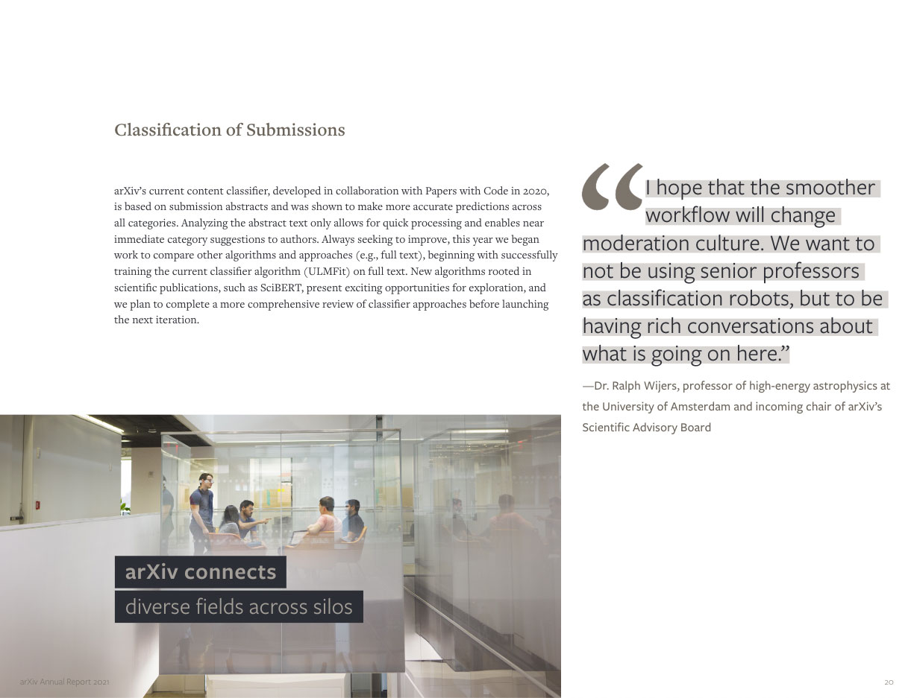
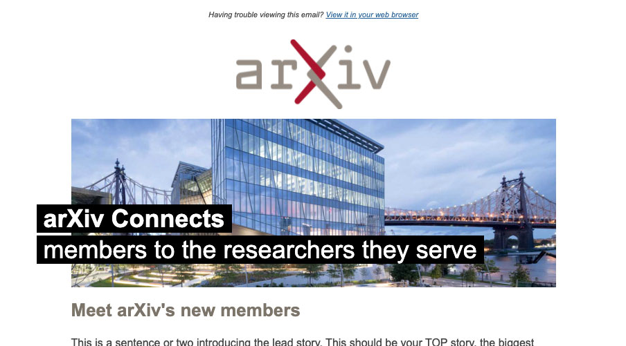

#Tagline
The tagline **"arXiv connects..."** reflects our role as a place of connection among researchers, institutions, repositories, and to the world of open science.
{.intro}

It re-enforces a message of interconnectivity as symbolized in the interlocking logo, but adds specific context through word and image choices. Our tagline is both consistent and flexible.

The font used is Freight Sans Pro. The text color is Light Library Grey over a black background.

##Example: over a large photo
The black highlight allows the tagline to retain legibility over even very busy backgrounds and can be easily combined with arXiv's colorized photography collection. Note the line break after 'arXiv connects'
{.mkd-img-full .mkd-border}

##Example: brochures
With this series of brochures, a customized tagline is used to connect the benefit arXiv offers to the target audience. In this example, both the photo and the tagline bleed off of the page.
{.mkd-img-full .mkd-border}

##Example: the tagline breaks the grid
In this example, the tagline breaks the grid established by other text on the page.
{.mkd-img-full .mkd-border}

##Example: the photo breaks the grid
Here, the tagline follows the established grid while the photo breaks out. Photos can add further context, build a sense of place, and reinforce the tagline message.
{.mkd-img-full .mkd-border}

##Example: newsletter header
The tagline is used in our Membership Newsletter header. By changing the context of the second line arXiv can draw attention to the specific idea being conveyed, or celebrate a particular audience. We switch to the Arial font here, because only system default fonts can be safely used in email templates.

The photo aligns with the grid, while the tagline breaks it to the left. Due to the limitations of email, the font in this case is Arial.
{.mkd-img-full .mkd-border}
