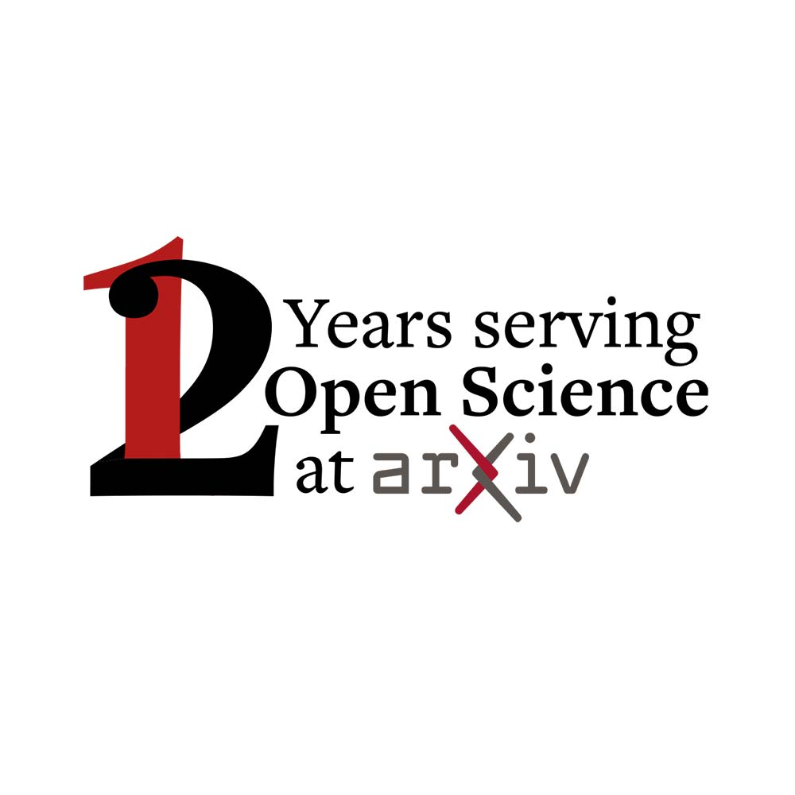
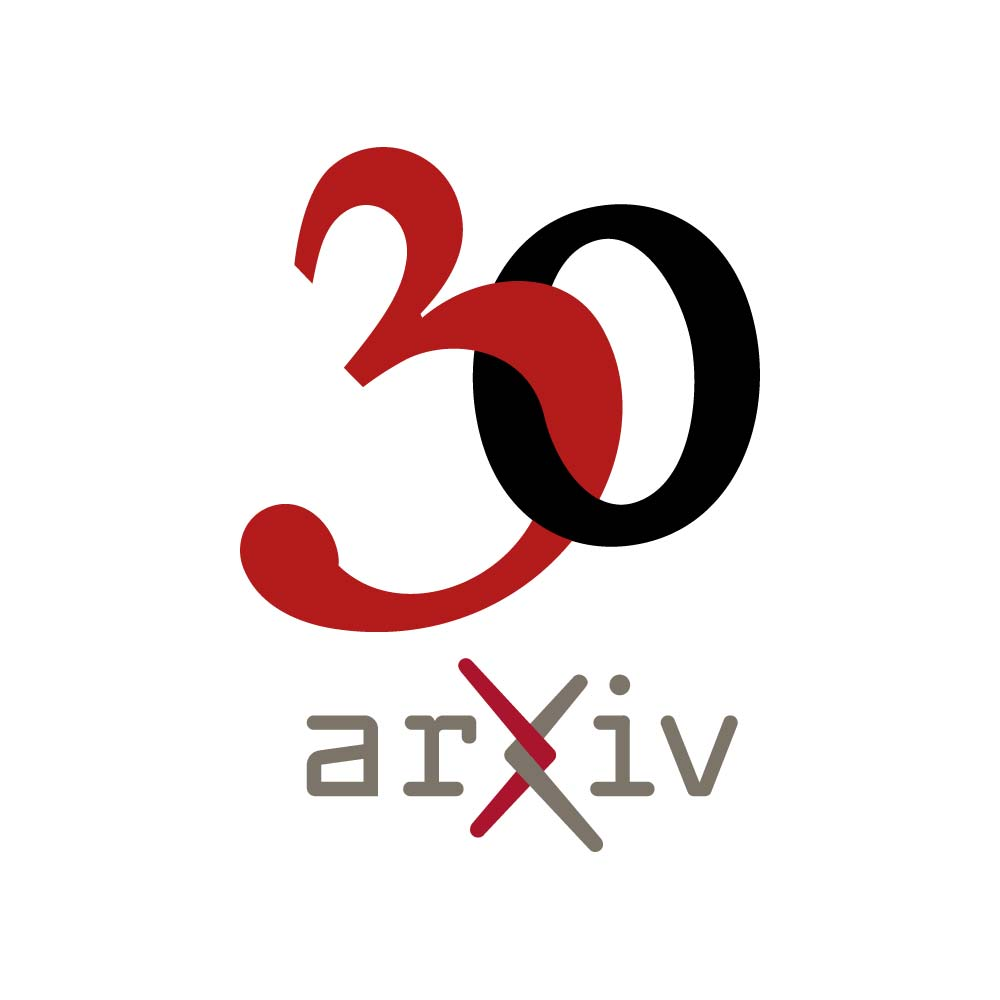
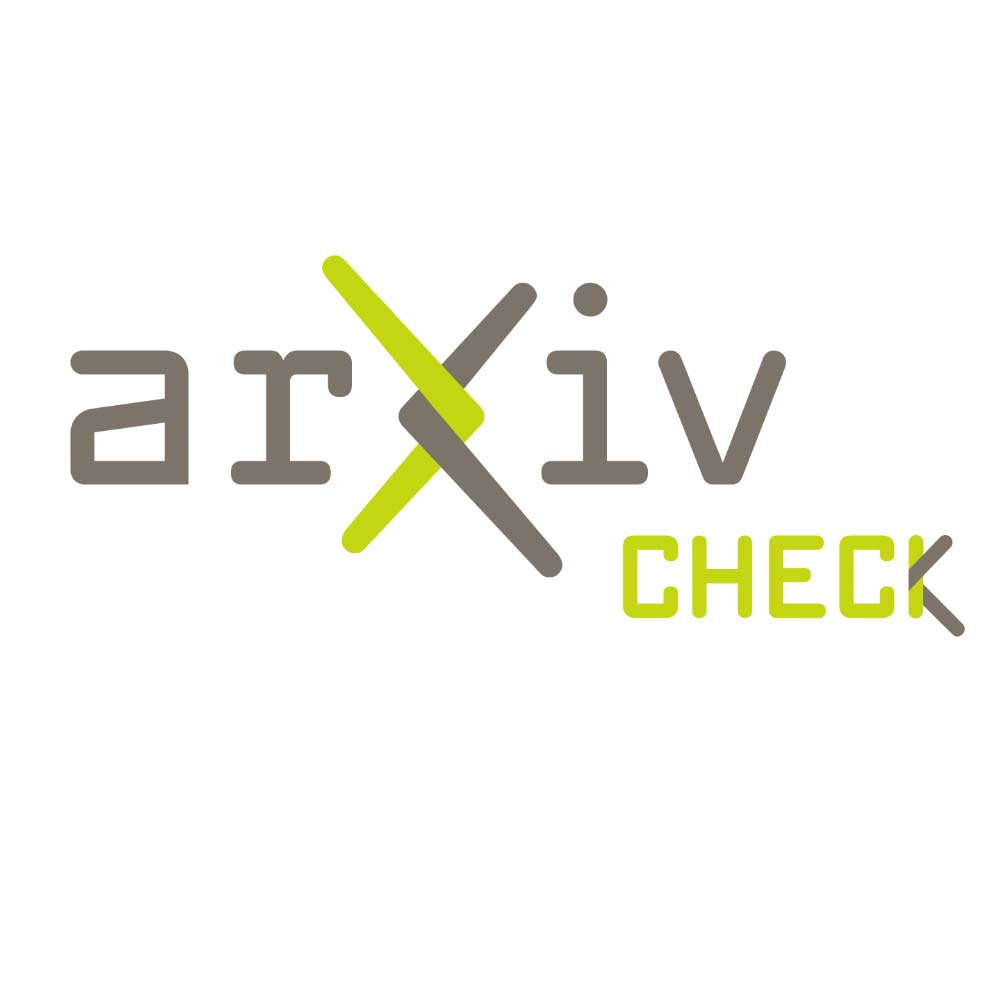

#Typography
Consistenty of typography is critical to arXiv's identity. But within our framework there are options and room for creativity.
{.intro}

Base styles are built around Freight Text and Freight Sans typefaces. The Freight family draws from Cornell University’s branding and connect us stylistically with our parent organization. arXiv has several typographic styles based on Freight that range from elegant and sophisticated to edgy and bold. Use these guidelines to balance both consistency and spontaneity.

##Architectural examples
This architectural treatments of the Freight Text serif typeface allows for variation and customization with consistency of style. Contrasting font sizes, stacked lines, and interplay of letterforms create elegance and visual interest without sacrificing legibility.

{.mkd-img-left .mkd-border}
{.mkd-img-left .mkd-border}

##Intertwined Letterforms
Intertwined letterforms—here celebrating our 30th anniversary and a logo extension—echo the intertwined arms of the chi in our logo.

{.mkd-img-left .mkd-border}
{.mkd-img-left .mkd-border}

##Additional
See brand guidelines for [taglines](tagline.html) and [quotes](quotes.html) for additional type treatments that are part of the arXiv brand family.
