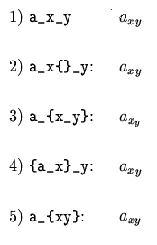

Examples of TeX Double Subscripts
=================================

In the examples below (1) is incorrect and gives a LaTeX error. A
&lt;RETURN&gt; leads to the same interpretation as (2). However, there
is [no genie to hit &lt;RETURN&gt;](mistakes.md#intervention) in arXiv's
automatic TeX system.

These are examples for the [double subscript and superscript errors
FAQ](mistakes.md#double_subscript).
