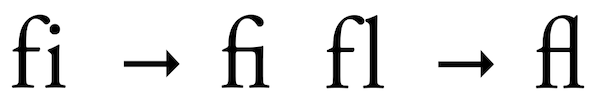

# Submission of PDF

If you are submitting a PDF document, please make sure to follow these
guidelines:

-   Submit one PDF file including all text and figures. PDF can
    efficiently include photographs imported in JPEG format. We do not
    permit submissions that include multiple PDF files, or PDF files in
    combination with other file types.
-   You must ensure that all standard and non-standard fonts are included and that
    outline (TrueType/Type1) rather than bitmap (Type3) fonts are used.
    In Adobe Distiller and many other products this is referred to as
    *compatibility mode* and will ensure that the PDF document is as
    portable as possible.
-   Note: a PDF file created from a TeX/LaTeX file will typically be rejected, with exceptions granted on a case-by-case basis.
    There are [good reasons](faq/whytex.md) why arXiv insists on
    TeX/LaTeX source if it is available. arXiv produces PDF
    automatically from all TeX submitted source. For information on
    viewing the PDF provided by arXiv, see our [PDF browsing
    help](pdf.md).

While PDF can be very useful, it has some limitations. Including large figures in PDF can hamper the
display of the document so that it is unusable. Authors should keep in
mind that not everyone will have a high-end machine, and they should
compose their documents accordingly with efficient figures.

Creating PDF
------------

Many authoring applications can directly create or export as PDF. Freely
available examples include [OpenOffice.org](http://www.openoffice.org/)
Writer or [Google Docs](http://docs.google.com).

Other authoring applications may require either a converter add-in or
post-processing to produce PDF. Many commercial word processors already include the
ability to export to a pdf. If you have a copy of Adobe Distiller
installed you should use that to create PDF. Otherwise, you might try
one of these free conversion utilities:

-   [PDFCreator](http://www.pdfforge.org/products/pdfcreator) — a
    downloadable PDF print addon for Windows.
-   [PrimoPDF](http://primopdf.com) — downloadable Windows printer
    driver that writes output to a PDF file. (There is also a PrimoPDF
    online service which accepts Word, RTF, ODF and other formats but
    some font substitutions may occur).
-   [CIB PDF
    brewer](https://www.cib.de/en/pdfbrewer/)
    is a downloadable Windows printer driver that writes output to a PDF
    file. The free version has limited font support. Notably,
    `MT  Extra` is not supported.

(Please contact us if this information is out of date or if you can
suggest other free tools that are better.)

Avoid Embedded JavaScript
-------------------------------------------------------
Do not include embedded JavaScript such as animated gifs, movies, HTML in your PDF. Submissions with embedded JavaScript are automatically rejected due to the potential security risks posed to arXiv systems. 

- Submit all movies and animated GIFS as separate(non-JavaScript) ancillary files.
- Remove or disable JavaScript when building your PDF or generate PDFs using standard tools such as Adobe Distiller or one of the free conversion utilities mentioned above. 

Fonts within PDF
-------------------------------------------------------

**Caution when using pre-unicode fonts**  
In order to increase the accessibility of our papers, we attempt to detect PDFs that contain non-standard character encoding for ligatures. Ligatures are when a sequence of characters are combined into a single character or glyph to improve their appearance. Characters that have features that would visually run into one another when used next to each other in the process of typesetting, such as ff, ffi, ffl, fi and fl, are commonly converted to ligatures.

{mkd-border alt='The letters f and i are displayed as individual characters typeset next to one another and then displayed as a ligature combined into one character. The letters f and l are displayed as individual characters typeset next to one another and then displayed as a ligature combined into one character.'}

Ligatures in PDFs may also not encode properly which may cause the ligatures not to display correctly or not at all. This can impact the ability of assistive technology to read or pronounce words correctly. You can check your PDF by asking a screen reader (there is one built into the Microsoft Edge browser) to read your paper aloud; if words like "different", "first", or "official" are pronounced incorrectly, your PDF uses a font which has this issue. Another way to check your paper is by copying and pasting sections of text from the PDF into a text editor, and look for missing strings such as “ff”, “fi”, “fl”, etc.  If you enable spell checking in your text editor, words with missing glyphs should be highlighted as spelling errors.

**Embedding non-standard fonts**  
Fonts used in PDF files may be embedded or non-embedded. PDF viewers silently attempt to render non-embedded fonts, potentially resulting in documents looking different for different users. Non-embedded fonts, especially fonts with non-standard characters,  may render differently on different machines. To avoid errors in text rendering, we recommend using PDF tools which embed all of the fonts used in your PDF. arXiv may reject PDF submissions because of non-standard, non-embedded fonts. For more information, see [https://helpx.adobe.com/acrobat/using/pdf-fonts.html](https://helpx.adobe.com/acrobat/using/pdf-fonts.html).

PDF must be machine readable
-------------------------------------------------------

arXiv relies on our submitters to provide a PDF which is *machine readable*
(i.e. that the PDF is not encrypted, bitmapped, or otherwise altered to prevent
text extraction), which facilitates **discovery and access**.
This means that we can build tools around your work to provide
content discovery (e.g. full text search), and readers can still
understand its contents using tools such as screen readers.

arXiv does not accept bitmapped or scanned PDF, even in the case of software provided OCR
(optical character recognition), because OCR software may not be sufficiently accurate for our
archival purposes, nor are they necessarily compliant for screen readers and other accessibility
requirements.

Copyright within PDF
------------------------------------------------

Copyright statements of the author are permitted within the pdf. Copyright
statements which prohibit or impair arXiv's [redistribution license](license/index.md) will be rejected. If explicit permission is
given for open access redistribution, these are permissible.
Users should contact [arXiv user support](https://arxiv.org/support) if they have questions.

Note on IEEE submissions. Please note arXiv will currently take the
'Accepted' IEEE version but not the 'Published' IEEE version. For more
information on IEEE policies please see:

-   [IEEE
    FAQ](https://www.ieee.org/content/dam/ieee-org/ieee/web/org/pubs/author_version_faq.pdf)
-   [IEEE Rights
    Policy](http://www.ieee.org/publications_standards/publications/rights/rights_policies.html)
-   [IEEE Third Party
    Servers](http://www.ieee.org/publications_standards/publications/rights/thirdpartyservers.html#sect2)
