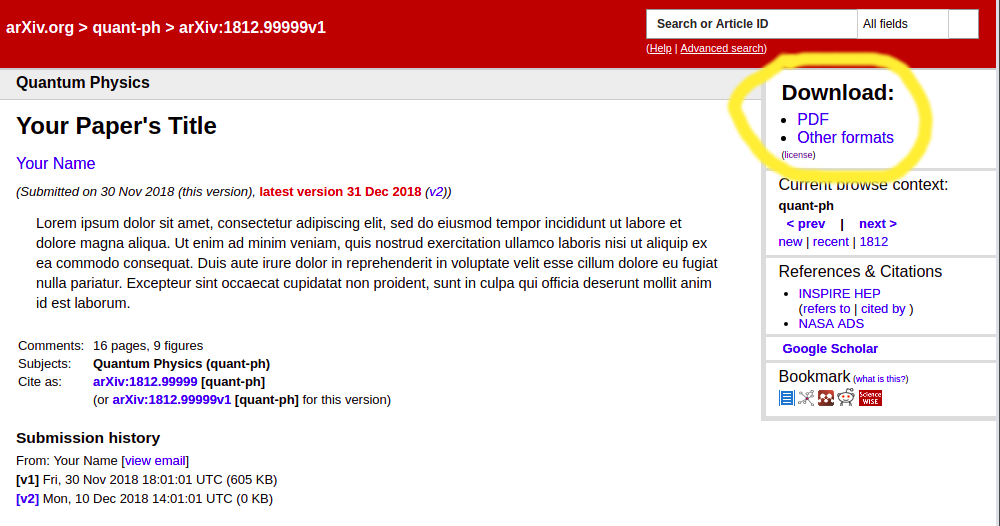

To withdraw an article
======================

Submission not yet announced
----------------------------

If your submission has not yet become [publicly
available](availability) you may delete or delay it. To do either
of these things go to your [user page](/user) and select
either the Delete () or Unsubmit
() icon. Deleting a submission
will remove it from our system, unsubmitting will return it to the
[incomplete status](submit_status#incomplete) allowing modification and
later resubmission. If you have difficulty in doing either of these
things then please [contact arXiv administrators](/help/contact)
immediately. In your message be sure to include the submission
identifier, an explanation of the problem, and the reason for
withdrawal.

Article has been announced
--------------------------

Articles that have been announced and made public cannot be completely removed.  A withdrawal creates a new version of the paper marked as withdrawn. That new version displays the reason for the withdrawal and does not link directly to the full text. Previous [versions](versions) will still be accessible, including the full text. Please see the example below.

To submit a withdrawal

- From your [user page](/user) select the Withdraw icon () for the appropriate article in the
"Articles You Own".
- Complete the Withdrawal form by providing a specific reason for the withdrawal within the
**Comments** field. 

Withdrawal reasons must be appropriate for the withdrawal to be accepted.

- Withdrawal reasons will be displayed publicly so when writing the withdrawal reason please keep in mind that you are explaining the withdrawal to the readers of arXiv
- It is not appropriate to withdraw a paper because it is published or submitted to a journal. Instead you could submit a [journal-ref](jref).
- It is not appropriate to withdraw a paper because it is being updated. Instead you could submit a [replacement](replace).
- It is not appropriate to withdraw a paper due to copyright infringement. Please instead see [Copyright Infringements](http://www.cornell.edu/copyright-infringement.cfm)

Example Withdrawal
--------------------------

The withdrawn version
- In the example below the withdrawal has created a new version (version 2). 
- The new withdrawn v2 becomes the default view of the paper. 
- The reason for the withdrawal is displayed in the Comments field. 
- Under the Download options on the right there is no option to download the PDF or TeX. Clicking on "Source" downloads an empty file.

Previous version remains accessible
- From the v2 above, when you click on "v1" you can still access the previous version of the paper
- Below is version 1 for the withdrawn paper
- The full text can be accessed under the Download options

