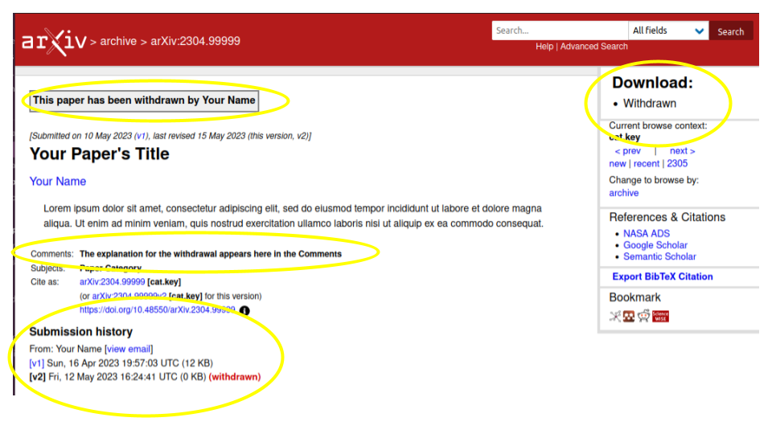

# Withdrawing an article

Submission not yet announced
----------------------------

If your submission has not yet become [publicly
available](availability.md) you may delete or delay it. To do either
of these things go to your [user page](https://arxiv.org/user) and select
either the Delete () or Unsubmit
() icon. Deleting a submission
will remove it from our system, unsubmitting will return it to the
[incomplete status](submit_status.md#incomplete) allowing modification and
later resubmission. If you have difficulty in doing either of these
things then please [contact arXiv administrators](contact.md)
immediately. In your message be sure to include the submission
identifier, an explanation of the problem, and the reason for
withdrawal.

Article has been announced
--------------------------

Articles that have been announced and made public cannot be completely removed.  A withdrawal creates a new version of the paper marked as withdrawn. That new version displays the reason for the withdrawal and does not link directly to the full text. Previous [versions](versions.md) will still be accessible, including the full text. Please see the example below.

To submit a withdrawal

- From your [user page](https://arxiv.org/user) select the Withdraw icon () for the appropriate article in the
"Articles You Own".
- Complete the Withdrawal form by providing a specific reason for the withdrawal within the
**Comments** field.

Withdrawal reasons must be appropriate for the withdrawal to be accepted.

- Withdrawal reasons will be displayed publicly so when writing the withdrawal reason please keep in mind that you are explaining the withdrawal to the readers of arXiv
- It is not appropriate to withdraw a paper because it is published or submitted to a journal. Instead you could submit a [journal-ref](jref.md).
- It is not appropriate to withdraw a paper because it is being updated. Instead you could submit a [replacement](replace.md).
- It is not appropriate to withdraw a paper due to copyright infringement. Please instead see [Copyright Infringements](http://www.cornell.edu/copyright-infringement.cfm)

Example Withdrawal
--------------------------

The withdrawn version

- The withdrawal creates a new version (version 2) which becomes the default view of the paper.
- The page will state that the paper has been withdrawn, and by whom.
- The reason for the withdrawal is displayed in the Comments field.
- Under the Download options on the right there is no option to download the PDF or TeX.

Previous versions remain accessible.

- All previous versions are still accessible through the version links in the Submission History section.
- The submission history will state "(withdrawn)" alongside the new version of the paper.
- A notification banner indicates that a newer version has been withdrawn.
- The full text of previous versions can still be accessed under the Download options.

