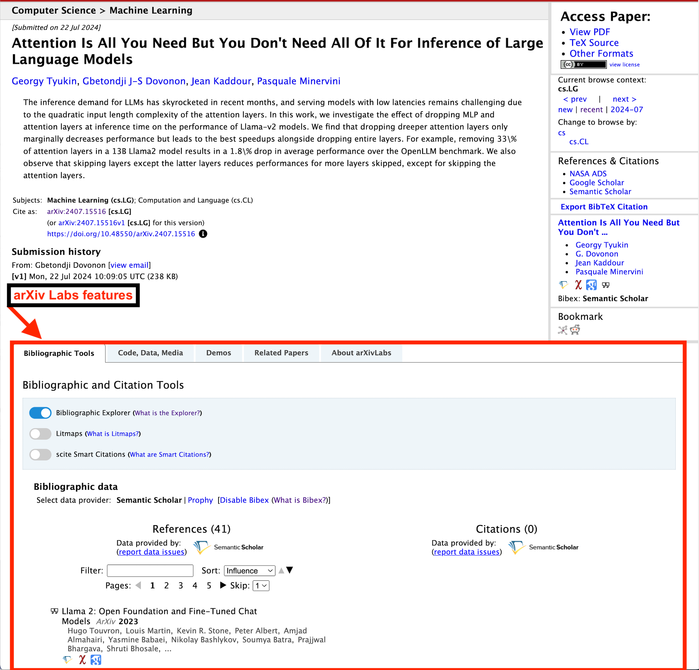

# arXivLabs: An invitation to collaborate

{.mkd-img-thumb align=right alt='a bubbling beaker with a smiling face and crossedbones behind it' role=presentation}

arXivLabs provides useful services to our readers such as bibliographic and contextual features, which are made available on the abstract page through a series of tabs at the bottom of the page. 

Proposed features must provide added value to arXiv content, the scientific community, and should be free of charge or operate on a freemium model. Please note that Labs projects may be removed at any time at the sole discretion of arXiv. As a courtesy, arXiv will notify the creator, when possible, that their integration has been removed.

### arXivLabs is:

- A way to contribute to arXiv
- A way to benefit the scientific community
- A way to enhance open science [learn how arXiv is contributing to open science](../about/accessibility.md)

### arXivLabs is not:

- A way to get you research funded. 
- A place for proposals to have arXiv collaborate with your research.
- A laboratory that you can ask to use for your scientific research.
- A place to tell us about your latest scientific breakthrough. (Please write a proper academic paper and submit it to use through the usual process) 
- A place to request endorsement [see the arXiv endorsement system](../help/endorsement.md)
- A place to submit your articles for posting on arXiv (see [General submission policies - arXiv info](../help/submit/index.md) for the relevant information)

[arXiv’s API](../help/api/index.md) is free and open to the public. You may use the arXiv API to retrieve arXiv metadata, full text, or source files for your project. 

If you wish to submit a proposal for an arXIvLabs project, please review our proposal criteria below before doing so. As part of your proposal, you will need to submit a Pull Request (PR). The final decision for approving an arXivLabs project is made by the arXiv management and teams. 

Learn more about previous [arXivLabs’ projects](https://blog.arxiv.org/?s=labs).

## arXivLabs Proposal Criteria

All arXiv-affiliated projects are expected to abide by the [arXiv Community Code of Conduct](../help/policies/code_of_conduct.md). The project must align with the overall arXiv mission and values of openness, community, excellence, and user data privacy. Commercial projects may be considered as long as they provide useful services in a permanently free tier.
Except when specifically authorized in writing, the use of the name “arXiv” or “arXiv.org” is prohibited in non-arXiv organization names or projects, advertising and other promotional vehicles.

### Responsibilities

Project participants must be able to submit the project via pull request (PR) and are responsible for developing and maintaining Labs components themselves.

#### Documentation

The project must provide and maintain clear and complete documentation that is available in the same public repository as the project source code. 
Some examples of what the documentation should include: 
- The technical dependencies of the project
- A description of any external APIs or data sources the project uses

#### Ownership Rights and Responsibilities

We encourage all Labs partners to continue to update and maintain their code. However, all source code used to integrate a Labs project with arXiv systems will be considered property of arXiv.

#### UI/UX

- Projects with user-facing components must adopt [WCAG 2.0](http://www.w3.org/TR/2008/REC-WCAG20-20081211/) Level A (Web Content Accessibility Guidelines). Higher levels of accessibility (i.e. AA, AAA) are encouraged and welcome.
- Any user-facing or promotional content must clearly indicate that the project is an arXivLabs project.
- As an arXiv-affiliated project, naming, content, and graphical elements must be consistent with the norms of professional conduct, including the arXiv Code of Conduct and [Brand and Style Guide](../brand/index.md).
  - Except when specifically authorized in writing, the use of the name “arXiv” or “arXiv.org” is prohibited in non-arXiv organization names or projects, advertising and other promotional vehicles.
- When practical, a quick-to-use Likert-style or cardinal feedback mechanism should be made available.

#### Security & Privacy
- Projects with UI components are reviewed for vulnerabilities that might put users or the arXiv platform itself at risk or leak user information. In cases where vulnerabilities are discovered, Labs partners will be responsible for correcting the issue or risk having their project rejected or terminated.
- The PR must contain all the code that is to be run on the abs page for the project integration. It must not load code from any other source, or for any other purpose.
- Projects must not circumvent or undermine existing security or quality of service measures on the arXiv platform.
- A feedback collection mechanism of some kind must be made available to end users. For example, a JIRA feedback collector may be used to collect qualitative feedback.

## Submit Your Proposal

The following steps will guide you in submitting an arXivLabs proposal: 

- Submit an arXivLabs proposal in the [Labs support portal](https://arxiv-org.atlassian.net/servicedesk/customer/portal/6).
Next, [submit your Pull Request (PR) to an arXiv repo](https://github.com/arXiv) using GitHub. 
- Request a review of your PR by selecting arXiv/labs-moderators as your reviewer.
- Create a fork to your organization, create a branch on the fork, and then create a PR against arXiv’s repository. This is a standard practice for creating a PR to suggest a change to other organizations. Please [consult this documentation](https://docs.github.com/en/pull-requests/collaborating-with-pull-requests/proposing-changes-to-your-work-with-pull-requests/creating-a-pull-request-from-a-fork) if you’d like more detailed information. 
- Your PR should only make changes in the labs area. Any changes in other parts of the abstract page will likely result in rejection of the PR.
- If possible, please run the tests in the upstream repository as well as yours. Including test results in the PR is very helpful to understand the nature of change and PR.
- Please see this well-defined [project example](https://github.com/arXiv/arxiv-browse/pull/197) to use as a guide to your PR. 
- Keep in mind, simpler PRs can be reviewed much more quickly than complex PRs.
- PRs are reviewed as resources become available. 
